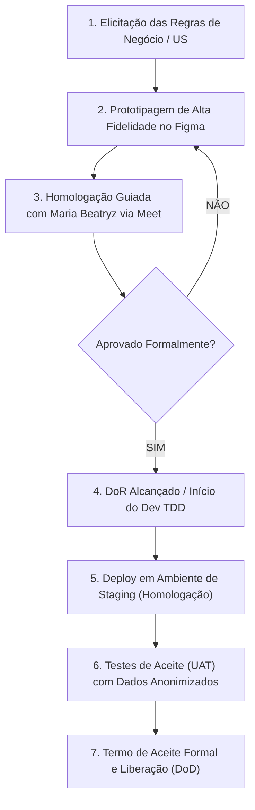

# 7.3 Processo de Validação Sociotécnica e Homologação com a Cliente

### Diretrizes Metodológicas e Acordo de Trabalho

A equipe *Cascata Ágil* formaliza nesta seção o compromisso metodológico de governança e rastreabilidade que rege a criação do **DUOC Finance**. Fica estabelecido o princípio inflexível de que **nenhuma linha de persistência de banco de dados (scripts DDL, migrations, entidades do ORM ou tabelas) é codificada antes da aprovação e homologação prévia do protótipo de alta fidelidade no Figma pela cliente parceira Maria Beatryz Vieira de Sousa**.

Esta diretriz visa blindar o escopo do projeto, proteger o orçamento de horas da equipe de desenvolvimento e assegurar a máxima aderência às rotinas reais de Departamento Pessoal e Gestão Financeira da DUOC.

---

#### 1. Regra de Homologação Prévia no Figma

Prototipar e navegar interativamente pelas telas no Figma antes de iniciar a codificação ou modelagem de banco de dados é um mecanismo de segurança sociotécnica. Em ecossistemas como o da DUOC, onde coexistem diferentes perfis de usuários (desde engenheiros e operários em campo lançando o Relatório de Viagem Técnica - RVT, até sócios acompanhando o custo real por contrato), pequenas ambiguidades no entendimento das regras de negócio podem resultar em retrabalho catastrófico no código backend.

Modificar um fluxo de telas, um campo de entrada ou a disposição visual de um cálculo de comissão no Figma consome minutos do designer. Alterar essa mesma regra após o banco de dados persistido, com APIs implementadas e regras de negócios acopladas, exige refatoração de migrations, alteração de DTOs, reescrita de testes unitários e alto custo de regressão. A validação prévia no Figma garante que a equipe e a cliente concordam exatamente com o **comportamento da solução** antes do esforço de codificação.

#### 2. Dinâmica das Sessões Guiadas com a Cliente

As sessões de validação ocorrem via Google Meet com duração máxima de 50 minutos e seguem a seguinte dinâmica estipulada:

* **Condução e Facilitação:** A reunião é conduzida pelo responsável de UX / Product Owner da equipe.
* **Comando do Protótipo (Sessão Invertida):** O link do protótipo interativo do Figma é compartilhado diretamente com a cliente **Maria Beatryz**. Ela **compartilha sua própria tela e assume o controle da navegação**. A equipe atua apenas instruindo os cenários de uso (ex: *"Maria, tente lançar as horas técnicas de uma viagem de campo no RVT e aprovar a folha do mês"*). Esse formato expõe com clareza falhas de usabilidade e dúvidas operacionais em tempo real.
* **Registro de Sugestões e Mudanças:** As observações e sugestões de mudança são anotadas no momento da reunião por um membro da equipe (Scrum Master/Relações Públicas) diretamente nos comentários do Figma e na ata da reunião. Cada ponto alterado gera um item no backlog de ajustes de prototipagem.

#### 3. Critérios Formais de Aceite (DoR e DoD)

* **Definition of Ready (DoR) - Pronta para Desenvolvimento:**
 1. História de Usuário (US) descrita no padrão *Como [Papel], Quero [Ação], Para que [Benefício]*.
 2. Protótipo de Alta Fidelidade no Figma correspondente à funcionalidade totalmente desenhado e validado pela equipe.
 3. **Aprovação por escrito da cliente Maria Beatryz** gravada na ata da sessão ou nos comentários do Figma.
 4. Critérios de aceite da história definidos e validados.
 5. Contrato de banco de dados e endpoints previstos (sem DDLs executados).

* **Definition of Done (DoD) - Entregue e Aceita:**
 1. Código-fonte desenvolvido e aderente à arquitetura proposta.
 2. Cobertura de testes automatizados (unitários e de integração) validada no pipeline.
 3. Demonstração funcional e homologada do software rodando em ambiente de Staging.
 4. Código integrado e aprovado via *Pull Request* na branch principal.
 5. Termo de Aceite registrado na documentação.

#### 4. Testes de Aceitação de Usuário (UAT)

Após a codificação e verificação interna de qualidade, a funcionalidade é implantada em ambiente de **Staging/Homologação**. A cliente Maria Beatryz recebe credenciais de acesso para executar o **UAT (User Acceptance Testing)**.

Para viabilizar testes realistas e seguros em termos de **LGPD (Lei Geral de Proteção de Dados)**:
* É gerada uma massa de dados sintética baseada na estrutura real de custos, contratos, horas de RVT e colaboradores da DUOC.
* Nomes, CPFs, salários reais e documentos sensíveis de colaboradores e clientes são totalmente anonimizados/pseudonimizados.
* A cliente realiza simulações ponta a ponta (ex: lançamento do ponto, fechamento da folha e cruzamento de custos por projeto).
* Havendo divergência de regras, o ciclo retorna para ajuste; caso contrário, a funcionalidade é homologada para release.

---

### Fluxo Metodológico do Ciclo de Validação

