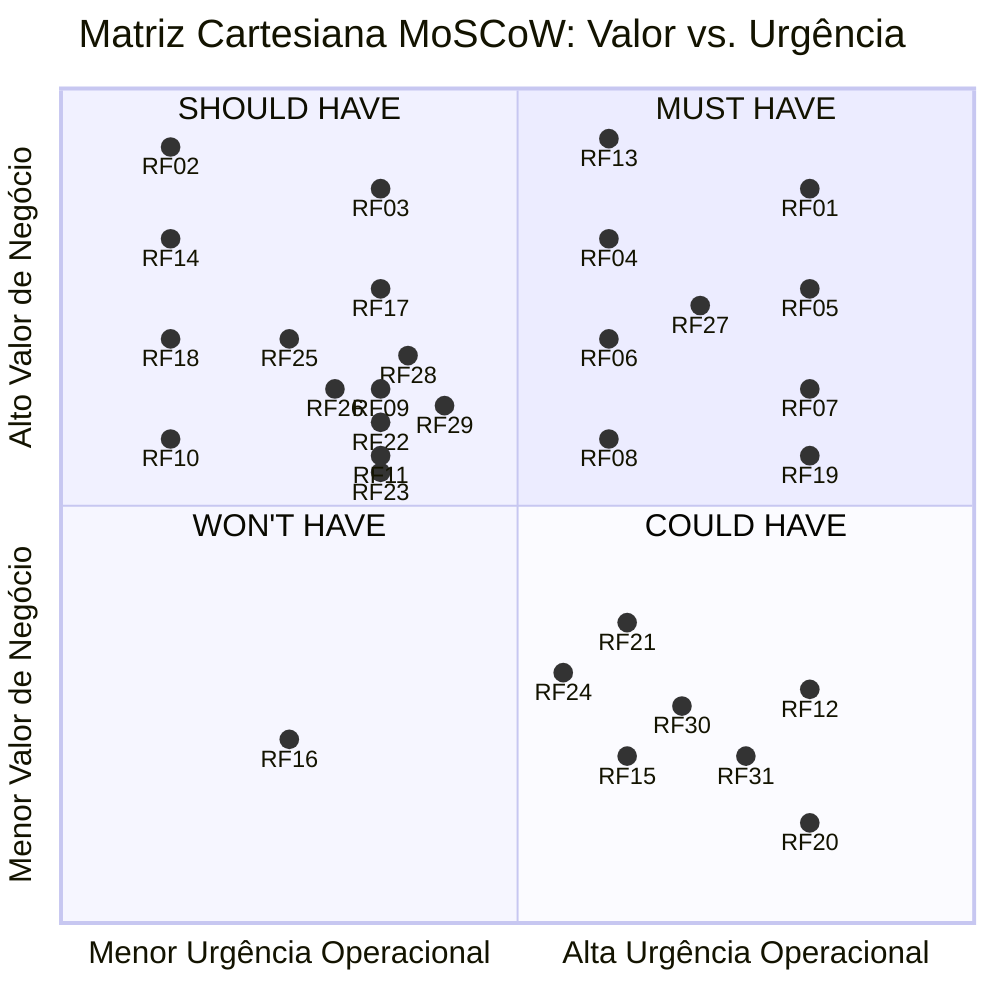
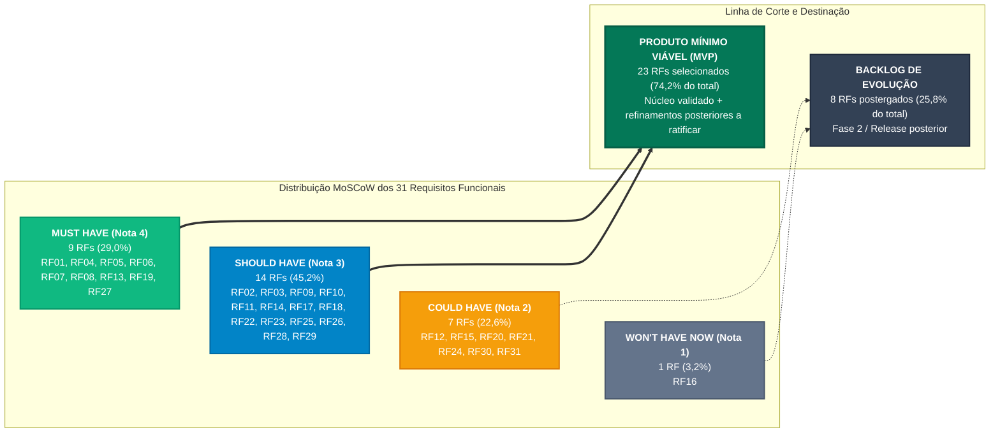
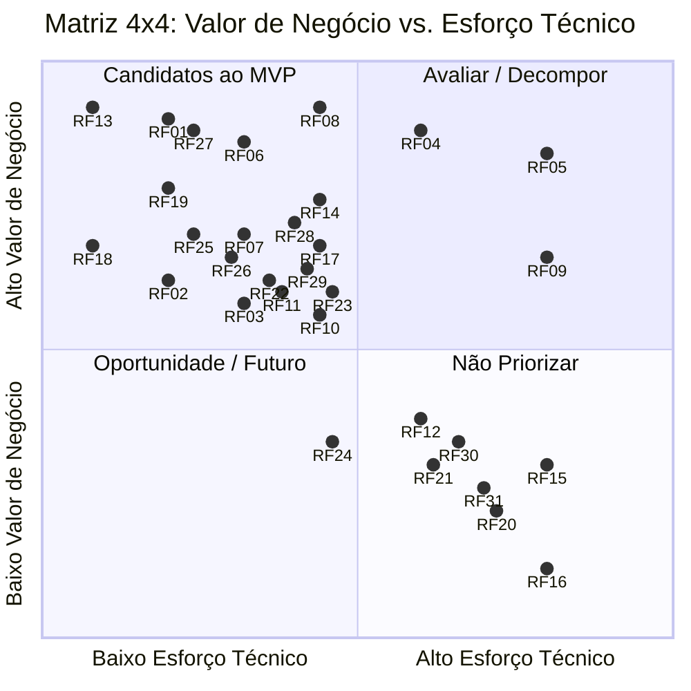
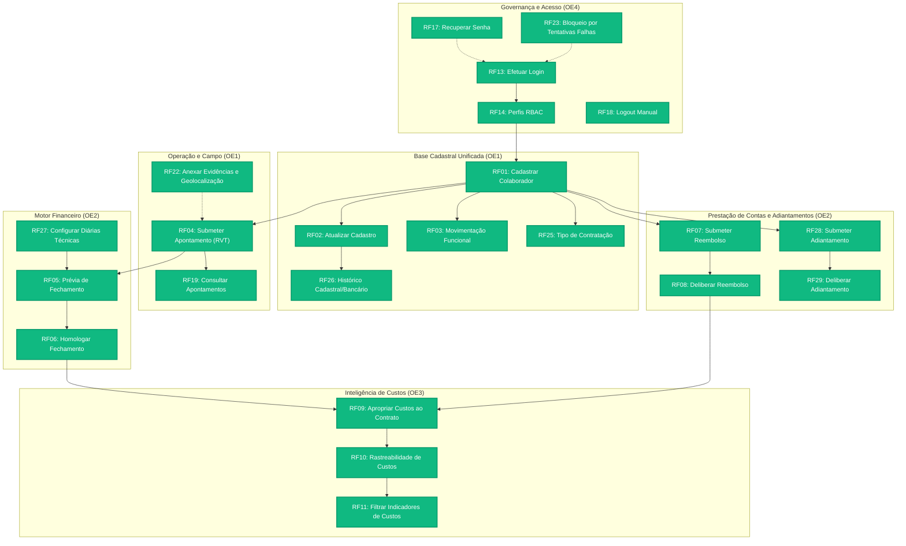

# Capítulo 10: Priorização de Requisitos e Definição do MVP

Este documento consolida a estratégia integrada de priorização do sistema **DUOC Finance**, articulando os **Requisitos Funcionais (RF)** e **Requisitos Não Funcionais (RNF)** sob duas perspectivas complementares e interdependentes:

1. **Valor de Negócio:** avaliado com a participação direta da cliente parceira **Maria Beatryz Vieira de Sousa** (Auxiliar-Administradora da DUOC Arquitetura e Engenharia), formalizado na [Ata da Reunião 05 (24/09/2026)](../atas/reuniao-05.md). Para os requisitos incorporados ou redefinidos após essa sessão, a classificação de valor apresentada neste documento é **preliminar** e deverá ser ratificada em validação posterior com a cliente.
2. **Esforço Técnico:** avaliado pela equipe técnica do projeto (**Cascata Ágil**), considerando esforço em horas, complexidade arquitetural e lacuna de capacidade técnica.

Os resultados dessas avaliações são cruzados na **Matriz 4 × 4 (Valor de Negócio × Esforço Técnico)**, fornecendo o embasamento analítico para a delimitação da linha de corte do **Produto Mínimo Viável (MVP)**, o tratamento dos requisitos de alto valor e alto esforço, a vinculação dos atributos de qualidade (RNFs) e a evolução controlada do escopo.

---

## 10.1 Avaliação do Valor de Negócio

A Engenharia de Requisitos orientada ao valor assegura que os esforços de modelagem, prototipação ágil (*UI-First*) e implementação concentrem-se prioritariamente nas funcionalidades que geram o mais alto retorno operacional e mitigam os maiores riscos institucionais da organização parceira.

### 10.1.1 Critérios Qualitativos de Negócio

Os critérios adotados para balizar o julgamento de valor consideraram:

1. **Importância para Resolver o Problema Central:** eliminação da dependência de planilhas manuais e mensagens fragmentadas de WhatsApp na apuração de diárias e prestação de contas (conforme diagnosticado no [Diagrama de Ishikawa](../visao-produto/capitulo-1/index.md#diagrama-de-causa-e-efeito-ishikawa) e nos fluxos TR-01 a TR-04).
2. **Contribuição para os Objetivos Estratégicos:** alinhamento direto com os quatro Objetivos Específicos da solução:
    - **OE1 — Padronizar e Unificar os Dados:** centralização cadastral de colaboradores e coleta estruturada de campo via Relatório de Viagem Técnica (RVT).
    - **OE2 — Aumentar a Eficiência Administrativo-Financeira:** automação do fechamento de diárias técnicas e fluxos ágeis de reembolso e adiantamento operacional.
    - **OE3 — Transparecer os Custos por Contrato:** apropriação clara de despesas e mão de obra por obra e centro de custo.
    - **OE4 — Garantir Segurança e Governança:** autenticação segura, controle de acesso baseado em papéis (RBAC) e rastreabilidade probatória.
3. **Mitigação de Riscos Trabalhistas e Fiscais:** requisitos que evitam pagamentos indevidos a colaboradores desligados (RN04), asseguram a comprovação fiscal em despesas (RN06) e garantem a retenção de auditoria conforme o Artigo 11 da CLT (RN19).
4. **Segregação de Funções e Privacidade (LGPD):** proteção do sigilo de remunerações e dados bancários, impedindo que técnicos de campo visualizem dados financeiros globais (RN14, RN16).

### 10.1.2 Critérios Quantitativos de Negócio

1. **Frequência e Abrangência de Uso:** volume diário de transações impactadas (apontamentos de obra, reembolsos e adiantamentos contínuos versus rotinas quinzenais/mensais de fechamento).
2. **Economia de Horas Administrativas (H/mês):** redução estimada de mais de 30 horas mensais gastas pela auxiliar-administradora na conferência manual de recibos físicos e conciliação de tabelas.
3. **Prevenção de Perdas Monetárias:** eliminação de pagamentos duplicados, erros de arredondamento em comissões e reembolsos sem documento fiscal correspondente (tolerância zero a desvios, RNF06).
4. **Redução do Tempo de Ciclo:** encurtamento do ciclo de liberação de pagamentos de 5 dias úteis de conferência manual para processamento supervisionado pelo sistema (RNF05).

### 10.1.3 Escala de Valor de Negócio e Associação ao MoSCoW

Para tornar a avaliação auditável e comparável, combinou-se o método **MoSCoW** a uma **escala quantitativa de 1 a 4**:

| Pontuação | Classificação MoSCoW | Interpretação e Impacto no Negócio | Diretriz Operacional para o MVP |
| :---: | :---: | :--- | :--- |
| **4** | **Must have** *(Mandatório / Crítico)* | **Indispensável:** sem esta funcionalidade, o sistema torna-se operacionalmente inviável ou juridicamente vulnerável. Sua ausência paralisa o processo central ou impede a substituição das rotinas manuais prioritárias. | **Inclusão obrigatória no MVP.** Bloqueante para a primeira versão operacional. |
| **3** | **Should have** *(Importante / Alta Prioridade)* | **Muito importante:** resolve atritos operacionais severos ou automatiza etapas de suporte direto ao fluxo principal. O produto ainda pode operar temporariamente sem ela mediante contorno manual assistido a curtíssimo prazo. | **Inclusão prioritária no MVP** para garantir sustentabilidade da rotina de trabalho. |
| **2** | **Could have** *(Desejável / Média Prioridade)* | **Agrega valor e conveniência:** melhora a experiência do usuário ou oferece recursos analíticos avançados, mas sua ausência não degrada a execução dos fluxos financeiros e cadastrais essenciais. | **Inclusão condicionada à capacidade residual** ou postergada para o ciclo seguinte. |
| **1** | **Won't have now** *(Postergado / Baixa Prioridade)* | **Não prioritário para a versão atual:** requisito reconhecido como valoroso para a maturidade corporativa futura, mas postergado por não atender às dores imediatas ou possuir melhor alternativa temporária. | **Fora do MVP.** Registrado formalmente no *roadmap* pós-implantação. |

### 10.1.4 Diagrama Cartesiano MoSCoW (Valor de Negócio vs. Urgência Operacional)

A distribuição consolidada dos **31 Requisitos Funcionais** sob a ótica de **Valor de Negócio** e **Urgência Operacional** é expressa visualmente no diagrama cartesiano abaixo. Os requisitos incorporados ou redefinidos após a Reunião 05 permanecem sujeitos à ratificação formal da cliente.

### 10.1.5 Distribuição MoSCoW e Linha de Corte do MVP

O diagrama estrutural abaixo sintetiza a distribuição das quatro categorias MoSCoW e a linha de corte consolidada. O núcleo originalmente discutido com a cliente foi preservado; os requisitos incorporados ou redefinidos posteriormente aparecem como refinamento técnico preliminar até nova ratificação.

---

## 10.2 Avaliação do Esforço Técnico

A avaliação técnica foi conduzida pela equipe de desenvolvimento e arquitetura da **Cascata Ágil**, analisando a demanda de implementação para cada um dos **31 Requisitos Funcionais**.

Para manter o rigor analítico e escalas orientadas no mesmo sentido (onde **1 representa menor barreira e 4 representa maior desafio**), o esforço técnico consolidado é composto por três dimensões mensuráveis:

### 10.2.1 Escalas Técnicas

#### 1. Esforço de Implementação (Tempo em Horas)

Mede o volume de trabalho em pessoa-hora para codificação de backend, frontend, persistência e elaboração de testes automatizados:

| Pontuação | Classificação | Faixa de Tempo | Descrição Operacional |
| :---: | :--- | :---: | :--- |
| **1** | Esforço baixo | Até 2 horas | Alteração pontual, fluxo direto com tela simples e validação básica. |
| **2** | Esforço moderado | Entre 2 e 8 horas | Fluxo de complexidade média, com formulários, validações e persistência relacional padrão. |
| **3** | Esforço alto | Entre 8 e 16 horas | Fluxo abrangente, com múltiplas etapas, processamentos condicionais ou manipulação de arquivos/tokens. |
| **4** | Esforço muito alto | Mais de 16 horas | Rotina de alta densidade algorítmica, concorrência crítica, reconciliação de dados em lote ou integração externa com incertezas. |

#### 2. Complexidade Técnica

Avalia as dependências arquiteturais, regras de validação cruzada e requisitos de integridade transacional:

| Pontuação | Classificação | Interpretação |
| :---: | :--- | :--- |
| **1** | Baixa | Utiliza solução conhecida, padrão CRUD, com poucas dependências locais. |
| **2** | Moderada | Exige parametrizações de filtros, validações condicionais simples ou integração interna entre duas tabelas. |
| **3** | Alta | Possui regras de negócio estritas (ex.: imutabilidade, bloqueio retroativo, validações monetárias centesimais ou upload de mídia). |
| **4** | Muito alta | Apresenta consistência transacional ACID mandatória, segregação estrita de papéis (RBAC em camadas), trilha de auditoria atômica ou integração com sistemas externos legados. |

#### 3. Lacuna de Capacidade da Equipe

Mede a distância entre o domínio tecnológico/conceitual necessário e a experiência prévia dos integrantes:

| Pontuação | Classificação | Interpretação |
| :---: | :--- | :--- |
| **1** | Domínio pleno | A equipe domina plenamente os conceitos e as tecnologias envolvidas (ex.: React/TypeScript, PostgreSQL básico, formulários). |
| **2** | Conhecimento suficiente | A equipe possui conhecimento teórico e prático satisfatório, demandando apenas pesquisa pontual ou adaptação de padrões conhecidos. |
| **3** | Aprendizagem relevante | A equipe precisa desenvolver ou validar conceitos específicos (ex.: manipulação de ponto fixo centesimal, isolamento por papéis e concorrência transacional). |
| **4** | Lacuna crítica | A equipe ainda não possui experiência prévia com o padrão ou tecnologia exigida, demandando investigação aprofundada ou prova de conceito. |

### 10.2.2 Fórmula de Consolidação e Regra de Conversão

Para consolidar as três dimensões técnicas em um indicador único e reprodutível, adota-se a média aritmética simples:

  Média Consolidada
  =
  
    
      Esforço (Nota) + Complexidade + Lacuna de Capacidade
    
    
      3
    
  

Para viabilizar o cruzamento na **Matriz 4 × 4**, a média decimal é convertida para uma escala ordinal inteira de **1 a 4** de acordo com faixas uniformes de arredondamento:

| Intervalo da Média | Esforço Consolidado na Matriz | Interpretação Técnica |
| :---: | :---: | :--- |
| **1,00 a 1,49** | **1 — Baixo** | Demanda técnica muito reduzida, tecnologia dominada e rápida entrega. |
| **1,50 a 2,49** | **2 — Moderado** | Demanda balanceada, regras claras e execução controlada no ciclo regular. |
| **2,50 a 3,49** | **3 — Alto** | Demanda substancial, regras de negócio densas e necessidade de atenção a testes. |
| **3,50 a 4,00** | **4 — Muito alto** | Elevada incerteza, múltiplos componentes acoplados ou risco de retrabalho expressivo. |

---

## 10.3 Tabela Consolidada das Avaliações

A tabela a seguir consolida as avaliações de **todos os 31 Requisitos Funcionais** da especificação (RF01 a RF31), integrando o **Valor de Negócio**, a justificativa operacional, as três dimensões técnicas e o **Esforço Técnico Consolidado**. Para os requisitos adicionados ou redefinidos após a Reunião 05, a classificação de valor é preliminar e deverá ser ratificada em validação posterior com a cliente.

| Código | Requisito Funcional | OE / CAR | Valor Negócio | Justificativa Operacional / de Negócio | Esforço (h) / Nota | Complex. | Lacuna | Média Consolidada | Esforço Consolidado |
| :---: | :--- | :---: | :---: | :--- | :---: | :---: | :---: | :---: | :---: |
| **RF01** | **Cadastrar colaborador** | OE1 / CAR-01 | **4** | Base fundacional: sem cadastro validado por CPF (RN01), nenhum pagamento de diária ou apontamento de obra pode ser gerado. | 6h (2) | 2 | 1 | 1,67 | **2 — Moderado** |
| **RF02** | **Atualizar cadastro de colaborador** | OE1 / CAR-01 | **3** | Alterações de dados cadastrais e bancários exigem autonomia administrativa sem depender de intervenção técnica. | 6h (2) | 2 | 1 | 1,67 | **2 — Moderado** |
| **RF03** | **Registrar movimentação funcional** | OE1 / CAR-01 | **3** | Afastamentos e desligamentos devem revogar credenciais e bloquear operações indevidas (RN03, RN04). | 6h (2) | 2 | 2 | 2,00 | **2 — Moderado** |
| **RF04** | **Submeter apontamento de campo** | OE1 / CAR-02 | **4** | Coração da coleta externa: substitui anotações dispersas pelo RVT digital estruturado. | 16h (3) | 3 | 3 | 3,00 | **3 — Alto** |
| **RF19** | **Consultar apontamentos registrados** | OE1 / CAR-02 | **4** | Permite ao colaborador acompanhar homologação, rejeição e necessidade de retificação antes do fechamento. | 4h (2) | 2 | 1 | 1,67 | **2 — Moderado** |
| **RF20** | **Importar presenças homologadas** | OE1 / CAR-09 | **2** | Integração externa com o *auditor.ia*; no ciclo piloto, a entrada pode ser suprida pelo RVT interno. | 12h (3) | 3 | 3 | 3,00 | **3 — Alto** |
| **RF22** | **Anexar evidências e geolocalização ao apontamento** | OE1 / CAR-02 | **3** | Complementa o apontamento com evidências da atividade e geolocalização quando disponível, fortalecendo a comprovação do RVT. | 8h (2) | 3 | 2 | 2,33 | **2 — Moderado** |
| **RF25** | **Cadastrar tipo de contratação do colaborador** | OE1 / CAR-01 | **3** | Diferencia Diarista, CLT e Prestador de Serviço, permitindo aplicar corretamente as regras administrativas e financeiras correspondentes. | 4h (2) | 2 | 1 | 1,67 | **2 — Moderado** |
| **RF26** | **Consultar histórico de alterações cadastrais e bancárias** | OE1 / CAR-01 | **3** | Preserva rastreabilidade de alterações sensíveis de cadastro e dados bancários, reduzindo divergências administrativas. | 8h (2) | 3 | 2 | 2,33 | **2 — Moderado** |
| **RF05** | **Solicitar prévia de fechamento** | OE2 / CAR-03 | **4** | Ataca o maior gargalo administrativo ao automatizar a consolidação de apontamentos, diárias e comissões para conferência. | 16h (3) | 4 | 3 | 3,33 | **3 — Alto** |
| **RF06** | **Homologar fechamento financeiro** | OE2 / CAR-03 | **4** | Garante a imutabilidade do lote financeiro antes do repasse, reduzindo alterações indevidas após conferência. | 6h (2) | 3 | 2 | 2,33 | **2 — Moderado** |
| **RF07** | **Submeter solicitação de reembolso** | OE2 / CAR-04 | **4** | Digitaliza a prestação de contas e exige comprovante fiscal conforme RN06. | 6h (2) | 2 | 2 | 2,00 | **2 — Moderado** |
| **RF08** | **Deliberar solicitação de reembolso** | OE2 / CAR-04 | **4** | Formaliza a aprovação ou rejeição das despesas antes do repasse financeiro. | 6h (2) | 2 | 2 | 2,00 | **2 — Moderado** |
| **RF21** | **Estornar fechamento financeiro** | OE2 / CAR-03 | **2** | Operação de exceção que pode permanecer fora do primeiro ciclo, com tratamento operacional assistido em caso de necessidade. | 10h (3) | 3 | 2 | 2,67 | **3 — Alto** |
| **RF27** | **Configurar tabela de valores de diárias técnicas** | OE2 / CAR-03 | **4** | A parametrização das diárias é necessária para que a prévia e o fechamento utilizem o valor vigente da competência. | 6h (2) | 2 | 1 | 1,67 | **2 — Moderado** |
| **RF28** | **Submeter solicitação de adiantamento operacional** | OE2 / CAR-04 | **3** | Digitaliza a solicitação prévia de recursos operacionais vinculados a contratos ativos. | 6h (2) | 2 | 2 | 2,00 | **2 — Moderado** |
| **RF29** | **Deliberar solicitação de adiantamento operacional** | OE2 / CAR-04 | **3** | Formaliza a aprovação ou rejeição dos adiantamentos e mantém a decisão rastreável. | 8h (2) | 2 | 2 | 2,00 | **2 — Moderado** |
| **RF09** | **Apropriar custos operacionais** | OE3 / CAR-05 | **3** | Aloca montantes de diárias e reembolsos aos contratos correspondentes, permitindo apuração consistente do custo real. | 16h (3) | 4 | 3 | 3,33 | **3 — Alto** |
| **RF10** | **Consultar rastreabilidade de custos** | OE3 / CAR-05 | **3** | Evidencia a origem documental de cada custo apropriado ao contrato. | 6h (2) | 2 | 2 | 2,00 | **2 — Moderado** |
| **RF11** | **Filtrar indicadores de custos** | OE3 / CAR-06 | **3** | Atende à necessidade de visibilidade e filtragem financeira dos custos diretos por obra no fechamento. | 6h (2) | 2 | 2 | 2,00 | **2 — Moderado** |
| **RF12** | **Monitorar execução orçamentária** | OE3 / CAR-06 | **2** | Útil à gestão, mas a apropriação correta do custo real tem precedência sobre a visualização de previsto versus realizado. | 12h (3) | 3 | 3 | 3,00 | **3 — Alto** |
| **RF30** | **Consultar comparativo histórico de custos entre contratos** | OE3 / CAR-05 | **2** | Oferece análise histórica útil, mas depende da existência de uma base consolidada de custos para gerar valor consistente. | 10h (3) | 3 | 2 | 2,67 | **3 — Alto** |
| **RF31** | **Configurar alertas de execução orçamentária** | OE3 / CAR-06 | **2** | Automatiza alertas gerenciais, porém a apropriação e a consulta básica dos custos têm precedência no primeiro ciclo. | 10h (3) | 3 | 2 | 2,67 | **3 — Alto** |
| **RF13** | **Efetuar login no sistema** | OE4 / CAR-07 | **4** | Condição indispensável de segurança da informação para proteger dados pessoais, bancários e financeiros. | 2h (1) | 1 | 1 | 1,00 | **1 — Baixo** |
| **RF14** | **Gerenciar perfis de acesso** | OE4 / CAR-07 | **3** | Garante o princípio do menor privilégio (RBAC), segregando campo, gestão e administração. | 6h (2) | 3 | 2 | 2,33 | **2 — Moderado** |
| **RF15** | **Consultar trilha de auditoria** | OE4 / CAR-08 | **2** | A persistência dos logs é obrigatória, mas a interface avançada de consulta e filtros pode aguardar a fase seguinte. | 10h (3) | 3 | 3 | 3,00 | **3 — Alto** |
| **RF16** | **Exportar relatório de auditoria** | OE4 / CAR-08 | **1** | Exportações formais podem ser supridas pontualmente por suporte técnico na fase piloto. | 12h (3) | 3 | 3 | 3,00 | **3 — Alto** |
| **RF17** | **Recuperar credenciais de acesso** | OE4 / CAR-07 | **3** | Evita que o esquecimento de senha paralise o usuário ou gere dependência de reset manual pela gestão. | 4h (2) | 2 | 1 | 1,67 | **2 — Moderado** |
| **RF18** | **Encerrar sessão manualmente** | OE4 / CAR-07 | **3** | Permite encerrar imediatamente uma sessão ativa, reduzindo exposição em dispositivos compartilhados. | 1h (1) | 1 | 1 | 1,00 | **1 — Baixo** |
| **RF23** | **Bloquear acesso após tentativas falhas consecutivas** | OE4 / CAR-07 | **3** | Mitiga ataques de força bruta sobre contas com acesso a dados sensíveis. | 6h (2) | 2 | 1 | 1,67 | **2 — Moderado** |
| **RF24** | **Expirar senha periodicamente e impedir reutilização** | OE4 / CAR-07 | **2** | Recurso adicional de política de credenciais que não é bloqueante para o primeiro ciclo operacional. | 6h (2) | 2 | 2 | 2,00 | **2 — Moderado** |

---

## 10.4 Matriz 4 × 4 — Valor de Negócio × Esforço Técnico

O cruzamento bidimensional entre o **Valor de Negócio** (eixo vertical) e o **Esforço Técnico Consolidado** (eixo horizontal) posiciona os **31 requisitos funcionais** do sistema.

### 10.4.1 Representação Visual da Matriz 4 × 4 (Diagrama Cartesiano)

O gráfico cartesiano a seguir mapeia a posição relativa dos requisitos, evidenciando o agrupamento do núcleo do MVP na região de alta entrega de valor com esforço controlado:

### 10.4.2 Tabela da Matriz 4 × 4

| Valor de Negócio ↓ / Esforço Técnico → | 1 — Baixo | 2 — Moderado | 3 — Alto | 4 — Muito alto |
| :---: | :--- | :--- | :--- | :---: |
| **4 — Muito alto** *(Must have)* | **RF13** *(Efetuar login)*  <small><strong>Prioridade máxima</strong></small> | **RF01** *(Cadastrar colaborador)* **RF06** *(Homologar fechamento)* **RF07** *(Submeter reembolso)* **RF08** *(Deliberar reembolso)* **RF19** *(Consultar apontamentos)* **RF27** *(Configurar diárias técnicas)*  <small><strong>Forte candidato ao MVP</strong></small> | **RF04** *(Submeter apontamento)* **RF05** *(Solicitar prévia de fechamento)*  <small><strong>Avaliar viabilidade / Decompor para MVP</strong></small> | —  <small><strong>Planejar, reduzir ou decompor</strong></small> |
| **3 — Alto** *(Should have)* | **RF18** *(Encerrar sessão)*  <small><strong>Forte candidato ao MVP</strong></small> | **RF02** *(Atualizar cadastro)* **RF03** *(Registrar movimentação)* **RF10** *(Rastreabilidade de custos)* **RF11** *(Filtrar indicadores)* **RF14** *(Gerenciar perfis RBAC)* **RF17** *(Recuperar credenciais)* **RF22** *(Anexar evidências e geolocalização)* **RF23** *(Bloquear tentativas falhas)* **RF25** *(Cadastrar tipo de contratação)* **RF26** *(Consultar histórico cadastral/bancário)* **RF28** *(Submeter adiantamento)* **RF29** *(Deliberar adiantamento)*  <small><strong>Candidatos ao MVP</strong></small> | **RF09** *(Apropriar custos)*  <small><strong>Avaliar contexto / Reduzir escopo para MVP</strong></small> | —  <small><strong>Entrega futura</strong></small> |
| **2 — Moderado** *(Could have)* | —  <small><strong>Avaliar oportunidade</strong></small> | **RF24** *(Expirar senha e impedir reutilização)*  <small><strong>Entrega futura / Capacidade residual</strong></small> | **RF12** *(Monitorar execução orçamentária)* **RF15** *(Consultar trilha de auditoria)* **RF20** *(Importar presenças auditor.ia)* **RF21** *(Estornar fechamento)* **RF30** *(Comparativo histórico de custos)* **RF31** *(Alertas de execução orçamentária)*  <small><strong>Entrega futura</strong></small> | —  <small><strong>Baixa prioridade</strong></small> |
| **1 — Baixo** *(Won't have now)* | —  <small><strong>Avaliar oportunidade</strong></small> | —  <small><strong>Baixa prioridade</strong></small> | **RF16** *(Exportar relatório de auditoria)*  <small><strong>Não priorizar agora</strong></small> | —  <small><strong>Não priorizar agora</strong></small> |

### 10.4.3 Análise Estratégica dos Quadrantes

1. **Prioridade máxima e fortes candidatos ao MVP (alto valor × baixo/moderado esforço):**
    - **RF13** e **RF18** apresentam esforço muito baixo e atendem diretamente ao controle de sessão.
    - **RF01, RF06, RF07, RF08, RF19 e RF27** combinam valor muito alto com esforço moderado e sustentam cadastro, fechamento, reembolso, consulta de apontamentos e parametrização das diárias.
2. **Candidatos estruturantes ao MVP (valor alto × esforço moderado):**
    - **RF02, RF03, RF10, RF11, RF14, RF17, RF22, RF23, RF25, RF26, RF28 e RF29** complementam autonomia cadastral, rastreabilidade, evidências de campo, segurança e fluxos financeiros. O **RF11** permanece no MVP por sua relevância para a visibilidade financeira por obra.
    - **RF22, RF25, RF26, RF28 e RF29** foram incorporados ou redefinidos após a validação original e, portanto, entram como priorização preliminar sujeita à ratificação da cliente.
    - **RF04**, **RF05** e **RF09** possuem esforço alto, mas representam elos vitais do fluxo ponta a ponta; por isso recebem estratégia de controle e redução de escopo em vez de postergação.
3. **Entrega futura e baixa prioridade (valor moderado/baixo):**
    - **RF12, RF15, RF16, RF20, RF21, RF24, RF30 e RF31** são postergados para o backlog evolutivo por dependerem de histórico consolidado, integração externa, rotinas de exceção, interfaces avançadas de auditoria ou capacidade residual.

---

## 10.5 Definição dos Requisitos Funcionais do MVP

A delimitação do Produto Mínimo Viável não se resumiu a agrupar funcionalidades fáceis. O corte considerou a formação de um **fluxo operacional minimamente completo, coerente e autossuficiente**, capaz de sanar as maiores dores da DUOC no primeiro ciclo de uso e, ao mesmo tempo, manter explícita a distinção entre itens já validados com a cliente e refinamentos posteriores sujeitos à ratificação.

### 10.5.1 Fluxo Funcional Contínuo de Ponta a Ponta

Para que a solução tenha utilidade real, os dados devem transitar de maneira fluida desde a autenticação e cadastro até a apuração e consulta de custos:

### 10.5.2 Tratamento dos Requisitos de Alto Valor e Alto Esforço

Requisitos posicionados na combinação de **Valor 4 e Esforço 3** (ou Valor 3 e Esforço 3) poderiam ser vistos como fatores de risco. No entanto, por constituírem etapas indispensáveis da cadeia de valor, adotou-se a seguinte estratégia de **redução de escopo e decomposição**:

| Código | Requisito Funcional | Desafio Técnico | Estratégia Adotada no MVP |
| :---: | :--- | :--- | :--- |
| **RF04** | **Submeter apontamento de campo** | Formulário de RVT e manipulação de evidências em dispositivo móvel. | **Escopo controlado:** foco na coleta dos campos essenciais de horas, contrato e escopo executado. A operação *offline* completa foi desacoplada para a fase evolutiva (RNF01). |
| **RF05** | **Solicitar prévia de fechamento** | Consolidação de apontamentos e cálculo automático de diárias. | **Escopo concentrado:** a prévia utiliza as regras contratuais ativas e os valores vigentes de diárias técnicas, sem incorporar encargos e provisões da folha CLT mantidos nos sistemas contábeis externos. |
| **RF09** | **Apropriar custos operacionais** | Múltiplas transações vinculando despesas a contratos e centros de custo. | **Apropriação direta:** o motor vincula os lotes homologados de diárias e reembolsos diretamente ao contrato ativo, deixando comparativos históricos e alertas orçamentários avançados para a evolução do produto. |

### 10.5.3 Lista Consolidada dos Requisitos Funcionais do MVP

A linha de corte consolidada contempla **23 Requisitos Funcionais**, cobrindo os fluxos essenciais de governança, cadastro, campo, fechamento, prestação de contas e apropriação. Os itens incorporados ou redefinidos após a Reunião 05 permanecem sujeitos à ratificação formal da cliente.

| RF | Requisito Funcional | Módulo / OE | CAR | Valor | Esforço | Justificativa de Inclusão no MVP |
| :---: | :--- | :---: | :---: | :---: | :---: | :--- |
| **RF01** | Cadastrar colaborador | Módulo 1 (OE1) | CAR-01 | **4** | **2** | Base unificada indispensável para apontamentos e rotinas financeiras. |
| **RF02** | Atualizar cadastro de colaborador | Módulo 1 (OE1) | CAR-01 | **3** | **2** | Mantém os dados cadastrais e bancários atualizados. |
| **RF03** | Registrar movimentação funcional | Módulo 1 (OE1) | CAR-01 | **3** | **2** | Atualiza situação funcional e bloqueia acessos/operações indevidas. |
| **RF04** | Submeter apontamento de campo | Módulo 1 (OE1) | CAR-02 | **4** | **3** | Coleta os dados de produção que alimentam o motor financeiro. |
| **RF19** | Consultar apontamentos registrados | Módulo 1 (OE1) | CAR-02 | **4** | **2** | Dá transparência ao colaborador sobre status e histórico dos próprios apontamentos. |
| **RF22** | Anexar evidências e geolocalização ao apontamento | Módulo 1 (OE1) | CAR-02 | **3** | **2** | Fortalece a comprovação do RVT com evidências e localização quando disponível. |
| **RF25** | Cadastrar tipo de contratação do colaborador | Módulo 1 (OE1) | CAR-01 | **3** | **2** | Permite aplicar as regras administrativas e financeiras adequadas a cada vínculo. |
| **RF26** | Consultar histórico de alterações cadastrais e bancárias | Módulo 1 (OE1) | CAR-01 | **3** | **2** | Preserva rastreabilidade das alterações cadastrais e bancárias sensíveis. |
| **RF05** | Solicitar prévia de fechamento | Módulo 2 (OE2) | CAR-03 | **4** | **3** | Automatiza a consolidação da competência para conferência. |
| **RF06** | Homologar fechamento financeiro | Módulo 2 (OE2) | CAR-03 | **4** | **2** | Trava lotes financeiros aprovados contra alterações diretas indevidas. |
| **RF07** | Submeter solicitação de reembolso | Módulo 2 (OE2) | CAR-04 | **4** | **2** | Digitaliza a prestação de contas com comprovante fiscal obrigatório. |
| **RF08** | Deliberar solicitação de reembolso | Módulo 2 (OE2) | CAR-04 | **4** | **2** | Formaliza a aprovação ou rejeição de despesas antes do repasse financeiro. |
| **RF27** | Configurar tabela de valores de diárias técnicas | Módulo 2 (OE2) | CAR-03 | **4** | **2** | Fornece os valores vigentes utilizados pelas rotinas de fechamento. |
| **RF28** | Submeter solicitação de adiantamento operacional | Módulo 2 (OE2) | CAR-04 | **3** | **2** | Digitaliza pedidos prévios de recursos vinculados a contratos ativos. |
| **RF29** | Deliberar solicitação de adiantamento operacional | Módulo 2 (OE2) | CAR-04 | **3** | **2** | Formaliza decisão e status dos adiantamentos solicitados. |
| **RF09** | Apropriar custos operacionais | Módulo 3 (OE3) | CAR-05 | **3** | **3** | Aloca custos homologados às obras correspondentes. |
| **RF10** | Consultar rastreabilidade de custos | Módulo 3 (OE3) | CAR-05 | **3** | **2** | Evidencia a origem de cada custo apropriado. |
| **RF11** | Filtrar indicadores de custos | Módulo 3 (OE3) | CAR-06 | **3** | **2** | Permite analisar custos por período, contrato, colaborador e centro de custo. |
| **RF13** | Efetuar login no sistema | Módulo 4 (OE4) | CAR-07 | **4** | **1** | Porta de entrada mandatória de segurança. |
| **RF14** | Gerenciar perfis de acesso | Módulo 4 (OE4) | CAR-07 | **3** | **2** | Segrega alçadas entre campo, gestão e administração. |
| **RF17** | Recuperar credenciais de acesso | Módulo 4 (OE4) | CAR-07 | **3** | **2** | Dá autonomia aos usuários e reduz dependência de suporte. |
| **RF18** | Encerrar sessão manualmente | Módulo 4 (OE4) | CAR-07 | **3** | **1** | Permite invalidar imediatamente a sessão ativa. |
| **RF23** | Bloquear acesso após tentativas falhas consecutivas | Módulo 4 (OE4) | CAR-07 | **3** | **2** | Reduz risco de ataques de força bruta. |

### 10.5.4 Requisitos Funcionais Postergados (Backlog Pós-MVP)

Os **8 requisitos** abaixo ficam alocados para a **Fase 2 (Pós-MVP)** ou release posterior:

| RF | Requisito Funcional | Módulo / OE | CAR | Valor | Esforço | Justificativa da Postergação |
| :---: | :--- | :---: | :---: | :---: | :---: | :--- |
| **RF12** | Monitorar execução orçamentária | Módulo 3 (OE3) | CAR-06 | **2** | **3** | A visualização de previsto versus realizado ganha maior utilidade após estabilização da base de custos. |
| **RF15** | Consultar trilha de auditoria | Módulo 4 (OE4) | CAR-08 | **2** | **3** | A gravação de auditoria permanece obrigatória no backend; a interface avançada de consulta pode ser entregue posteriormente. |
| **RF16** | Exportar relatório de auditoria | Módulo 4 (OE4) | CAR-08 | **1** | **3** | Exportações formais podem ser supridas pontualmente por suporte técnico na fase piloto. |
| **RF20** | Importar presenças homologadas | Módulo 1 (OE1) | CAR-09 | **2** | **3** | A integração com o *auditor.ia* possui dependência externa; o RVT próprio atende ao primeiro ciclo. |
| **RF21** | Estornar fechamento financeiro | Módulo 2 (OE2) | CAR-03 | **2** | **3** | É uma operação de exceção que pode permanecer assistida no primeiro ciclo. |
| **RF24** | Expirar senha periodicamente e impedir reutilização | Módulo 4 (OE4) | CAR-07 | **2** | **2** | Política adicional de credenciais não bloqueante para a primeira versão operacional. |
| **RF30** | Consultar comparativo histórico de custos entre contratos | Módulo 3 (OE3) | CAR-05 | **2** | **3** | Depende de histórico consolidado de custos para produzir comparação representativa. |
| **RF31** | Configurar alertas de execução orçamentária | Módulo 3 (OE3) | CAR-06 | **2** | **3** | Automatiza monitoramento gerencial, mas a apropriação e consulta básica dos custos têm precedência. |

---

## 10.6 Tratamento dos Requisitos Não Funcionais (RNFs)

Os atributos de qualidade e restrições técnicas do sistema receberam análise individualizada e foram vinculados ao escopo do MVP, garantindo que aspectos críticos de segurança, confiabilidade, desempenho, acessibilidade e conformidade acompanhem a primeira versão operacional.

### 10.6.1 Metodologia de Classificação dos RNFs

Cada um dos **20 RNFs** especificados no [Capítulo 8: Requisitos de Software](index.md) foi enquadrado em uma das quatro categorias:

1. **Obrigatório para o MVP:** atributo transversal indispensável de segurança da informação, privacidade, confiabilidade, acessibilidade ou obrigação externa. Entra no MVP sem negociação.
2. **Associado a RF do MVP:** atributo de qualidade vinculado diretamente a um ou mais RFs selecionados para o MVP. O RF só é considerado concluído (*Done*) quando o critério mensurável aplicável é atendido.
3. **Evolutivo:** atributo pertinente ao produto, mas associado a funcionalidade postergada ou dependente de infraestrutura prevista para ciclos posteriores.
4. **Não Aplicável ao MVP:** requisito sem incidência sobre o recorte operacional da primeira versão.

### 10.6.2 Tabela de Classificação e Vinculação dos RNFs ao MVP

| Código | Requisito Não Funcional Verificável | URPS+ | Sommerville | RFs Vinculados | Categoria no MVP | Critério Mensurável e Justificativa de Enquadramento |
| :---: | :--- | :--- | :--- | :---: | :---: | :--- |
| **RNF01** | Operar em modo *offline* em canteiros sem rede | Reliability | Requisito do Produto | RF04 | **Evolutivo** | Armazenar localmente pelo menos 100 apontamentos, com alerta a 80% da capacidade e sincronização em até 30 s após retorno da conexão. A operação desconectada completa foi postergada por decisão de escopo. |
| **RNF02** | Consulta cadastral com tempo ágil | Performance | Requisito do Produto | RF01, RF02, RF03, RF25, RF26 | **Associado ao MVP** | Busca e renderização da ficha em até 2,0 s em 95% das requisições sob carga nominal. |
| **RNF03** | Criptografia em repouso e trânsito | Security (+) | Requisito do Produto | Transversal | **Obrigatório para o MVP** | Dados sensíveis com AES-256 e comunicações com TLS 1.3. |
| **RNF04** | Usabilidade e agilidade no RVT de campo | Usability | Requisito do Produto | RF04, RF19, RF22 | **Associado ao MVP** | Apontamento concluído em até 5 passos/telas e taxa de sucesso ≥ 90% em teste de usabilidade. |
| **RNF05** | Fechamento financeiro com alta eficiência | Performance | Requisito do Produto | RF05, RF06 | **Associado ao MVP** | Processar e renderizar até 500 registros em no máximo 5,0 s em 95 de 100 execuções. |
| **RNF06** | Exatidão aritmética centesimal | Reliability | Requisito do Produto | RF05, RF06, RF08, RF27, RF29 | **Associado ao MVP** | Discrepância monetária de exatamente R$ 0,00 em comparação ao gabarito contábil. |
| **RNF07** | Validação no upload de comprovantes | Supportability / Security (+) | Requisito do Produto | RF07, RF22 | **Associado ao MVP** | Bloqueio de arquivos acima de 5 MB ou em formato diferente de PDF, PNG e JPEG. |
| **RNF08** | Justificativa mandatória em estornos | Security (+) | Requisito do Produto | RF21 | **Evolutivo** | Impedir estorno quando a justificativa estiver ausente ou possuir menos de 15 caracteres. Acompanha o RF21 no backlog pós-MVP. |
| **RNF09** | Carga do painel analítico ≤ 3 s | Performance | Requisito do Produto | RF11, RF12, RF30, RF31 | **Associado ao MVP** | Renderização completa em até 3,0 s para base de até 10.000 lançamentos e 100 contratos; no MVP aplica-se diretamente às consultas do RF11. |
| **RNF10** | Restrição de dados financeiros conforme perfil | Security (+) | Requisito do Produto | RF05, RF06, RF09, RF10, RF11 | **Obrigatório para o MVP** | 100% das consultas não autorizadas devem ser bloqueadas com HTTP 403. |
| **RNF11** | Consistência ACID na apropriação de custos | Reliability | Requisito do Produto | RF09 | **Associado ao MVP** | Nenhuma duplicidade ou divergência em 100 testes de operações concorrentes. |
| **RNF12** | Responsividade do painel em desktop e tablet | Usability | Requisito do Produto | RF11, RF12, RF30, RF31 | **Associado ao MVP** | Elementos essenciais devem permanecer utilizáveis em 1024×768 e 768×1024 sem rolagem horizontal; no MVP aplica-se ao painel disponibilizado pelo RF11. |
| **RNF13** | Expiração de token temporário em até 8 horas | Security (+) | Requisito do Produto | RF13 | **Obrigatório para o MVP** | Tokens com mais de 8 horas devem ser rejeitados com HTTP 401 em 100% dos testes. |
| **RNF14** | Autorização RBAC em 100% das rotas de API | Security (+) / Legal | Requisito Externo (LGPD) | RF13, RF14 / Transversal | **Obrigatório para o MVP** | 100% das rotas sensíveis protegidas por RBAC, com acesso indevido retornando HTTP 403. |
| **RNF15** | Atomicidade na gravação dos logs de auditoria | Reliability | Requisito do Produto | Transversal às operações de escrita | **Obrigatório para o MVP** | Toda escrita em dados sensíveis deve possuir registro de auditoria na mesma transação, com perda zero. |
| **RNF16** | Retenção de logs por no mínimo 5 anos | Supportability / Legal | Requisito Externo (CLT) | Transversal | **Obrigatório para o MVP** | Impedir exclusão de registros com retenção inferior a 1.825 dias. |
| **RNF17** | Backup diário automático com restauração verificada | Reliability | Requisito do Produto | Transversal | **Obrigatório para o MVP** | Backup diário, retenção mínima de 30 dias, restauração em até 4 h e perda máxima de 24 h. |
| **RNF18** | Disponibilidade mínima mensal do sistema | Reliability | Requisito do Produto | Transversal | **Obrigatório para o MVP** | Disponibilidade mínima mensal de 99,5%, com manutenção programada comunicada previamente. |
| **RNF19** | Acessibilidade digital nas interfaces | Usability | Requisito do Produto | Transversal | **Obrigatório para o MVP** | Navegação por teclado, rótulos ARIA, contraste mínimo 4.5:1 e conformidade com WCAG 2.1 nível AA. |
| **RNF20** | Integridade de payloads nas rotas de escrita da API | Reliability / Security (+) | Requisito do Produto | Transversal | **Obrigatório para o MVP** | 100% das requisições POST, PUT e PATCH validadas contra schema; payload inválido retorna HTTP 400 estruturado. |

### 10.6.3 Síntese Numérica da Distribuição dos RNFs

- **Obrigatórios para o MVP:** **10 requisitos (50,0%)** — *RNF03, RNF10, RNF13, RNF14, RNF15, RNF16, RNF17, RNF18, RNF19 e RNF20*.
- **Associados a RFs do MVP:** **8 requisitos (40,0%)** — *RNF02, RNF04, RNF05, RNF06, RNF07, RNF09, RNF11 e RNF12*.
- **Evolutivos:** **2 requisitos (10,0%)** — *RNF01 e RNF08*.
- **Não Aplicáveis:** **0 requisitos (0,0%)**.
- **Total no Escopo do MVP:** **18 de 20 RNFs (90,0%)** entram diretamente na primeira versão operacional.

---

## 10.7 Evidência e Registro da Validação do MVP com o Cliente

A Reunião 05 registrou a validação do núcleo funcional disponível em **24/09/2026**. O escopo foi posteriormente refinado pela equipe com novos requisitos e com a redefinição de alguns itens; essas alterações posteriores permanecem explicitamente marcadas como **preliminares** até nova ratificação da cliente.

### 10.7.1 Ficha Técnica da Sessão de Validação

- **Data e Horário:** 24 de setembro de 2026, das 19h30 às 20h45 (GMT-03:00).
- **Formato:** reunião síncrona por videoconferência via Google Meet, conforme registro interno da equipe.
- **Participantes:**
    - **Representante da Cliente Parceira:** Maria Beatryz Vieira de Sousa (Auxiliar-Administradora da DUOC Arquitetura e Engenharia).
    - **Membros da Equipe Cascata Ágil:** Eric Araújo (Product Owner e condução da sessão), Matheus Ribeiro (Scrum Master e Co-PO), Giovana Ferreira (Engenheira Frontend e UI/UX), Paulo Nery (Engenheiro Backend), Matheus Saraiva Camargo (Arquiteto de Software e Banco de Dados), Gustavo Bonifácio (QA e Testes) e Lucas Zanetti (Garantia de Qualidade).
- **Registro Detalhado:** a ata formal com os debates e deliberações encontra-se publicada na [Ata da Reunião 05](../atas/reuniao-05.md).

### 10.7.2 Quadro de Deliberações e Aceite de Escopo

!!! note "Atualizações posteriores à validação"

    A Reunião 05 registrou a validação do núcleo funcional existente naquele momento. Requisitos incorporados posteriormente por refinamento da especificação — incluindo RF23 a RF31 e a redefinição do RF22 — possuem classificação preliminar neste capítulo e deverão ser ratificados em uma próxima sessão de validação com a cliente. O quadro abaixo preserva as decisões efetivamente registradas em 24/09/2026 e esclarece alterações posteriores de identificação quando necessário.

| Tópico da Validação | Decisão Registrada | Fundamentação e Rastreabilidade |
| :--- | :---: | :--- |
| **Aprovação do Núcleo do MVP** | **Aprovado com Ressalvas** | A cliente confirmou que os **16 RFs então selecionados** atacavam as dores centrais de conferência manual de diárias e extravio de comprovantes fiscais, com continuidade do refinamento documental pela equipe. |
| **Inclusão de Indicadores de Custos no MVP (RF11)** | **Aprovado pela Cliente** | Maria Beatryz alinhou a inclusão da filtragem de indicadores de custos por obra (**RF11**) no escopo prioritário. O monitoramento orçamentário avançado (**RF12**) permaneceu postergado. |
| **Rebaixamento do Requisito de Estorno (RF21)** | **Consensuado** | O grupo acordou reduzir a prioridade e retirar o estorno financeiro (**RF21**) do MVP, mantendo tratamento operacional assistido para exceções no primeiro ciclo. |
| **Postergação do Modo Offline (RNF01)** | **Consensuado** | A operação *offline* completa (**RNF01**) foi postergada para a fase evolutiva; o requisito permanece documentado, mas não bloqueia o MVP. |
| **Postergação da Exportação de Auditoria (RF16)** | **Aprovado pela Cliente** | Ficou acordado manter a exportação de relatórios de auditoria (**RF16**) fora do escopo inicial, preservando a gravação obrigatória dos logs no backend. |
| **Postergação da Importação de Presenças Externas (RF20)** | **Aprovado pela Cliente** | A importação de presenças homologadas do *auditor.ia* (**RF20**) não foi considerada impeditiva para o primeiro ciclo, pois o RVT próprio atende à coleta inicial. A exportação de espelhos de frequência, presente em versão anterior da especificação sob o identificador RF22, deixou de compor o catálogo atual; o **RF22 atual** refere-se a evidências e geolocalização do apontamento. |
| **Ajuste no Fluxo de Reembolso** | **Consensuado** | A cliente solicitou tratamento rigoroso para comprovantes de reembolso, refletido na regra **RN06** e no **RNF07**. |
| **Homologação dos Atributos de Qualidade e Segurança discutidos na sessão** | **Homologado** | Foram validados como relevantes ao MVP a exatidão monetária (**RNF06**), a criptografia em repouso e trânsito (**RNF03**), a expiração de sessão (**RNF13**) e o backup diário (**RNF17**). |

---

## Histórico de Versão

| Versão | Data | Descrição | Autor(es) | Revisor(es) |
| :---: | :---: | :--- | :--- | :--- |
| `1.0` | 24/09/2026 | Estruturação da metodologia de valor de negócio dos RFs (escala 1 a 4 associada ao MoSCoW), critérios qualitativos/quantitativos e pontuação preliminar pactuada na Reunião 05 com a cliente Maria Beatryz. | Matheus Ribeiro e Eric Araújo | |
| `1.1` | 25/09/2026 | Refatoração estrutural da priorização com desmembramento em categorias MoSCoW e inclusão de diagrama cartesiano inicial de valor versus urgência. | Matheus Ribeiro e Eric Araújo | |
| `1.2` | 28/09/2026 | Estruturação da proposta inicial da Matriz 4×4 (Valor × Esforço), definição preliminar do corte de RFs do MVP e justificativa dos itens postergados. | Gustavo Bonifácio | Matheus Ribeiro |
| `1.3` | 28/09/2026 | Incorporação da metodologia de classificação e vinculação dos Requisitos Não Funcionais (RNF01 a RNF16) às categorias do MVP (Obrigatórios, Associados e Evolutivos). | Paulo Nery | Matheus Ribeiro |
| `1.4` | 28/09/2026 | Adição da metodologia de estimativa de esforço técnico (escalas de horas, complexidade técnica e lacuna de capacidade) e tabela com médias consolidadas. | Giovana Ferreira | Matheus Ribeiro |
| `2.0` | 28/09/2026 | Unificação e consolidação canônica do capítulo de Priorização e MVP: harmonização das perspectivas de negócio e esforço técnico, integração das correções da avaliação em pares, calibração dos quadrantes cartesianos, fluxo contínuo do MVP e formalização da validação com a cliente. | Matheus Ribeiro | Eric Araújo |
| `2.1` | 28/09/2026 | Revisão do escopo de priorização, validação da distribuição dos RFs então existentes na Matriz 4×4, auditoria das vinculações dos RNFs ao MVP e homologação dos critérios de aceite. | Eric Araújo | Matheus Ribeiro |
| `2.2` | 30/09/2026 | Alinhamento com a Reunião 05: promoção do RF11 (Should have / MVP), rebaixamento do RF21 (Could have / Pós-MVP), registro da versão então vigente do RF22, confirmação de RNF01 e RNF08 como evolutivos e RNF09 como associado ao MVP; atualização dos diagramas, fluxo funcional e matriz 4×4. | Matheus Ribeiro | Eric Araújo |
| `2.3` | 06/10/2026 | Inclusão de RF23 e RF24 (Módulo 4/CAR-07) na avaliação de valor/esforço, na Matriz 4×4 e nos diagramas MoSCoW; RF23 promovido ao MVP e RF24 postergado ao backlog. Inclusão de RNF18 a RNF20 (transversais) na classificação do MVP. | Matheus Saraiva Camargo | Matheus Ribeiro |
| `2.4` | 07/10/2026 | Sincronização integral com a especificação atual de 31 RFs e 20 RNFs: redefinição do RF22, inclusão de RF25 a RF31, atualização da distribuição MoSCoW, Matriz 4×4, fluxo funcional, linha de corte do MVP e backlog evolutivo; atualização da integração externa para *auditor.ia*; revisão da classificação de RNF12 e RNF19; e distinção explícita entre requisitos validados na Reunião 05 e refinamentos posteriores sujeitos à ratificação da cliente. | Matheus Saraiva Camargo | Matheus Ribeiro |