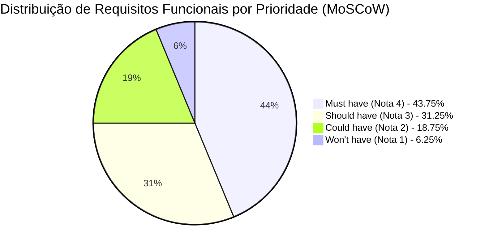
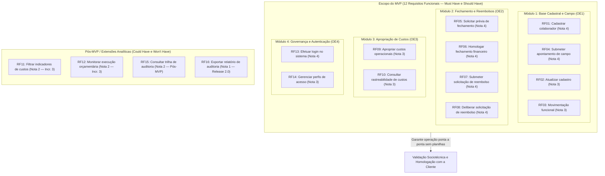

# Capítulo 8: Priorização de Requisitos e Definição do MVP

Este documento formaliza a priorização sistemática dos Requisitos Funcionais do sistema **DUOC Finance** com base em critérios objetivos de **Valor de Negócio**, orientando o escopo do **Produto Mínimo Viável (MVP)** e o encadeamento dos incrementos no ciclo de desenvolvimento sob a metodologia **RAD (Rapid Application Development)**.

A atribuição de notas, pesos e justificativas operacionais decorre de deliberação consensual realizada diretamente com a cliente parceira **Maria Beatryz Vieira de Sousa** (Auxiliar Administrativa da DUOC Arquitetura e Engenharia), devidamente formalizada na [Ata da Reunião 05 (24/09/2026)](../atas/reuniao-05.md).

---

## 8.1 Introdução e Contexto Estratégico

A Engenharia de Requisitos orientada ao valor assegura que os esforços de modelagem, prototipação ágil (UI-First) e construção de software concentrem-se prioritariamente nas funcionalidades que geram o mais alto retorno operacional e mitigam os maiores riscos institucionais da organização parceira.

No cenário da **DUOC Arquitetura e Engenharia**, a gestão de campo e a conciliação financeiro-administrativa enfrentam gargalos crônicos decorrentes da fragmentação de planilhas eletrônicas e da troca descentralizada de mensagens via WhatsApp (conforme diagnosticado no [Diagrama de Ishikawa](../visao-produto/capitulo-1/index.md#diagrama-de-causa-e-efeito-ishikawa) e nos [Fluxos Transacionais TR-01 a TR-04](../visao-produto/capitulo-1/index.md#estrutura-detalhada-das-transacoes)).

A priorização dos requisitos conecta-se diretamente aos quatro **Objetivos Específicos (OE)** do projeto:

- **OE1 — Padronizar e Unificar os Dados:** Centralização cadastral de colaboradores CLT e diaristas de campo, viabilizando o apontamento digital estruturado via RVT.
- **OE2 — Aumentar a Eficiência Administrativo-Financeira:** Automação da apuração de diárias técnicas e fluxos ágeis de prestação de contas com comprovantes fiscais digitalizados.
- **OE3 — Transparecer as Informações sobre Custos por Contrato:** Apropriação clara de despesas e mão de obra por obra e centro de custo.
- **OE4 — Garantir Segurança e Governança de Dados:** Autenticação corporativa, controle de acesso baseado em papéis (RBAC) e rastreabilidade probatória.

---

## 8.2 Metodologia de Avaliação e Critérios de Valor de Negócio

Para transformar a percepção empírica de valor em uma métrica auditável e reprodutível, a equipe **Cascata Ágil** combinou a consagrada técnica **MoSCoW** (*Must have*, *Should have*, *Could have*, *Won't have*) a uma **escala quantitativa ordinal de 1 a 4**, balizada por critérios qualitativos e quantitativos de impacto no negócio da DUOC.

### 8.2.1 Escala Quantitativa de Valor de Negócio e Associação ao MoSCoW

| Pontuação | Classificação MoSCoW | Significado Operacional e Impacto no Negócio | Diretriz para o MVP |
| :---: | :---: | :--- | :--- |
| **4** | **Must have** *(Mandatório / Crítico)* | **Indispensável à operação:** Sem esta funcionalidade, o sistema torna-se operacionalmente inviável ou juridicamente vulnerável. Sua ausência paralisa o processo central (apontamento em obra ou fechamento financeiro) e impede a substituição das planilhas legadas. | **Inclusão obrigatória no MVP.** Bloqueante para entrada em produção. |
| **3** | **Should have** *(Importante / Alta Prioridade)* | **Alto valor agregado:** Resolve atritos operacionais severos ou automatiza etapas de suporte direto ao fluxo principal. Possui alternativa de contorno manual aceitável apenas a curtíssimo prazo, sendo essencial para a sustentabilidade da rotina de trabalho. | **Inclusão prioritária no MVP** ou no incremento imediatamente subsequente. |
| **2** | **Could have** *(Desejável / Média Prioridade)* | **Conveniência e sofisticação analítica:** Funcionalidade benéfica que melhora a experiência do usuário ou oferece visões analíticas avançadas, mas cuja ausência não degrada a execução dos fluxos financeiros e cadastrais essenciais. | **Inclusão condicionada à capacidade residual** do cronograma (Incremento 3). |
| **1** | **Won't have (neste momento)** *(Baixa Prioridade / Futuro)* | **Evolução postergada:** Requisito reconhecido como valoroso para a maturidade corporativa, mas expressamente excluído do escopo do MVP por exigir integrações complexas ou por não ser urgente frente às dores imediatas. | **Fora do MVP.** Registrado formalmente no roadmap pós-implantação (Release 2.0). |

---

### 8.2.2 Critérios Qualitativos de Negócio

A avaliação qualitativa considerou quatro dimensões estratégicas da rotina da DUOC:

1. **Mitigação de Riscos Trabalhistas e Fiscais:** Requisitos que evitam pagamentos indevidos a colaboradores afastados ou desligados (RN04), asseguram a obrigatoriedade de notas fiscais digitalizadas (RN06) e garantem a retenção auditável de registros conforme o Artigo 11 da CLT (RN19).
2. **Eliminação do Retrabalho e Integridade da Informação:** Substituição definitiva da digitação redundante de planilhas por uma base unificada, estabelecendo uma fonte única da verdade para dados de colaboradores e diárias.
3. **Autonomia Operacional das Equipes:** Descentralização da coleta de dados por meio do apontamento direto pelo colaborador ou encarregado em campo, desonerando a administração central de cobrar comprovantes via mensagens instantâneas.
4. **Segregação de Funções e Privacidade (LGPD):** Proteção do sigilo de remunerações e dados sensíveis bancários, garantindo que colaboradores de campo não visualizem dados estratégicos da diretoria (RN14, RN16).

---

### 8.2.3 Critérios Quantitativos de Negócio

Para respaldar a pontuação atribuída, foram estabelecidos parâmetros quantitativos mensuráveis:

1. **Volume Transacional Impactado:** Frequência de uso do requisito (diário para apontamentos e reembolsos; quinzenal/mensal para fechamento financeiro de dezenas de contratos ativos e prestadores de serviço).
2. **Economia de Horas Administrativas (H/mês):** Estimativa da redução de horas gastas pela sócia-administradora e assistente administrativa na conferência manual de recibos e preenchimento de tabelas (estimada em mais de 30 horas mensais no fechamento).
3. **Prevenção de Perdas Monetárias:** Eliminação de pagamentos duplicados, arredondamentos imprecisos em cálculos de comissões/diárias e concessão de reembolsos sem documento fiscal correspondente (tolerância zero a desvios, RNF06).
4. **Redução do Tempo de Ciclo:** Encurtamento do intervalo entre a execução do serviço em campo e a disponibilização do extrato de conferência supervisionada (de até 5 dias úteis de espera manual para processamento instantâneo, RNF05).

---

## 8.3 Detalhamento dos Requisitos por Categoria MoSCoW

Nesta seção, cada um dos quatro quadrantes do **MoSCoW** é detalhado em um tópico exclusivo com sua respectiva tabela analítica, fundamentação de negócio e rastreabilidade técnica.

### 8.3.1 Categoria Must Have — Mandatório (Nota 4 | 7 Requisitos)

A categoria **Must Have (Nota 4)** reúne as funcionalidades vitais do sistema. Sem estes requisitos, a DUOC não consegue abandonar as planilhas manuais, pois não haveria meio de coletar os dados de campo, calcular o fechamento de pagamentos ou proteger o acesso às informações financeiras.

| Código | Requisito Funcional (Ação do Usuário) | Módulo / OE | CAR | Nota | Justificativa de Negócio e Impacto Operacional | Escopo MVP |
| :---: | :--- | :---: | :---: | :---: | :--- | :---: |
| **RF01** | **Cadastrar colaborador** | Módulo 1 (OE1) | CAR-01 | **4** | **Base fundacional do sistema.** Sem o cadastro formal de colaboradores (pessoais, trabalhistas e bancários), nenhum apontamento, diária ou reembolso pode ser lançado ou quitado. A validação de CPF único (RN01) elimina a ocorrência de homônimos e registros duplicados nas planilhas. | **Dentro do MVP** |
| **RF04** | **Submeter apontamento de campo** | Módulo 1 (OE1) | CAR-02 | **4** | **Coração da coleta operacional.** Substitui o preenchimento manual em papel e fotos dispersas de ordens de serviço no WhatsApp pelo Relatório de Viagem Técnica (RVT) digital com fotos e comprovantes. Garante a matéria-prima para o cálculo de diárias. | **Dentro do MVP** |
| **RF05** | **Solicitar prévia de fechamento** | Módulo 2 (OE2) | CAR-03 | **4** | **Maior gargalo administrativo estancado.** Automatiza a consolidação de centenas de horas técnicas e diárias homologadas em um extrato preliminar. Elimina mais de 30 horas mensais gastas pela gestão conferindo fórmulas manuais em planilhas Excel. | **Dentro do MVP** |
| **RF06** | **Homologar fechamento financeiro** | Módulo 2 (OE2) | CAR-03 | **4** | **Confiabilidade e imutabilidade contábil.** Formaliza a aprovação da competência pela sócia-administradora, bloqueando o lote contra alterações retroativas (RN08). Garante segurança jurídica antes do repasse financeiro de pagamentos. | **Dentro do MVP** |
| **RF07** | **Submeter solicitação de reembolso** | Módulo 2 (OE2) | CAR-04 | **4** | **Fim da perda crônica de notas físicas.** Viagens a obras no entorno do DF resultavam em perda recorrente de comprovantes fiscais em papel. A obrigatoriedade do comprovante digitalizado vinculado a contrato ativo (RN06, RN09) previne prejuízos imediatos. | **Dentro do MVP** |
| **RF08** | **Deliberar solicitação de reembolso** | Módulo 2 (OE2) | CAR-04 | **4** | **Governança e controle de despesas.** Permite à coordenação técnica aprovar ou reprovar despesas de viagem com parecer obrigatório antes do desembolso, evitando pagamentos de notas indevidas ou fora da alçada contratual. | **Dentro do MVP** |
| **RF13** | **Efetuar login no sistema** | Módulo 4 (OE4) | CAR-07 | **4** | **Segurança da informação e LGPD.** Condição *sine qua non* para operação corporativa. Protege dados bancários e valores de faturamento contra acessos não autorizados por meio de autenticação segura e tokens de sessão (RN15). | **Dentro do MVP** |

---

### 8.3.2 Categoria Should Have — Importante (Nota 3 | 5 Requisitos)

A categoria **Should Have (Nota 3)** contempla os requisitos estruturantes de alto impacto. Embora admitam contornos manuais temporários em cenários de contingência (por exemplo, ajustes pontuais de banco de dados pela equipe técnica durante os primeiros dias), sua presença no MVP é imprescindível para garantir que a equipe administrativa da DUOC opere com autonomia contínua.

| Código | Requisito Funcional (Ação do Usuário) | Módulo / OE | CAR | Nota | Justificativa de Negócio e Impacto Operacional | Escopo MVP |
| :---: | :--- | :---: | :---: | :---: | :--- | :---: |
| **RF02** | **Atualizar cadastro de colaborador** | Módulo 1 (OE1) | CAR-01 | **3** | **Sustentabilidade operacional contínua.** Alterações de chaves Pix, contas bancárias e dados de contato ocorrem com alta frequência na DUOC. A interface de edição garante que a própria cliente atualize esses dados sem depender de intervenções manuais de programadores. | **Dentro do MVP** |
| **RF03** | **Registrar movimentação funcional** | Módulo 1 (OE1) | CAR-01 | **3** | **Mitigação de risco trabalhista e bloqueio de segurança.** O registro tempestivo de afastamentos e rescisões revoga automaticamente tokens de acesso ao app (RN04) e impede que colaboradores desligados recebam diárias indevidas (RN03). | **Dentro do MVP** |
| **RF09** | **Apropriar custos operacionais** | Módulo 3 (OE3) | CAR-05 | **3** | **Inteligência financeira por projeto.** Vincula o montante consolidado de diárias e reembolsos homologados diretamente ao contrato de cada obra atendida (RN10, RN11). Permite à diretoria enxergar a margem de contribuição real de cada cliente. | **Dentro do MVP** |
| **RF10** | **Consultar rastreabilidade de custos** | Módulo 3 (OE3) | CAR-05 | **3** | **Transparência e resolução de atritos contratuais.** Permite inspecionar a origem de cada custo debitado a um contrato (executor, data, homologador). Facilita a prestação de contas com contratantes corporativos da DUOC. | **Dentro do MVP** |
| **RF14** | **Gerenciar perfis de acesso** | Módulo 4 (OE4) | CAR-07 | **3** | **Autonomia de governança (RBAC).** Assegura que colaboradores de campo tenham acesso estrito às suas ordens de trabalho, enquanto gestores manipulam dados financeiros (RN16). Permite à administração da DUOC configurar permissões sem suporte de TI. | **Dentro do MVP** |

---

### 8.3.3 Categoria Could Have — Desejável (Nota 2 | 3 Requisitos)

A categoria **Could Have (Nota 2)** engloba funcionalidades analíticas e de conveniência que enriquecem substancialmente a experiência gerencial da sócia-administradora. Sua não inclusão inicial não impede a realização dos pagamentos nem a execução das obras. O desenvolvimento desses requisitos está programado como extensão no **Incremento 3**, condicionado à existência de folga técnica no cronograma do RAD.

| Código | Requisito Funcional (Ação do Usuário) | Módulo / OE | CAR | Nota | Justificativa de Negócio e Impacto Operacional | Escopo MVP |
| :---: | :--- | :---: | :---: | :---: | :--- | :---: |
| **RF11** | **Filtrar indicadores de custos** | Módulo 3 (OE3) | CAR-06 | **2** | **Conveniência analítica para tomadores de decisão.** A aplicação de múltiplos filtros combinados (período, contrato, colaborador, centro de custos) agiliza o diagnóstico gerencial. No entanto, relatórios estáticos consolidados já atendem à rotina inicial do negócio. | **Extensão (Incr. 3)** |
| **RF12** | **Monitorar execução orçamentária** | Módulo 3 (OE3) | CAR-06 | **2** | **Gestão preventiva de desvios orçamentários.** Apresenta percentuais de execução e alertas visuais de estouro de orçamento (RN13). É altamente valorizada pela gestora para o médio prazo, mas secundária em relação ao cálculo exato do valor a pagar aos diaristas. | **Extensão (Incr. 3)** |
| **RF15** | **Consultar trilha de auditoria** | Módulo 4 (OE4) | CAR-08 | **2** | **Auditoria visual em tela.** A gravação atômica dos logs no banco de dados é obrigatória por requisito de segurança (RN17, RN18). Contudo, a interface gráfica com filtros de pesquisa para o usuário pode ser entregue posteriormente, já que incidentes iniciais podem ser auditados no banco. | **Pós-MVP Imediato** |

---

### 8.3.4 Categoria Won't Have — Postergado (Nota 1 | 1 Requisito)

A categoria **Won't Have (Nota 1)** representa demandas reconhecidas como valorosas para a conformidade regulatória avançada da DUOC, mas cuja frequência de uso é esporádica e cuja complexidade de implementação consumiria esforço crítico de engenharia necessário para estabilizar o motor financeiro. Ficou acordado com a cliente que esse requisito será formalmente entregue na **Release 2.0 (pós-MVP)**.

| Código | Requisito Funcional (Ação do Usuário) | Módulo / OE | CAR | Nota | Justificativa de Negócio e Impacto Operacional | Previsão de Entrega |
| :---: | :--- | :---: | :---: | :---: | :--- | :---: |
| **RF16** | **Exportar relatório de auditoria** | Módulo 4 (OE4) | CAR-08 | **1** | **Demanda esporádica e preventiva.** A geração e exportação de dossiê consolidado e auditável em PDF/CSV para fins de fiscalização trabalhista (CLT Artigo 11 / RN19) é necessária apenas em eventuais diligências formais. A cliente acordou que extrações manuais assistidas pela equipe de TI atendem à fase piloto, liberando o time para focar nas diárias de campo. | **Release 2.0 (Pós-MVP)** |

---

## 8.4 Tabela-Síntese Consolidada de Avaliação de Valor de Negócio

Para viabilizar uma consulta comparativa unificada, a tabela abaixo consolida todos os **16 Requisitos Funcionais**, ordenados por pontuação decrescente de valor de negócio e módulo:

| Código | Requisito Funcional | OE | CAR | Nota | MoSCoW | Impacto Central no Negócio da DUOC | Escopo MVP |
| :---: | :--- | :---: | :---: | :---: | :---: | :--- | :---: |
| **RF01** | **Cadastrar colaborador** | OE1 | CAR-01 | **4** | Must have | Cria a base unificada de pessoal com validação de CPF e contas bancárias. | **No MVP** |
| **RF04** | **Submeter apontamento de campo** | OE1 | CAR-02 | **4** | Must have | Digitaliza o RVT no canteiro de obras com upload de fotos e horas trabalhadas. | **No MVP** |
| **RF05** | **Solicitar prévia de fechamento** | OE2 | CAR-03 | **4** | Must have | Consolida horas de campo em extrato supervisionado de diárias e comissões. | **No MVP** |
| **RF06** | **Homologar fechamento financeiro** | OE2 | CAR-03 | **4** | Must have | Trava o lote financeiro contra alterações retroativas, garantindo imutabilidade. | **No MVP** |
| **RF07** | **Submeter solicitação de reembolso** | OE2 | CAR-04 | **4** | Must have | Exige cupom fiscal digitalizado em compras de viagem vinculadas a contratos. | **No MVP** |
| **RF08** | **Deliberar solicitação de reembolso** | OE2 | CAR-04 | **4** | Must have | Estabelece fluxo de aprovação com parecer prévio para desembolsos operacionais. | **No MVP** |
| **RF13** | **Efetuar login no sistema** | OE4 | CAR-07 | **4** | Must have | Garante autenticação corporativa, emissão de tokens e proteção legal (LGPD). | **No MVP** |
| **RF02** | **Atualizar cadastro de colaborador** | OE1 | CAR-01 | **3** | Should have | Confere autonomia à cliente para retificar dados bancários e contatos sem TI. | **No MVP** |
| **RF03** | **Registrar movimentação funcional** | OE1 | CAR-01 | **3** | Should have | Revoga credenciais em rescisões e impede geração indevida de pagamentos. | **No MVP** |
| **RF09** | **Apropriar custos operacionais** | OE3 | CAR-05 | **3** | Should have | Aloca despesas e mão de obra diretamente aos contratos ativos da DUOC. | **No MVP** |
| **RF10** | **Consultar rastreabilidade de custos** | OE3 | CAR-05 | **3** | Should have | Evidencia a trilha completa de origem de cada custo debitado a uma obra. | **No MVP** |
| **RF14** | **Gerenciar perfis de acesso** | OE4 | CAR-07 | **3** | Should have | Segrega visualizações conforme alçadas (campo, gestão e administração). | **No MVP** |
| **RF11** | **Filtrar indicadores de custos** | OE3 | CAR-06 | **2** | Could have | Refina gráficos analíticos por filtros customizados de centro de custo. | **Extensão (Incr. 3)** |
| **RF12** | **Monitorar execução orçamentária** | OE3 | CAR-06 | **2** | Could have | Alerta visualmente desvios orçamentários entre previsto e realizado. | **Extensão (Incr. 3)** |
| **RF15** | **Consultar trilha de auditoria** | OE4 | CAR-08 | **2** | Could have | Permite pesquisar visualmente registros de logs de auditoria na interface. | **Pós-MVP** |
| **RF16** | **Exportar relatório de auditoria** | OE4 | CAR-08 | **1** | Won't have | Emite dossiês formais para conformidade trabalhista (Artigo 11 da CLT). | **Release 2.0** |

---

## 8.5 Análise Quantitativa e Aderência Metodológica

A distribuição percentual das prioridades MoSCoW demonstra plena harmonia com as boas práticas internacionais de Engenharia de Software:

### 8.5.1 Resumo Quantitativo por Categoria MoSCoW

| Classificação MoSCoW | Nota | Quantidade de RFs | Proporção (%) | Requisitos Contemplados |
| :--- | :---: | :---: | :---: | :--- |
| **Must have (Mandatório)** | 4 | 7 | 43,75% | RF01, RF04, RF05, RF06, RF07, RF08, RF13 |
| **Should have (Importante)** | 3 | 5 | 31,25% | RF02, RF03, RF09, RF10, RF14 |
| **Could have (Desejável)** | 2 | 3 | 18,75% | RF11, RF12, RF15 |
| **Won't have (Postergado)** | 1 | 1 | 6,25% | RF16 |
| **Total Geral** | — | **16** | **100,00%** | **Todos os 16 RFs especificados** |

!!! success "Aderência à Boa Prática do MoSCoW (Regra 60-20-20)"
    Na literatura clássica de Engenharia de Software e Métodos Ágeis (Clegg & Barker), recomenda-se que os requisitos *Must have* não ultrapassem **60% da capacidade produtiva total** do time de desenvolvimento, reservando margem operacional de segurança para contingências e absorção de mudanças. 
    
    No DUOC Finance, os *Must have* representam exatamente **43,75%** dos requisitos, e a soma de *Must* e *Should* totaliza **75,00%**, configurando um escopo de MVP altamente realista, robusto e perfeitamente exequível dentro do semestre letivo.

---

## 8.6 Delimitação e Escopo do Produto Mínimo Viável (MVP)

A linha de corte (*Cut-line*) estabelecida em comum acordo com Maria Beatryz delimita o **Produto Mínimo Viável (MVP)** como o conjunto dos requisitos com pontuação **4 (Must have)** e **3 (Should have)**, totalizando **12 Requisitos Funcionais**, acompanhados dos respectivos Requisitos Não Funcionais estruturantes.

### 8.6.1 Cobertura dos Objetivos Específicos no MVP

- **OE1 (Padronização e Unificação de Dados): 100% contemplado no MVP.** Todos os 4 RFs (RF01 a RF04) integram o escopo, sanando a dispersão de cadastros e o apontamento em campo.
- **OE2 (Eficiência Administrativo-Financeira): 100% contemplado no MVP.** Todos os 4 RFs (RF05 a RF08) integram o escopo, digitalizando o motor de fechamento de diárias e a prestação de contas de viagens.
- **OE3 (Inteligência de Custos por Contrato): 50% no núcleo do MVP e 50% em extensões.** O núcleo de apropriação e rastreabilidade direta por obra (RF09 e RF10) é entregue no MVP; filtros avançados e alertas de estouro orçamentário (RF11 e RF12) entram como extensões do Incremento 3.
- **OE4 (Governança, Segurança e Rastreabilidade): 50% no núcleo do MVP e 50% em evoluções futuras.** A segurança de acesso (login e perfis RBAC — RF13 e RF14) compõe o MVP; visualização gráfica e exportação de relatórios em massa de auditoria (RF15 e RF16) são postergadas.

---

## Histórico de Versão

| Versão | Data | Descrição | Autor(es) | Revisor(es) |
| :---: | :---: | :--- | :--- | :--- |
| `1.0` | 24/09/2026 | Estruturação da metodologia de valor de negócio (escala 1 a 4 associada ao MoSCoW), consolidação da tabela de pontuação dos 16 RFs e delimitação formal do MVP pactuada na Reunião 05 com a cliente Maria Beatryz. | Matheus Ribeiro e Eric Araújo | |
| `1.1` | 25/09/2026 | Refatoração estrutural da priorização: desmembramento do MoSCoW em seções exclusivas com tabelas dedicadas por categoria (Must, Should, Could e Won't), inclusão de diagrama cartesiano de 4 quadrantes (quadrantChart) e mapeamento visual de todos os 16 RFs. | Matheus Ribeiro e Eric Araújo | Lucas Zanetti |
