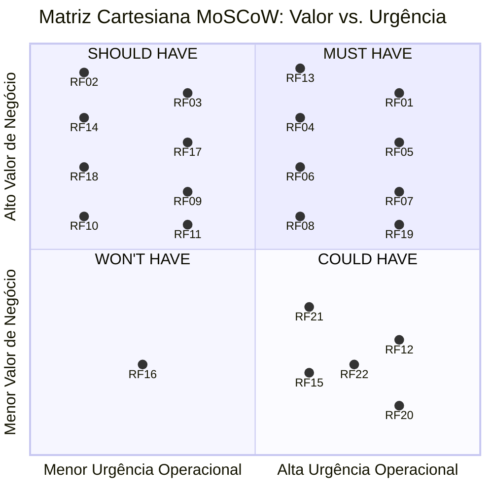
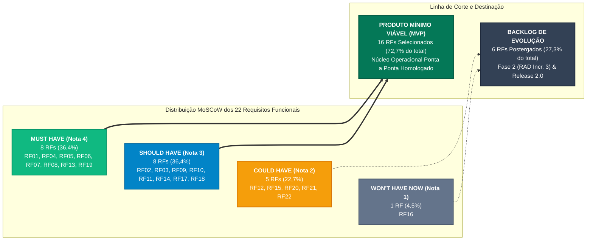
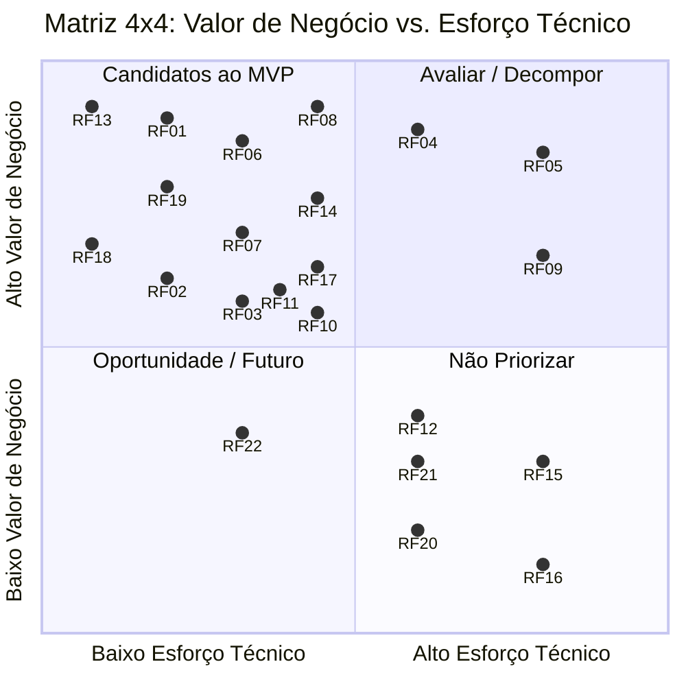
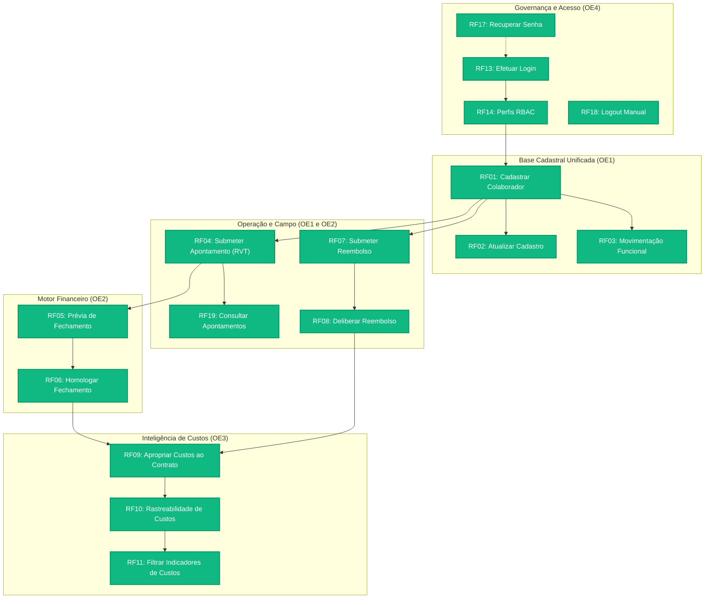

# Capítulo 8: Priorização de Requisitos e Definição do MVP

Este documento consolida a estratégia integrada de priorização do sistema **DUOC Finance**, articulando os **Requisitos Funcionais (RF)** e **Requisitos Não Funcionais (RNF)** sob duas perspectivas complementares e interdependentes:

1. **Valor de Negócio:** Avaliado com a participação direta da cliente parceira **Maria Beatryz Vieira de Sousa** (Auxiliar-Administradora da DUOC Arquitetura e Engenharia), formalizado na [Ata da Reunião 05 (24/09/2026)](../atas/reuniao-05.md).
2. **Esforço Técnico:** Avaliado pela equipe técnica do projeto (**Cascata Ágil**), considerando esforço em horas, complexidade arquitetural e lacuna de capacidade técnica.

Os resultados dessas avaliações são cruzados na **Matriz 4 × 4 (Valor de Negócio × Esforço Técnico)**, fornecendo o embasamento analítico para a delimitação da linha de corte do **Produto Mínimo Viável (MVP)**, o tratamento dos requisitos de alto valor e alto esforço, a vinculação dos atributos de qualidade (RNFs) e a validação consensual do escopo.

---

## 8.1 Avaliação do Valor de Negócio

A Engenharia de Requisitos orientada ao valor assegura que os esforços de modelagem, prototipação ágil (*UI-First*) e implementação concentrem-se prioritariamente nas funcionalidades que geram o mais alto retorno operacional e mitigam os maiores riscos institucionais da organização parceira.

### 8.1.1 Critérios Qualitativos de Negócio

Os critérios adotados para balizar o julgamento de valor durante a sessão com a cliente consideraram:

1. **Importância para Resolver o Problema Central:** Eliminação da dependência de planilhas manuais e mensagens fragmentadas de WhatsApp na apuração de diárias e prestação de contas (conforme diagnosticado no [Diagrama de Ishikawa](../visao-produto/capitulo-1/index.md#diagrama-de-causa-e-efeito-ishikawa) e nos fluxos TR-01 a TR-04).
2. **Contribuição para os Objetivos Estratégicos:** Alinhamento direto com os quatro Objetivos Específicos da solução:
    - **OE1 — Padronizar e Unificar os Dados:** Centralização cadastral de colaboradores e coleta estruturada de campo via Relatório de Viagem Técnica (RVT).
    - **OE2 — Aumentar a Eficiência Administrativo-Financeira:** Automação do fechamento de diárias técnicas e fluxos ágeis de reembolso com notas fiscais digitalizadas.
    - **OE3 — Transparecer os Custos por Contrato:** Apropriação clara de despesas e mão de obra por obra e centro de custo.
    - **OE4 — Garantir Segurança e Governança:** Autenticação segura, controle de acesso baseado em papéis (RBAC) e rastreabilidade probatória.
3. **Mitigação de Riscos Trabalhistas e Fiscais:** Requisitos que evitam pagamentos indevidos a colaboradores desligados (RN04), asseguram a comprovação fiscal em despesas (RN06) e garantem a retenção de auditoria conforme o Artigo 11 da CLT (RN19).
4. **Segregação de Funções e Privacidade (LGPD):** Proteção do sigilo de remunerações e dados bancários, impedindo que técnicos de campo visualizem dados financeiros globais (RN14, RN16).

### 8.1.2 Critérios Quantitativos de Negócio

1. **Frequência e Abrangência de Uso:** Volume diário de transações impactadas (apontamentos de obra e reembolsos contínuos vs. rotinas quinzenais/mensais de fechamento).
2. **Economia de Horas Administrativas (H/mês):** Redução estimada de mais de 30 horas mensais gastas pela auxiliar-administradora na conferência manual de recibos físicos e conciliação de tabelas.
3. **Prevenção de Perdas Monetárias:** Eliminação de pagamentos duplicados, erros de arredondamento em comissões e reembolsos sem documento fiscal correspondente (tolerância zero a desvios, RNF06).
4. **Redução do Tempo de Ciclo:** Encurtamento do ciclo de liberação de pagamentos de 5 dias úteis de conferência manual para processamento instantâneo supervisionado (RNF05).

### 8.1.3 Escala de Valor de Negócio e Associação ao MoSCoW

Para tornar a avaliação auditável e comparável, combinou-se o método **MoSCoW** a uma **escala quantitativa de 1 a 4**:

| Pontuação | Classificação MoSCoW | Interpretação e Impacto no Negócio | Diretriz Operacional para o MVP |
| :---: | :---: | :--- | :--- |
| **4** | **Must have** *(Mandatório / Crítico)* | **Indispensável:** Sem esta funcionalidade, o sistema torna-se operacionalmente inviável ou juridicamente vulnerável. Sua ausência paralisa o processo central (apontamento ou fechamento financeiro) e impede a substituição das planilhas legadas. | **Inclusão obrigatória no MVP.** Bloqueante para entrada em produção. |
| **3** | **Should have** *(Importante / Alta Prioridade)* | **Muito importante:** Resolve atritos operacionais severos ou automatiza etapas de suporte direto ao fluxo principal. O produto ainda pode operar temporariamente sem ela mediante contorno manual assistido a curtíssimo prazo. | **Inclusão prioritária no MVP** para garantir sustentabilidade da rotina de trabalho. |
| **2** | **Could have** *(Desejável / Média Prioridade)* | **Agrega valor e conveniência:** Melhora a experiência do usuário ou oferece recursos analíticos avançados, mas sua ausência não degrada a execução dos fluxos financeiros e cadastrais essenciais. | **Inclusão condicionada à capacidade residual** ou postergada para o ciclo seguinte. |
| **1** | **Won't have now** *(Postergado / Baixa Prioridade)* | **Não prioritário para a versão atual:** Requisito reconhecido como valoroso para a maturidade corporativa futura, mas expressamente postergado por demandar integrações externas ou não atender a dores imediatas. | **Fora do MVP.** Registrado formalmente no *roadmap* pós-implantação (Release 2.0). |

### 8.1.4 Diagrama Cartesiano MoSCoW (Valor de Negócio vs. Urgência Operacional)

A distribuição consensual dos 22 Requisitos Funcionais sob a ótica de **Valor de Negócio** e **Urgência Operacional** para resolução das dores da DUOC é expressa visualmente no diagrama cartesiano abaixo:

### 8.1.5 Distribuição MoSCoW e Linha de Corte do MVP

O diagrama estrutural abaixo sintetiza a proporção das quatro categorias MoSCoW e a delimitação formal da linha de corte pactuada com a auxiliar-administradora Maria Beatryz:

---

## 8.2 Avaliação do Esforço Técnico

A avaliação técnica foi conduzida pela equipe de desenvolvimento e arquitetura da **Cascata Ágil**, analisando a demanda de implementação para cada um dos 22 Requisitos Funcionais.

Para manter o rigor analítico e escalas orientadas no mesmo sentido (onde **1 representa menor barreira e 4 representa maior desafio**), o esforço técnico consolidado é composto por três dimensões mensuráveis:

### 8.2.1 Escalas Técnicas

#### 1. Esforço de Implementação (Tempo em Horas)
Mede o volume de trabalho em pessoa-hora para codificação de backend, frontend, persistência e elaboração de testes automatizados:

| Pontuação | Classificação | Faixa de Tempo | Descrição Operacional |
| :---: | :--- | :---: | :--- |
| **1** | Esforço baixo | Até 2 horas | Alteração pontual, fluxo direto com tela simples e validação básica. |
| **2** | Esforço moderado | Entre 2 e 8 horas | Fluxo de complexidade média, com formulários, validações e persistência relacional padrão. |
| **3** | Esforço alto | Entre 8 e 16 horas | Fluxo abrangente, com múltiplas etapas, processamentos condicionais ou manipulação de arquivos/tokens. |
| **4** | Esforço muito alto | Mais de 16 horas | Rotina de alta densidade algorítmica, concorrência crítica, reconciliação de dados em lote ou integração externa com incertezas. |

#### 2. Complexidade Técnica
Avalia as dependências arquiteturais, regras de validação cruzada e requisitos de integridade transacional:

| Pontuação | Classificação | Interpretação |
| :---: | :--- | :--- |
| **1** | Baixa | Utiliza solução conhecida, padrão CRUD, com poucas dependências locais. |
| **2** | Moderada | Exige parametrizações de filtros, validações condicionais simples ou integração interna entre duas tabelas. |
| **3** | Alta | Possui regras de negócio estritas (ex.: imutabilidade, bloqueio retroativo, validações monetárias centesimais ou upload de mídia). |
| **4** | Muito alta | Apresenta consistência transacional ACID mandatória, segregação estrita de papéis (RBAC em camadas), trilha de auditoria atômica ou integração com sistemas externos legados. |

#### 3. Lacuna de Capacidade da Equipe
Mede a distância entre o domínio tecnológico/conceitual necessário e a experiência prévia dos integrantes:

| Pontuação | Classificação | Interpretação |
| :---: | :--- | :--- |
| **1** | Domínio pleno | A equipe domina plenamente os conceitos e as tecnologias envolvidas (ex.: React/TypeScript, PostgreSQL básico, formulários). |
| **2** | Conhecimento suficiente | A equipe possui conhecimento teórico e prático satisfatório, demandando apenas pesquisa pontual ou adaptação de padrões conhecidos. |
| **3** | Aprendizagem relevante | A equipe precisa desenvolver ou validar conceitos específicos (ex.: manipulação de ponto fixo centesimal, isolamento multitenancy/RBAC complexo). |
| **4** | Lacuna crítica | A equipe ainda não possui experiência prévia com o padrão ou tecnologia exigida, demandando investigação aprofundada ou prova de conceito. |

### 8.2.2 Fórmula de Consolidação e Regra de Conversão

Para consolidar as três dimensões técnicas em um indicador único e reprodutível, adota-se a média aritmética simples:

  Média Consolidada
  =
  
    
      Esforço (Nota) + Complexidade + Lacuna de Capacidade
    
    
      3
    
  

Para viabilizar o cruzamento na **Matriz 4 × 4**, a média decimal é convertida para uma escala ordinal inteira de **1 a 4** de acordo com faixas uniformes de arredondamento:

| Intervalo da Média | Esforço Consolidado na Matriz | Interpretação Técnica |
| :---: | :---: | :--- |
| **1,00 a 1,49** | **1 — Baixo** | Demanda técnica muito reduzida, tecnologia dominada e rápida entrega. |
| **1,50 a 2,49** | **2 — Moderado** | Demanda balanceada, regras claras e execução controlada no ciclo regular. |
| **2,50 a 3,49** | **3 — Alto** | Demanda substancial, regras de negócio densas e necessidade de atenção a testes. |
| **3,50 a 4,00** | **4 — Muito alto** | Elevada incerteza, múltiplos componentes acoplados ou risco de retrabalho expressivo. |

---

## 8.3 Tabela Consolidada das Avaliações

A tabela a seguir consolida as avaliações de **todos os 22 Requisitos Funcionais** da especificação (RF01 a RF22), integrando o **Valor de Negócio** (acordado com a cliente Maria Beatryz), a justificativa operacional, as notas das três dimensões técnicas e o **Esforço Técnico Consolidado**.

| Código | Requisito Funcional | OE / CAR | Valor Negócio | Justificativa do Cliente | Esforço (h) / Nota | Complex. | Lacuna | Média Consolidada | Esforço Consolidado |
| :---: | :--- | :---: | :---: | :--- | :---: | :---: | :---: | :---: | :---: |
| **RF01** | **Cadastrar colaborador** | OE1 / CAR-01 | **4** | Base fundacional: sem cadastro validado por CPF (RN01), nenhum pagamento de diária ou apontamento de obra pode ser gerado. | 6h (2) | 2 | 1 | 1,67 | **2 — Moderado** |
| **RF02** | **Atualizar cadastro de colaborador** | OE1 / CAR-01 | **3** | Alterações de chaves Pix e dados de contato são semanais; o administrativo precisa de autonomia sem acionar desenvolvedores. | 6h (2) | 2 | 1 | 1,67 | **2 — Moderado** |
| **RF03** | **Registrar movimentação funcional** | OE1 / CAR-01 | **3** | Afastamentos e rescisões devem revogar credenciais e bloquear pagamentos indevidos a ex-colaboradores (RN03, RN04). | 6h (2) | 2 | 2 | 2,00 | **2 — Moderado** |
| **RF04** | **Submeter apontamento de campo** | OE1 / CAR-02 | **4** | Coração da coleta externa: substitui anotações em papel e fotos no WhatsApp pelo RVT digital com evidências de obra. | 16h (3) | 3 | 3 | 3,00 | **3 — Alto** |
| **RF19** | **Consultar apontamentos registrados** | OE1 / CAR-02 | **4** | O colaborador precisa acompanhar se o apontamento foi homologado ou se requer retificação antes do fechamento financeiro. | 4h (2) | 2 | 1 | 1,67 | **2 — Moderado** |
| **RF20** | **Importar presenças homologadas** | OE1 / CAR-09 | **2** | Integração externa com o *Shifton*; no ciclo piloto, a entrada pode ser validada diretamente pelo RVT interno. | 12h (3) | 3 | 3 | 3,00 | **3 — Alto** |
| **RF22** | **Exportar relatório de presenças homologadas** | OE1 / CAR-09 | **2** | Espelho de frequência e relatórios para trabalhador e RH; na fase piloto, o extrato é conferido em tela via RVT. | 6h (2) | 2 | 2 | 2,00 | **2 — Moderado** |
| **RF05** | **Solicitar prévia de fechamento** | OE2 / CAR-03 | **4** | Maior gargalo da gestão: elimina mais de 30 horas mensais de conferência manual de planilhas para apurar diárias e comissões. | 16h (3) | 4 | 3 | 3,33 | **3 — Alto** |
| **RF06** | **Homologar fechamento financeiro** | OE2 / CAR-03 | **4** | Garante a imutabilidade do lote contábil antes do repasse financeiro, conferindo segurança jurídica à Auxiliar-administradora. | 6h (2) | 3 | 2 | 2,33 | **2 — Moderado** |
| **RF07** | **Submeter solicitação de reembolso** | OE2 / CAR-04 | **4** | Estanca a perda recorrente de comprovantes fiscais em obras externas exigindo anexo digital obrigatório (RN06). | 6h (2) | 2 | 2 | 2,00 | **2 — Moderado** |
| **RF08** | **Deliberar solicitação de reembolso** | OE2 / CAR-04 | **4** | Alçada formal de aprovação da diretoria sobre despesas de viagem antes do desembolso, evitando pagamentos indevidos. | 6h (2) | 2 | 2 | 2,00 | **2 — Moderado** |
| **RF21** | **Estornar fechamento financeiro** | OE2 / CAR-03 | **2** | Operação de exceção desnecessária no primeiro ciclo; premissa de validação por sócios não ocorre na prática e correções são operacionais. | 10h (3) | 3 | 2 | 2,67 | **3 — Alto** |
| **RF09** | **Apropriar custos operacionais** | OE3 / CAR-05 | **3** | Aloca montantes de diárias e reembolsos diretamente aos contratos de cada obra, permitindo apurar a margem real de lucro. | 16h (3) | 4 | 3 | 3,33 | **3 — Alto** |
| **RF10** | **Consultar rastreabilidade de custos** | OE3 / CAR-05 | **3** | Evidencia a trilha documental da origem de cada despesa para prestação de contas com contratantes corporativos. | 6h (2) | 2 | 2 | 2,00 | **2 — Moderado** |
| **RF11** | **Filtrar indicadores de custos** | OE3 / CAR-06 | **3** | Solicitado prioritariamente pela cliente para assegurar visibilidade e filtragem financeira dos custos diretos por obra no fechamento. | 6h (2) | 2 | 2 | 2,00 | **2 — Moderado** |
| **RF12** | **Monitorar execução orçamentária** | OE3 / CAR-06 | **2** | Alertas visuais de desvio orçamentário; embora útil, a apuração correta do custo real tem precedência sobre os gráficos. | 12h (3) | 3 | 3 | 3,00 | **3 — Alto** |
| **RF13** | **Efetuar login no sistema** | OE4 / CAR-07 | **4** | Condição *sine qua non* de segurança da informação e conformidade com a LGPD para proteger dados bancários e salariais. | 2h (1) | 1 | 1 | 1,00 | **1 — Baixo** |
| **RF14** | **Gerenciar perfis de acesso** | OE4 / CAR-07 | **3** | Garante o princípio do menor privilégio (RBAC), assegurando que técnicos de campo não vejam dados financeiros globais. | 6h (2) | 3 | 2 | 2,33 | **2 — Moderado** |
| **RF15** | **Consultar trilha de auditoria** | OE4 / CAR-08 | **2** | A gravação em banco é nativa e atômica; a tela de consulta com filtros é um diferencial que pode aguardar a Fase 2. | 10h (3) | 3 | 3 | 3,00 | **3 — Alto** |
| **RF16** | **Exportar relatório de auditoria** | OE4 / CAR-08 | **1** | Demanda preventiva para fiscalizações trabalhistas formais; extrações assistidas pela equipe de TI atendem à fase piloto. | 12h (3) | 3 | 3 | 3,00 | **3 — Alto** |
| **RF17** | **Recuperar credenciais de acesso** | OE4 / CAR-07 | **3** | Evita que o esquecimento de senhas paralise o colaborador em campo ou sobrecarregue a gestão com pedidos de reset manual. | 4h (2) | 2 | 1 | 1,67 | **2 — Moderado** |
| **RF18** | **Encerrar sessão manualmente** | OE4 / CAR-07 | **3** | Vital para resguardar a sessão ao utilizar aparelhos móveis compartilhados no canteiro de obras. | 1h (1) | 1 | 1 | 1,00 | **1 — Baixo** |

---

## 8.4 Matriz 4 × 4 — Valor de Negócio × Esforço Técnico

O cruzamento bidimensional entre o **Valor de Negócio** (eixo vertical) e o **Esforço Técnico Consolidado** (eixo horizontal) posiciona os 22 requisitos funcionais do sistema.

### 8.4.1 Representação Visual da Matriz 4 × 4 (Diagrama Cartesiano)

O gráfico cartesiano a seguir mapeia a posição relativa dos requisitos, evidenciando o agrupamento do núcleo do MVP na região de alta entrega de valor com esforço controlado:

### 8.4.2 Tabela da Matriz 4 × 4

| Valor de Negócio ↓ / Esforço Técnico → | 1 — Baixo | 2 — Moderado | 3 — Alto | 4 — Muito alto |
| :---: | :--- | :--- | :--- | :---: |
| **4 — Muito alto** *(Must have)* | **RF13** *(Efetuar login)*  <small><strong>Prioridade máxima</strong></small> | **RF01** *(Cadastrar colaborador)* **RF06** *(Homologar fechamento)* **RF07** *(Submeter reembolso)* **RF08** *(Deliberar reembolso)* **RF19** *(Consultar apontamentos)*  <small><strong>Forte candidato ao MVP</strong></small> | **RF04** *(Submeter apontamento)* **RF05** *(Solicitar prévia fechamento)*  <small><strong>Avaliar viabilidade / Decompor para MVP</strong></small> | —  <small><strong>Planejar, reduzir ou decompor</strong></small> |
| **3 — Alto** *(Should have)* | **RF18** *(Encerrar sessão)*  <small><strong>Forte candidato ao MVP</strong></small> | **RF02** *(Atualizar cadastro)* **RF03** *(Registrar movimentação)* **RF10** *(Rastreabilidade de custos)* **RF11** *(Filtrar indicadores de custos)* **RF14** *(Gerenciar perfis RBAC)* **RF17** *(Recuperar credenciais)*  <small><strong>Candidato ao MVP</strong></small> | **RF09** *(Apropriar custos)*  <small><strong>Avaliar contexto / Reduzir escopo para MVP</strong></small> | —  <small><strong>Entrega futura</strong></small> |
| **2 — Moderado** *(Could have)* | —  <small><strong>Avaliar oportunidade</strong></small> | **RF22** *(Exportar presenças homologadas)*  <small><strong>Avaliar oportunidade / Entrega futura</strong></small> | **RF12** *(Monitorar execução orçamentária)* **RF15** *(Consultar trilha de auditoria)* **RF20** *(Importar presenças Shifton)* **RF21** *(Estornar fechamento financeiro)*  <small><strong>Entrega futura</strong></small> | —  <small><strong>Baixa prioridade</strong></small> |
| **1 — Baixo** *(Won't have now)* | —  <small><strong>Avaliar oportunidade</strong></small> | —  <small><strong>Baixa prioridade</strong></small> | **RF16** *(Exportar relatório de auditoria)*  <small><strong>Não priorizar agora (Release 2.0)</strong></small> | —  <small><strong>Não priorizar agora</strong></small> |

### 8.4.3 Análise Estratégica dos Quadrantes

1. **Prioridade Máxima e Fortes Candidatos ao MVP (Alto Valor × Baixo/Moderado Esforço):**
   - **RF13** e **RF18** (autenticação e encerramento de sessão) apresentam esforço muito baixo (Nota 1) por aproveitarem recursos nativos do Supabase Auth e representam barreiras mandatórias de segurança.
   - **RF01, RF06, RF07, RF08 e RF19** formam o núcleo de maior alavancagem de valor imediato: cadastram pessoal, homologam lotes de pagamento, viabilizam a prestação de contas de viagens e conferem transparência ao colaborador de campo sobre seus registros.
2. **Candidatos Estruturantes ao MVP (Valor Alto × Esforço Moderado):**
   - **RF02, RF03, RF10, RF11, RF14 e RF17** garantem a autonomia, inteligência de custos e governança da DUOC. O **RF11** foi alçado ao MVP a pedido expresso da cliente parceira para viabilizar o acompanhamento analítico e a filtragem de custos diretos por obra já no primeiro ciclo.
3. **Requisitos de Alto Valor e Alto Esforço (Avaliar Viabilidade e Reduzir Escopo):**
   - **RF04** (apontamento de campo), **RF05** (prévia de fechamento) e **RF09** (apropriação de custos) situam-se na coluna de Esforço Alto (Nota 3). Conforme detalhado na seção 8.5.2, esses requisitos **não são descartados**, pois representam os elos vitais do fluxo ponta a ponta. Em vez disso, recebem uma estratégia de **controle e redução de escopo** na primeira entrega.
4. **Quadrantes de Entrega Futura e Baixa Prioridade (Valor Moderado/Baixo × Esforço Moderado/Alto):**
   - **RF12, RF15, RF16, RF20, RF21 e RF22** representam extensões analíticas (dashboards orçamentários), rotinas de auditoria visual em massa, reversão de fechamento (RF21, cuja validação externa não ocorre na prática) ou integrações e relatórios com sistemas externos (*Shifton*). Foram expressamente alocados para o **Backlog Pós-MVP (Fase 2 / Release 2.0)**, liberando capacidade produtiva para estabilizar o núcleo transacional.

---

## 8.5 Definição dos Requisitos Funcionais do MVP

A delimitação do Produto Mínimo Viável não se resumiu a agrupar funcionalidades fáceis. O corte considerou a formação de um **fluxo operacional minimamente completo, coerente e autossuficiente**, capaz de sanar as maiores dores da DUOC no primeiro ciclo de uso em produção.

### 8.5.1 Fluxo Funcional Contínuo de Ponta a Ponta

Para que a solução tenha utilidade real, os dados devem transitar de maneira fluida desde a autenticação e cadastro até a apuração e fechamento de custos:

### 8.5.2 Tratamento dos Requisitos de Alto Valor e Alto Esforço

Requisitos posicionados na combinação de **Valor 4 e Esforço 3** (ou Valor 3 e Esforço 3) poderiam ser vistos como fatores de risco. No entanto, por constituírem etapas indispensáveis da cadeia de valor, adotou-se a seguinte estratégia de **redução de escopo e decomposição**:

| Código | Requisito Funcional | Desafio Técnico | Estratégia Adotada no MVP |
| :---: | :--- | :--- | :--- |
| **RF04** | **Submeter apontamento de campo** | Upload de imagens pesadas e formulário extenso de RVT em canteiro de obras. | **Escopo controlado:** Foco na coleta dos campos essenciais de horas, contrato e escopo executado com anexo de comprovantes sob compressão básica. Suporte a sincronização *offline* complexa foi desacoplado para a fase de campo ampliada (RNF01 evolutivo). |
| **RF05** | **Solicitar prévia de fechamento** | Consolidação de dezenas de apontamentos e cálculo automático de diárias. | **Escopo concentrado:** A prévia foca estritamente nas regras contratuais ativas da DUOC para apuração de diárias técnicas e comissões simplificadas, sem incorporar rotinas de encargos CLT (que permanecem nos softwares contábeis externos). |
| **RF09** | **Apropriar custos operacionais** | Múltiplas transações concorrentes vinculando despesas a contratos e centros de custo. | **Apropriação direta:** O motor vincula os lotes homologados de diárias e reembolsos diretamente ao contrato ativo, exibindo os valores consolidados em formato tabular direto, postergando parametrizações orçamentárias complexas. |

### 8.5.3 Lista Consolidada dos Requisitos Funcionais do MVP

A linha de corte homologada contempla **16 Requisitos Funcionais**, cobrindo 100% dos fluxos essenciais de governança, cadastro, campo, fechamento e apropriação:

| RF | Requisito Funcional | Módulo / OE | CAR | Valor | Esforço | Justificativa de Inclusão no MVP |
| :---: | :--- | :---: | :---: | :---: | :---: | :--- |
| **RF13** | Efetuar login no sistema | Módulo 4 (OE4) | CAR-07 | **4** | **1** | Porta de entrada mandatória de segurança da informação e LGPD. |
| **RF18** | Encerrar sessão manualmente | Módulo 4 (OE4) | CAR-07 | **3** | **1** | Garante proteção imediata ao compartilhar celulares em campo. |
| **RF17** | Recuperar credenciais de acesso | Módulo 4 (OE4) | CAR-07 | **3** | **2** | Autonomia aos usuários e redução de atritos operacionais de suporte. |
| **RF14** | Gerenciar perfis de acesso (RBAC) | Módulo 4 (OE4) | CAR-07 | **3** | **2** | Segrega alçadas entre campo e gestão financeira (RN16). |
| **RF01** | Cadastrar colaborador | Módulo 1 (OE1) | CAR-01 | **4** | **2** | Base unificada indispensável para disparar apontamentos e pagamentos. |
| **RF02** | Atualizar cadastro de colaborador | Módulo 1 (OE1) | CAR-01 | **3** | **2** | Permite manter contas bancárias e chaves Pix devidamente atualizadas. |
| **RF03** | Registrar movimentação funcional | Módulo 1 (OE1) | CAR-01 | **3** | **2** | Bloqueia credenciais e pagamentos indevidos a profissionais desligados. |
| **RF04** | Submeter apontamento de campo | Módulo 1 (OE1) | CAR-02 | **4** | **3** | Coleta os dados de produção de obra que alimentam o motor financeiro. |
| **RF19** | Consultar apontamentos registrados | Módulo 1 (OE1) | CAR-02 | **4** | **2** | Transparência para o técnico acompanhar a homologação do seu trabalho. |
| **RF07** | Submeter solicitação de reembolso | Módulo 2 (OE2) | CAR-04 | **4** | **2** | Digitaliza a prestação de contas com comprovantes fiscais obrigatórios. |
| **RF08** | Deliberar solicitação de reembolso | Módulo 2 (OE2) | CAR-04 | **4** | **2** | Alçada de aprovação da gestão sobre despesas antes do repasse financeiro. |
| **RF05** | Solicitar prévia de fechamento | Módulo 2 (OE2) | CAR-03 | **4** | **3** | Automatiza a consolidação mensal, estancando 30h de trabalho manual. |
| **RF06** | Homologar fechamento financeiro | Módulo 2 (OE2) | CAR-03 | **4** | **2** | Trava os lotes financeiros aprovados contra alterações indevidas. |
| **RF09** | Apropriar custos operacionais | Módulo 3 (OE3) | CAR-05 | **3** | **3** | Aloca montantes pagos diretamente às obras correspondentes. |
| **RF10** | Consultar rastreabilidade de custos | Módulo 3 (OE3) | CAR-05 | **3** | **2** | Evidencia a origem de cada custo para prestação de contas com clientes. |
| **RF11** | Filtrar indicadores de custos | Módulo 3 (OE3) | CAR-06 | **3** | **2** | Permite filtrar despesas e mão de obra por contrato/obra, atendendo à demanda prioritária da cliente para visibilidade financeira. |

### 8.5.4 Requisitos Funcionais Postergados (Backlog Pós-MVP)

Os 6 requisitos abaixo foram deliberadamente postergados para a **Fase 2 (Pós-MVP)** ou **Release 2.0**:

| RF | Requisito Funcional | Módulo / OE | CAR | Valor | Esforço | Justificativa da Postergação |
| :---: | :--- | :---: | :---: | :---: | :---: | :--- |
| **RF12** | Monitorar execução orçamentária | Módulo 3 (OE3) | CAR-06 | **2** | **3** | Gráficos de previsto versus realizado exigem histórico estável de custos já apropriados para terem utilidade prática. |
| **RF15** | Consultar trilha de auditoria | Módulo 4 (OE4) | CAR-08 | **2** | **3** | A gravação no banco de dados ocorre de forma transparente e atômica; a interface com filtros em tela pode ser entregue posteriormente. |
| **RF16** | Exportar relatório de auditoria | Módulo 4 (OE4) | CAR-08 | **1** | **3** | Geração e exportação de dossiê consolidado em PDF/CSV para fiscalização da CLT pode ser suprida pontualmente por suporte de TI na fase piloto. |
| **RF20** | Importar presenças homologadas | Módulo 1 (OE1) | CAR-09 | **2** | **3** | A integração com o sistema externo *Shifton* envolve dependências técnicas externas; a entrada no MVP é garantida pelo RVT próprio (RF04). |
| **RF21** | Estornar fechamento financeiro | Módulo 2 (OE2) | CAR-03 | **2** | **3** | Operação de exceção desnecessária no primeiro ciclo; premissa de validação por sócios não ocorre na prática e correções são operacionais. |
| **RF22** | Exportar relatório de presenças homologadas | Módulo 1 (OE1) | CAR-09 | **2** | **2** | Espelho de frequência e relatórios individuais para RH/colaborador são conveniência analítica; conferência inicial atendida pelo RVT. |

---

## 8.6 Tratamento dos Requisitos Não Funcionais (RNFs)

Os atributos de qualidade e restrições técnicas do sistema receberam análise individualizada e foram vinculados formalmente ao escopo do MVP, garantindo que aspectos críticos de segurança, confiabilidade, desempenho e conformidade jurídica acompanhem a entrega inicial.

### 8.6.1 Metodologia de Classificação dos RNFs

Cada um dos 17 RNFs especificados no [Capítulo 8: Requisitos de Software](index.md) foi enquadrado em uma das quatro categorias oficiais:

1. **Obrigatório para o MVP:** Atributo transversal indispensável de segurança da informação, privacidade (LGPD), confiabilidade ou legislação que rege o produto como um todo. Entra no MVP sem negociação.
2. **Associado a RF do MVP:** Atributo de qualidade vinculado diretamente a um RF selecionado para o MVP. O RF só é considerado concluído (*Done*) quando o critério mensurável deste RNF é plenamente atendido.
3. **Evolutivo:** Atributo pertinente ao produto, mas associado a funcionalidades postergadas ou dependente de infraestrutura prevista para ciclos posteriores do RAD.
4. **Não Aplicável ao MVP:** Requisito desvinculado do recorte operacional da solução.

### 8.6.2 Tabela de Classificação e Vinculação dos RNFs ao MVP

| Código | Requisito Não Funcional Verificável | URPS+ | Sommerville | RFs Vinculados | Categoria no MVP | Critério Mensurável e Justificativa de Enquadramento |
| :---: | :--- | :--- | :--- | :---: | :---: | :--- |
| **RNF01** | Operar em modo *offline* em canteiros sem rede | Reliability | Requisito do Produto | RF04 | **Evolutivo** | Mínimo 100 apontamentos em fila local com alerta a 80%. Como a entrega inicial do DUOC Finance é um Web App na Vercel (subdomínio `finance.doc.br`) e as obras no DF possuem conectividade móvel, o modo de operação desconectado estrito foi postergado para a fase evolutiva. |
| **RNF02** | Consulta cadastral com tempo ágil | Performance | Requisito do Produto | RF01, RF02, RF03 | **Associado ao MVP** | Tempo de resposta ≤ 2,0 s sob carga nominal. Evita lentidão operacional na rotina diária de cadastro e conferência de pessoal. |
| **RNF03** | Criptografia em repouso e trânsito | Security (+) | Requisito do Produto | Transversal | **Obrigatório para o MVP** | Criptografia AES-256 no banco e TLS 1.3 em rede. Condição mandatória da LGPD (Art. 46) para armazenar dados pessoais e bancários reais. |
| **RNF04** | Usabilidade e agilidade no RVT de campo | Usability | Requisito do Produto | RF04, RF19 | **Associado ao MVP** | Preenchimento do RVT em até 5 telas com taxa de conclusão ≥ 90% em primeiro uso. Garante que os técnicos em obra consigam apontar dados sem atrito. |
| **RNF05** | Fechamento financeiro com alta eficiência | Performance | Requisito do Produto | RF05, RF06 | **Associado ao MVP** | Cálculo e renderização do extrato de 500 registros em ≤ 5,0 s. Cumpre o objetivo de desonerar 30h de conferência manual. |
| **RNF06** | Exatidão aritmética centesimal | Reliability | Requisito do Produto | RF05, RF06, RF08 | **Associado ao MVP** | Discrepância de exatamente R$ 0,00 com ponto fixo. Tolerância zero a arredondamentos flutuantes em valores pagos a prestadores. |
| **RNF07** | Validação no upload de comprovantes | Supportability / Security | Requisito do Produto | RF04, RF07 | **Associado ao MVP** | Bloqueio de arquivos > 5 MB e extensões fora de PDF/PNG/JPEG. Protege o armazenamento e a legibilidade das notas fiscais anexadas. |
| **RNF08** | Justificativa mandatória em estornos | Security (+) | Requisito do Produto | RF21 | **Evolutivo** | Aborto compulsório de estornos com justificativa textual < 15 caracteres. Como o RF21 foi retirado do MVP e alocado no Backlog Pós-MVP, este atributo de qualidade acompanha sua entrega na Fase 2. |
| **RNF09** | Carga do painel analítico ≤ 3 s | Performance | Requisito do Produto | RF11, RF12 | **Associado ao MVP** | Renderização analítica em ≤ 3,0 s sob 10.000 lançamentos. Com a inclusão do RF11 no MVP, aplica-se às consultas e filtros de indicadores de custo por contrato. |
| **RNF10** | Restrição de dados financeiros (RBAC) | Security (+) | Requisito do Produto | RF05, RF06, RF09, RF10 | **Obrigatório para o MVP** | Retorno mandatório de HTTP 403 Forbidden para perfis sem alçada financeira. Protege dados de remuneração e sigilo estratégico. |
| **RNF11** | Consistência ACID na apropriação de custos | Reliability | Requisito do Produto | RF09 | **Associado ao MVP** | Ausência de divergências em testes de concorrência simultânea. Impede a sobreposição de custos ou criação de despesas órfãs no contrato. |
| **RNF12** | Responsividade do painel em desktop e tablet | Usability | Requisito do Produto | RF11, RF12 | **Evolutivo** | Ausência de *scroll* horizontal em 1024x768 e 768x1024. Vinculado aos dashboards analíticos postergados para o Incremento 3. |
| **RNF13** | Expiração de token temporário em até 8 horas | Security (+) | Requisito do Produto | RF13 | **Obrigatório para o MVP** | Rejeição automática com HTTP 401 Unauthorized após 8h. Limita janelas de uso indevido em celulares compartilhados em obra. |
| **RNF14** | Autorização RBAC em 100% das rotas de API | Security (+) / Legal | Requisito Externo (LGPD) | RF13, RF14 (Transversal) | **Obrigatório para o MVP** | Cobertura total de filtros RBAC nas rotas de backend sensíveis. Sem ele, a proteção ficaria restrita superficialmente à interface. |
| **RNF15** | Atomicidade na gravação de logs de auditoria | Reliability | Requisito do Produto | Transversal às operações de escrita | **Obrigatório para o MVP** | Gravação do log de auditoria na mesma transação atômica da escrita. Taxa de perda zero para dados pessoais e transações financeiras. |
| **RNF16** | Retenção de logs por 5 anos contra expurgo | Supportability / Legal | Requisito Externo (CLT) | Transversal | **Obrigatório para o MVP** | Ausência de comandos de deleção de registros com tempo < 5 anos (1.825 dias), atendendo ao prazo prescricional do Art. 11 da CLT. |
| **RNF17** | Backup diário automático com restauração | Reliability | Requisito do Produto | Transversal (Banco e Comprovantes) | **Obrigatório para o MVP** | Backup diário completo com integridade verificada e restauração de teste em ≤ 4 h, perda máxima de dados de 24h e retenção de 30 dias. |

### 8.6.3 Síntese Numérica da Distribuição dos RNFs

- **Obrigatórios para o MVP:** **7 requisitos** (41,2%) — *RNF03, RNF10, RNF13, RNF14, RNF15, RNF16 e RNF17*.
- **Associados a RFs do MVP:** **7 requisitos** (41,2%) — *RNF02, RNF04, RNF05, RNF06, RNF07, RNF09 e RNF11*.
- **Evolutivos:** **3 requisitos** (17,6%) — *RNF01, RNF08 e RNF12*.
- **Não Aplicáveis:** **0 requisitos** (0,0%).
- **Total no Escopo do MVP:** **14 de 17 RNFs (82,4%)** entram diretamente na primeira versão entregável.

---

## 8.7 Evidência e Registro da Validação do MVP com o Cliente

Em estrito cumprimento às diretrizes de governança e validação sociotécnica da Engenharia de Requisitos, a composição final do MVP foi deliberada e homologada consensualmente com a organização parceira.

### 8.7.1 Ficha Técnica da Sessão de Validação

- **Data e Horário:** 24 de setembro de 2026, das 19h30 às 20h45 (GMT-03:00).
- **Formato:** Reunião síncrona por videoconferência via Google Meet (gravada internamente no repositório institucional da equipe).
- **Participantes:**
  - **Representante da Cliente Parceira:** Maria Beatryz Vieira de Sousa (Auxiliar-Administradora da DUOC Arquitetura e Engenharia).
  - **Membros da Equipe Cascata Ágil:** Eric Araújo (Product Owner e condução da sessão), Matheus Ribeiro (Scrum Master e Co-PO), Giovana Ferreira (Engenheira Frontend e UI/UX), Paulo Nery (Engenheiro Backend), Matheus Saraiva Camargo (Arquiteto de Software e Banco de Dados), Gustavo Bonifácio (QA e Testes) e Lucas Zanetti (Garantia de Qualidade).
- **Registro Detalhado:** A ata formal com a transcrição dos debates, minutagem e deliberações encontra-se publicada na [Ata da Reunião 05](../atas/reuniao-05.md).

### 8.7.2 Quadro de Deliberações e Aceite de Escopo

| Tópico da Validação | Decisão Homologada pela Cliente | Fundamentação e Rastreabilidade |
| :--- | :---: | :--- |
| **Aprovação do Núcleo do MVP** | **Aprovado com Ressalvas** | A cliente confirmou que os **16 RFs** selecionados eliminam com exatidão as dores centrais de conferência manual de diárias e extravio de comprovantes fiscais em canteiros de obra, com posterior leitura detalhada da documentação pelo grupo. |
| **Inclusão de Indicadores de Custos no MVP (RF11)** | **Aprovado pela Cliente** | Maria Beatryz alinhou a inclusão imediata da filtragem de indicadores de custos por obra (**RF11**) no escopo prioritário do MVP para elevar o valor de negócio e visibilidade financeira direta. O monitoramento orçamentário avançado (**RF12**) permaneceu postergado para o Incremento 3. |
| **Rebaixamento do Requisito de Estorno (RF21)** | **Consensuado** | Eric Araújo e o grupo acordaram reduzir a prioridade e retirar o estorno financeiro (**RF21**) do MVP, dado que a premissa de validação por sócios não ocorre na prática e ajustes pontuais são tratados operacionalmente na gestão interna. |
| **Postergação do Modo Offline (RNF01)** | **Consensuado** | O grupo decidiu postergar a operação offline (**RNF01**), visto que a entrega inicial será um Web App hospedado na Vercel (subdomínio `finance.doc.br`), e não um app mobile nativo. |
| **Postergação da Exportação de Auditoria (RF16)** | **Aprovado pela Cliente** | Ficou acordado manter a exportação de relatórios de auditoria em massa (**RF16**) fora do escopo inicial do MVP devido à baixa frequência de uso (demandas anuais), resguardada a persistência atômica dos logs no backend. |
| **Postergação de Presenças Externas e Exportação (RF20 e RF22)** | **Aprovado pela Cliente** | Pactuado que a importação do *Shifton* (**RF20**) e a exportação de espelhos de frequência (**RF22**) não são impeditivas para o primeiro ciclo, pois o apontamento direto de campo (RVT) atende à conferência inicial. |
| **Ajuste no Fluxo de Reembolso** | **Consensuado** | A cliente solicitou destaque visual obrigatório caso uma solicitação de reembolso não possua anexo legível de nota fiscal, o que resultou na parametrização estrita da regra **RN06** e do **RNF07**. |
| **Homologação dos Atributos de Qualidade e Segurança** | **Homologado** | A cliente e a equipe validaram como obrigatórios no MVP a tolerância zero a desvios monetários (**RNF06**), a criptografia em repouso e trânsito (**RNF03**), a expiração de sessão em 8h (**RNF13**) e o backup diário automático (**RNF17**). |

---

## Histórico de Versão

| Versão | Data | Descrição | Autor(es) | Revisor(es) |
| :---: | :---: | :--- | :--- | :--- |
| `1.0` | 24/09/2026 | Estruturação da metodologia de valor de negócio dos RFs (escala 1 a 4 associada ao MoSCoW), critérios qualitativos/quantitativos e pontuação preliminar pactuada na Reunião 05 com a cliente Maria Beatryz. | Matheus Ribeiro e Eric Araújo | |
| `1.1` | 25/09/2026 | Refatoração estrutural da priorização com desmembramento em categorias MoSCoW e inclusão de diagrama cartesiano inicial de valor versus urgência. | Matheus Ribeiro e Eric Araújo | |
| `1.2` | 28/09/2026 | Estruturação da proposta inicial da Matriz 4×4 (Valor × Esforço), definição preliminar do corte de RFs do MVP e justificativa dos itens postergados. | Gustavo Bonifácio | Matheus Ribeiro |
| `1.3` | 28/09/2026 | Incorporação da metodologia de classificação e vinculação dos Requisitos Não Funcionais (RNF01 a RNF16) às categorias do MVP (Obrigatórios, Associados e Evolutivos). | Paulo Nery | Matheus Ribeiro |
| `1.4` | 28/09/2026 | Adição da metodologia de estimativa de esforço técnico (escalas de horas, complexidade técnica e lacuna de capacidade) e tabela com médias consolidadas. | Giovana Ferreira | Matheus Ribeiro |
| `2.0` | 28/09/2026 | Unificação e consolidação canônica integral do Capítulo 8 (Priorização e MVP): harmonização das perspectivas de negócio e esforço técnico, integração das correções da avaliação em pares (RF17 a RF21 e RNF17), calibração e ampliação dos quadrantes cartesianos (MoSCoW e Matriz 4×4), fluxo contínuo do MVP e formalização da validação com a cliente. | Matheus Ribeiro | Eric Araújo |
| `2.1` | 28/09/2026 | Revisão do escopo de priorização, validação da distribuição dos 21 RFs na Matriz 4×4, auditoria das vinculações dos 17 RNFs ao MVP e homologação dos critérios de aceite. | Eric Araújo | Matheus Ribeiro |
| `2.2` | 30/09/2026 | Alinhamento com a Reunião 05: promoção do RF11 (Should have / MVP), rebaixamento do RF21 (Could have / Pós-MVP), inclusão do RF22 (Could have / Pós-MVP) na CAR-09, confirmação de RNF01 e RNF08 como Evolutivos e RNF09 como Associado ao MVP; atualização dos diagramas cartesianos, fluxo funcional e matriz 4×4. | Matheus Ribeiro | Eric Araújo |

