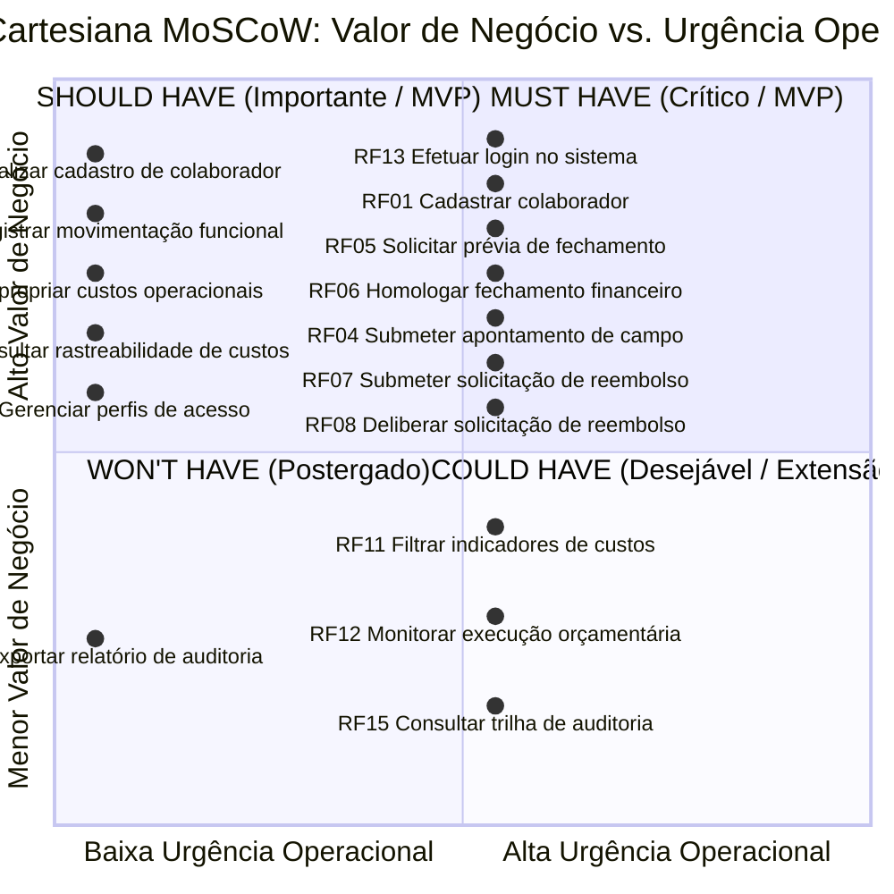

# Capítulo 8: Priorização de Requisitos e Definição do MVP

Este documento consolida a estratégia integrada de priorização do sistema **DUOC Finance**, articulando os **Requisitos Funcionais (RF)** por critérios objetivos de **Valor de Negócio** e **MoSCoW**, bem como a classificação e vinculação dos **Requisitos Não Funcionais (RNF)** ao escopo do **Produto Mínimo Viável (MVP)**.

A atribuição de notas, pesos e justificativas operacionais de negócio decorre de deliberação consensual realizada diretamente com a cliente parceira **Maria Beatryz Vieira de Sousa** (Sócia-Administradora da DUOC Arquitetura e Engenharia), formalizada na [Ata da Reunião 05 (24/09/2026)](../atas/reuniao-05.md).

---

# PARTE I — PRIORIZAÇÃO DE REQUISITOS FUNCIONAIS (VALOR DE NEGÓCIO E MoSCoW)

## 8.1 Introdução e Contexto Estratégico

A Engenharia de Requisitos orientada ao valor assegura que os esforços de modelagem, prototipação ágil (UI-First) e construção de software concentrem-se prioritariamente nas funcionalidades que geram o mais alto retorno operacional e mitigam os maiores riscos institucionais da organização parceira.

No cenário da **DUOC Arquitetura e Engenharia**, a gestão de campo e a conciliação financeiro-administrativa enfrentam gargalos crônicos decorrentes da fragmentação de planilhas eletrônicas e da troca descentralizada de mensagens via WhatsApp (conforme diagnosticado no [Diagrama de Ishikawa](../visao-produto/capitulo-1/index.md#diagrama-de-causa-e-efeito-ishikawa) e nos [Fluxos Transacionais TR-01 a TR-04](../visao-produto/capitulo-1/index.md#estrutura-detalhada-das-transacoes)).

A priorização dos requisitos conecta-se diretamente aos quatro **Objetivos Específicos (OE)** do projeto:

- **OE1 — Padronizar e Unificar os Dados:** Centralização cadastral de colaboradores CLT e diaristas de campo, viabilizando o apontamento digital estruturado via RVT.
- **OE2 — Aumentar a Eficiência Administrativo-Financeira:** Automação da apuração de diárias técnicas e fluxos ágeis de prestação de contas com comprovantes fiscais digitalizados.
- **OE3 — Transparecer as Informações sobre Custos por Contrato:** Apropriação clara de despesas e mão de obra por obra e centro de custo.
- **OE4 — Garantir Segurança e Governança de Dados:** Autenticação corporativa, controle de acesso baseado em papéis (RBAC) e rastreabilidade probatória.

---

## 8.2 Metodologia de Avaliação e Critérios de Valor de Negócio

Para transformar a percepção empírica de valor em uma métrica auditável e reprodutível, a equipe **Cascata Ágil** combinou a consagrada técnica **MoSCoW** (*Must have*, *Should have*, *Could have*, *Won't have*) a uma **escala quantitativa ordinal de 1 a 4**, balizada por critérios qualitativos e quantitativos de impacto no negócio da DUOC.

### 8.2.1 Escala Quantitativa de Valor de Negócio e Associação ao MoSCoW

| Pontuação | Classificação MoSCoW | Significado Operacional e Impacto no Negócio | Diretriz para o MVP |
| :---: | :---: | :--- | :--- |
| **4** | **Must have** *(Mandatório / Crítico)* | **Indispensável à operação:** Sem esta funcionalidade, o sistema torna-se operacionalmente inviável ou juridicamente vulnerável. Sua ausência paralisa o processo central (apontamento em obra ou fechamento financeiro) e impede a substituição das planilhas legadas. | **Inclusão obrigatória no MVP.** Bloqueante para entrada em produção. |
| **3** | **Should have** *(Importante / Alta Prioridade)* | **Alto valor agregado:** Resolve atritos operacionais severos ou automatiza etapas de suporte direto ao fluxo principal. Possui alternativa de contorno manual aceitável apenas a curtíssimo prazo, sendo essencial para a sustentabilidade da rotina de trabalho. | **Inclusão prioritária no MVP** ou no incremento imediatamente subsequente. |
| **2** | **Could have** *(Desejável / Média Prioridade)* | **Conveniência e sofisticação analítica:** Funcionalidade benéfica que melhora a experiência do usuário ou oferece visões analíticas avançadas, mas cuja ausência não degrada a execução dos fluxos financeiros e cadastrais essenciais. | **Inclusão condicionada à capacidade residual** do cronograma (Incremento 3). |
| **1** | **Won't have (neste momento)** *(Baixa Prioridade / Futuro)* | **Evolução postergada:** Requisito reconhecido como valoroso para a maturidade corporativa, mas expressamente excluído do escopo do MVP por exigir integrações complexas ou por não ser urgente frente às dores imediatas. | **Fora do MVP.** Registrado formalmente no roadmap pós-implantação (Release 2.0). |

### 8.2.2 Critérios Qualitativos de Negócio

1. **Mitigação de Riscos Trabalhistas e Fiscais:** Requisitos que evitam pagamentos indevidos a colaboradores afastados ou desligados (RN04), asseguram a obrigatoriedade de notas fiscais digitalizadas (RN06) e garantem a retenção auditável de registros conforme o Artigo 11 da CLT (RN19).
2. **Eliminação do Retrabalho e Integridade da Informação:** Substituição definitiva da digitação redundante de planilhas por uma base unificada, estabelecendo uma fonte única da verdade para dados de colaboradores e diárias.
3. **Autonomia Operacional das Equipes:** Descentralização da coleta de dados por meio do apontamento direto pelo colaborador ou encarregado em campo, desonerando a administração central de cobrar comprovantes via mensagens instantâneas.
4. **Segregação de Funções e Privacidade (LGPD):** Proteção do sigilo de remunerações e dados sensíveis bancários, garantindo que colaboradores de campo não visualizem dados estratégicos da diretoria (RN14, RN16).

### 8.2.3 Critérios Quantitativos de Negócio

1. **Volume Transacional Impactado:** Frequência de uso do requisito (diário para apontamentos e reembolsos; quinzenal/mensal para fechamento financeiro de dezenas de contratos ativos e prestadores de serviço).
2. **Economia de Horas Administrativas (H/mês):** Estimativa da redução de horas gastas pela sócia-administradora e assistente administrativa na conferência manual de recibos e preenchimento de tabelas (estimada em mais de 30 horas mensais no fechamento).
3. **Prevenção de Perdas Monetárias:** Eliminação de pagamentos duplicados, arredondamentos imprecisos em cálculos de comissões/diárias e concessão de reembolsos sem documento fiscal correspondente (tolerância zero a desvios, RNF06).
4. **Redução do Tempo de Ciclo:** Encurtamento do intervalo entre a execução do serviço em campo e a disponibilização do extrato de conferência supervisionada (de até 5 dias úteis de espera manual para processamento instantâneo, RNF05).

---

## 8.3 Diagrama Cartesiano de Priorização (Plano de 4 Quadrantes)

A priorização dos 16 requisitos funcionais é representada visualmente no **Plano Cartesiano de Valor vs. Urgência**, estruturado sobre dois eixos analíticos complementares:

- **Eixo Vertical (Y) — Valor de Negócio:** Mensura o retorno estratégico, conformidade jurídica e impacto na receita/custos (escala de 1 a 4).
- **Eixo Horizontal (X) — Urgência Operacional / Criticidade no MVP:** Mensura a premência de implantação para estancar dores imediatas e viabilizar os fluxos diários da empresa.

### 8.3.1 Gráfico Cartesiano de Priorização (Mermaid)

### 8.3.2 Distribuição dos Requisitos nos 4 Quadrantes Cartesianos

-   :material-star-box:{ .lg .middle style="color: #10b981;" } **Quadrante I — Must Have (Alto Valor, Alta Urgência)**

    ---
    **Foco:** Núcleo inegociável do Produto Mínimo Viável (MVP). Ações críticas sem as quais a empresa não opera.

    *   **RF01:** Cadastrar colaborador *(OE1 / CAR-01)*
    *   **RF04:** Submeter apontamento de campo *(OE1 / CAR-02)*
    *   **RF05:** Solicitar prévia de fechamento *(OE2 / CAR-03)*
    *   **RF06:** Homologar fechamento financeiro *(OE2 / CAR-03)*
    *   **RF07:** Submeter solicitação de reembolso *(OE2 / CAR-04)*
    *   **RF08:** Deliberar solicitação de reembolso *(OE2 / CAR-04)*
    *   **RF13:** Efetuar login no sistema *(OE4 / CAR-07)*

-   :material-check-decagram:{ .lg .middle style="color: #3b82f6;" } **Quadrante II — Should Have (Alto Valor, Menor Urgência)**

    ---
    **Foco:** Requisitos estruturantes que dão sustentabilidade e autonomia operacional à equipe da DUOC no MVP.

    *   **RF02:** Atualizar cadastro de colaborador *(OE1 / CAR-01)*
    *   **RF03:** Registrar movimentação funcional *(OE1 / CAR-01)*
    *   **RF09:** Apropriar custos operacionais *(OE3 / CAR-05)*
    *   **RF10:** Consultar rastreabilidade de custos *(OE3 / CAR-05)*
    *   **RF14:** Gerenciar perfis de acesso *(OE4 / CAR-07)*

-   :material-clock-outline:{ .lg .middle style="color: #f59e0b;" } **Quadrante IV — Could Have (Médio Valor, Moderada Urgência)**

    ---
    **Foco:** Recursos analíticos avançados e conveniência gerencial. Extensões programadas para o Incremento 3.

    *   **RF11:** Filtrar indicadores de custos *(OE3 / CAR-06)*
    *   **RF12:** Monitorar execução orçamentária *(OE3 / CAR-06)*
    *   **RF15:** Consultar trilha de auditoria *(OE4 / CAR-08)*

-   :material-close-octagon-outline:{ .lg .middle style="color: #94a3b8;" } **Quadrante III — Won't Have (Menor Valor Imediato, Baixa Urgência)**

    ---
    **Foco:** Funcionalidades de conformidade preventiva de longo prazo, postergadas para versões pós-MVP.

    *   **RF16:** Exportar relatório de auditoria *(OE4 / CAR-08)*  
        *(Previsão de desenvolvimento: Release 2.0)*

---

## 8.4 Detalhamento dos Requisitos por Categoria MoSCoW

### 8.4.1 Categoria Must Have — Mandatório (Nota 4 | 7 Requisitos)

| Código | Requisito Funcional (Ação do Usuário) | Módulo / OE | CAR | Nota | Justificativa de Negócio e Impacto Operacional | Escopo MVP |
| :---: | :--- | :---: | :---: | :---: | :--- | :---: |
| **RF01** | **Cadastrar colaborador** | Módulo 1 (OE1) | CAR-01 | **4** | **Base fundacional do sistema.** Sem o cadastro formal de colaboradores (pessoais, trabalhistas e bancários), nenhum apontamento, diária ou reembolso pode ser lançado ou quitado. A validação de CPF único (RN01) elimina a ocorrência de homônimos e registros duplicados nas planilhas. | **Dentro do MVP** |
| **RF04** | **Submeter apontamento de campo** | Módulo 1 (OE1) | CAR-02 | **4** | **Coração da coleta operacional.** Substitui o preenchimento manual em papel e fotos dispersas de ordens de serviço no WhatsApp pelo Relatório de Viagem Técnica (RVT) digital com fotos e comprovantes. Garante a matéria-prima para o cálculo de diárias. | **Dentro do MVP** |
| **RF05** | **Solicitar prévia de fechamento** | Módulo 2 (OE2) | CAR-03 | **4** | **Maior gargalo administrativo estancado.** Automatiza a consolidação de centenas de horas técnicas e diárias homologadas em um extrato preliminar. Elimina mais de 30 horas mensais gastas pela gestão conferindo fórmulas manuais em planilhas Excel. | **Dentro do MVP** |
| **RF06** | **Homologar fechamento financeiro** | Módulo 2 (OE2) | CAR-03 | **4** | **Confiabilidade e imutabilidade contábil.** Formaliza a aprovação da competência pela sócia-administradora, bloqueando o lote contra alterações retroativas (RN08). Garante segurança jurídica antes do repasse financeiro de pagamentos. | **Dentro do MVP** |
| **RF07** | **Submeter solicitação de reembolso** | Módulo 2 (OE2) | CAR-04 | **4** | **Fim da perda crônica de notas físicas.** Viagens a obras no entorno do DF resultavam em perda recorrente de comprovantes fiscais em papel. A obrigatoriedade do comprovante digitalizado vinculado a contrato ativo (RN06, RN09) previne prejuízos imediatos. | **Dentro do MVP** |
| **RF08** | **Deliberar solicitação de reembolso** | Módulo 2 (OE2) | CAR-04 | **4** | **Governança e controle de despesas.** Permite à coordenação técnica aprovar ou reprovar despesas de viagem com parecer obrigatório antes do desembolso, evitando pagamentos de notas indevidas ou fora da alçada contratual. | **Dentro do MVP** |
| **RF13** | **Efetuar login no sistema** | Módulo 4 (OE4) | CAR-07 | **4** | **Segurança da informação e LGPD.** Condição *sine qua non* para operação corporativa. Protege dados bancários e valores de faturamento contra acessos não autorizados por meio de autenticação segura e tokens de sessão (RN15). | **Dentro do MVP** |

---

### 8.4.2 Categoria Should Have — Importante (Nota 3 | 5 Requisitos)

| Código | Requisito Funcional (Ação do Usuário) | Módulo / OE | CAR | Nota | Justificativa de Negócio e Impacto Operacional | Escopo MVP |
| :---: | :--- | :---: | :---: | :---: | :--- | :---: |
| **RF02** | **Atualizar cadastro de colaborador** | Módulo 1 (OE1) | CAR-01 | **3** | **Sustentabilidade operacional contínua.** Alterações de chaves Pix, contas bancárias e dados de contato ocorrem com alta frequência na DUOC. A interface de edição garante que a própria cliente atualize esses dados sem depender de intervenções manuais de programadores. | **Dentro do MVP** |
| **RF03** | **Registrar movimentação funcional** | Módulo 1 (OE1) | CAR-01 | **3** | **Mitigação de risco trabalhista e bloqueio de segurança.** O registro tempestivo de afastamentos e rescisões revoga automaticamente tokens de acesso ao app (RN04) e impede que colaboradores desligados recebam diárias indevidas (RN03). | **Dentro do MVP** |
| **RF09** | **Apropriar custos operacionais** | Módulo 3 (OE3) | CAR-05 | **3** | **Inteligência financeira por projeto.** Vincula o montante consolidado de diárias e reembolsos homologados diretamente ao contrato de cada obra atendida (RN10, RN11). Permite à diretoria enxergar a margem de contribuição real de cada cliente. | **Dentro do MVP** |
| **RF10** | **Consultar rastreabilidade de custos** | Módulo 3 (OE3) | CAR-05 | **3** | **Transparência e resolução de atritos contratuais.** Permite inspecionar a origem de cada custo debitado a um contrato (executor, data, homologador). Facilita a prestação de contas com contratantes corporativos da DUOC. | **Dentro do MVP** |
| **RF14** | **Gerenciar perfis de acesso** | Módulo 4 (OE4) | CAR-07 | **3** | **Autonomia de governança (RBAC).** Assegura que colaboradores de campo tenham acesso estrito às suas ordens de trabalho, enquanto gestores manipulam dados financeiros (RN16). Permite à administração da DUOC configurar permissões sem suporte de TI. | **Dentro do MVP** |

---

### 8.4.3 Categoria Could Have — Desejável (Nota 2 | 3 Requisitos)

| Código | Requisito Funcional (Ação do Usuário) | Módulo / OE | CAR | Nota | Justificativa de Negócio e Impacto Operacional | Escopo MVP |
| :---: | :--- | :---: | :---: | :---: | :--- | :---: |
| **RF11** | **Filtrar indicadores de custos** | Módulo 3 (OE3) | CAR-06 | **2** | **Conveniência analítica para tomadores de decisão.** A aplicação de múltiplos filtros combinados (período, contrato, colaborador, centro de custos) agiliza o diagnóstico gerencial. No entanto, relatórios estáticos consolidados já atendem à rotina inicial do negócio. | **Extensão (Incr. 3)** |
| **RF12** | **Monitorar execução orçamentária** | Módulo 3 (OE3) | CAR-06 | **2** | **Gestão preventiva de desvios orçamentários.** Apresenta percentuais de execução e alertas visuais de estouro de orçamento (RN13). É altamente valorizada pela gestora para o médio prazo, mas secundária em relação ao cálculo exato do valor a pagar aos diaristas. | **Extensão (Incr. 3)** |
| **RF15** | **Consultar trilha de auditoria** | Módulo 4 (OE4) | CAR-08 | **2** | **Auditoria visual em tela.** A gravação atômica dos logs no banco de dados é obrigatória por requisito de segurança (RN17, RN18). Contudo, a interface gráfica com filtros de pesquisa para o usuário pode ser entregue posteriormente, já que incidentes iniciais podem ser auditados no banco. | **Pós-MVP Imediato** |

---

### 8.4.4 Categoria Won't Have — Postergado (Nota 1 | 1 Requisito)

| Código | Requisito Funcional (Ação do Usuário) | Módulo / OE | CAR | Nota | Justificativa de Negócio e Impacto Operacional | Previsão de Entrega |
| :---: | :--- | :---: | :---: | :---: | :--- | :---: |
| **RF16** | **Exportar relatório de auditoria** | Módulo 4 (OE4) | CAR-08 | **1** | **Demanda esporádica e preventiva.** A geração e exportação de dossiê consolidado e auditável em PDF/CSV para fins de fiscalização trabalhista (CLT Artigo 11 / RN19) é necessária apenas em eventuais diligências formais. A cliente acordou que extrações manuais assistidas pela equipe de TI atendem à fase piloto, liberando o time para focar nas diárias de campo. | **Release 2.0 (Pós-MVP)** |

---

## 8.5 Tabela-Síntese Consolidada de Avaliação de Valor de Negócio (RFs)

| Código | Requisito Funcional | OE | CAR | Nota | MoSCoW | Impacto Central no Negócio da DUOC | Escopo MVP |
| :---: | :--- | :---: | :---: | :---: | :---: | :--- | :---: |
| **RF01** | **Cadastrar colaborador** | OE1 | CAR-01 | **4** | Must have | Cria a base unificada de pessoal com validação de CPF e contas bancárias. | **No MVP** |
| **RF04** | **Submeter apontamento de campo** | OE1 | CAR-02 | **4** | Must have | Digitaliza o RVT no canteiro de obras com upload de fotos e horas trabalhadas. | **No MVP** |
| **RF05** | **Solicitar prévia de fechamento** | OE2 | CAR-03 | **4** | Must have | Consolida horas de campo em extrato supervisionado de diárias e comissões. | **No MVP** |
| **RF06** | **Homologar fechamento financeiro** | OE2 | CAR-03 | **4** | Must have | Trava o lote financeiro contra alterações retroativas, garantindo imutabilidade. | **No MVP** |
| **RF07** | **Submeter solicitação de reembolso** | OE2 | CAR-04 | **4** | Must have | Exige cupom fiscal digitalizado em compras de viagem vinculadas a contratos. | **No MVP** |
| **RF08** | **Deliberar solicitação de reembolso** | OE2 | CAR-04 | **4** | Must have | Estabelece fluxo de aprovação com parecer prévio para desembolsos operacionais. | **No MVP** |
| **RF13** | **Efetuar login no sistema** | OE4 | CAR-07 | **4** | Must have | Garante autenticação corporativa, emissão de tokens e proteção legal (LGPD). | **No MVP** |
| **RF02** | **Atualizar cadastro de colaborador** | OE1 | CAR-01 | **3** | Should have | Confere autonomia à cliente para retificar dados bancários e contatos sem TI. | **No MVP** |
| **RF03** | **Registrar movimentação funcional** | OE1 | CAR-01 | **3** | Should have | Revoga credenciais em rescisões e impede geração indevida de pagamentos. | **No MVP** |
| **RF09** | **Apropriar custos operacionais** | OE3 | CAR-05 | **3** | Should have | Aloca despesas e mão de obra diretamente aos contratos ativos da DUOC. | **No MVP** |
| **RF10** | **Consultar rastreabilidade de custos** | OE3 | CAR-05 | **3** | Should have | Evidencia a trilha completa de origem de cada custo debitado a uma obra. | **No MVP** |
| **RF14** | **Gerenciar perfis de acesso** | OE4 | CAR-07 | **3** | Should have | Segrega visualizações conforme alçadas (campo, gestão e administração). | **No MVP** |
| **RF11** | **Filtrar indicadores de custos** | OE3 | CAR-06 | **2** | Could have | Refina gráficos analíticos por filtros customizados de centro de custo. | **Extensão (Incr. 3)** |
| **RF12** | **Monitorar execução orçamentária** | OE3 | CAR-06 | **2** | Could have | Alerta visualmente desvios orçamentários entre previsto e realizado. | **Extensão (Incr. 3)** |
| **RF15** | **Consultar trilha de auditoria** | OE4 | CAR-08 | **2** | Could have | Permite pesquisar visualmente registros de logs de auditoria na interface. | **Pós-MVP** |
| **RF16** | **Exportar relatório de auditoria** | OE4 | CAR-08 | **1** | Won't have | Emite dossiês formais para conformidade trabalhista (Artigo 11 da CLT). | **Release 2.0** |

### 8.5.1 Distribuição Quantitativa e Regra 60-20-20

| Classificação MoSCoW | Nota | Quantidade de RFs | Proporção (%) | Requisitos Contemplados |
| :--- | :---: | :---: | :---: | :--- |
| **Must have (Mandatório)** | 4 | 7 | 43,75% | RF01, RF04, RF05, RF06, RF07, RF08, RF13 |
| **Should have (Importante)** | 3 | 5 | 31,25% | RF02, RF03, RF09, RF10, RF14 |
| **Could have (Desejável)** | 2 | 3 | 18,75% | RF11, RF12, RF15 |
| **Won't have (Postergado)** | 1 | 1 | 6,25% | RF16 |
| **Total Geral** | — | **16** | **100,00%** | **Todos os 16 RFs especificados** |

---

# PARTE II — CLASSIFICAÇÃO E VINCULAÇÃO DOS REQUISITOS NÃO FUNCIONAIS (RNF) AO MVP

Este segmento registra a classificação dos **Requisitos Não Funcionais (RNF)** do sistema **DUOC Finance** em relação ao escopo do Produto Mínimo Viável (MVP). O objetivo é garantir que os atributos de qualidade indispensáveis (segurança da informação, conformidade com a LGPD, exatidão financeira e desempenho) acompanhem a primeira entrega à **DUOC Arquitetura e Engenharia**, e não fiquem para depois das funcionalidades.

Os RNFs classificados são os especificados no [Capítulo 8: Requisitos de Software](index.md) (RNF01 a RNF16). O recorte do MVP segue a [Delimitação do Escopo do MVP](../visao-produto/capitulo-2/index.md#26-viabilidade-da-proposta-analise-do-mvp) do Capítulo 2.

---

## 8.6 Recorte Funcional de Referência do MVP

Para classificar um RNF como associado ao MVP, é preciso saber quais Requisitos Funcionais (RF) estão no MVP. O recorte abaixo aplica a delimitação do Capítulo 2.6 (cadastro e RBAC, RVT com reembolso, motor de cálculo de diárias e comissões, apropriação de custos por contrato, visualização tabular de custo por contrato e registro básico de auditoria) aos RFs especificados.

| Situação | Requisitos Funcionais | Fundamentação no Escopo do MVP |
| :--- | :--- | :--- |
| **No MVP** | RF01, RF02, RF03, RF04 | Cadastro centralizado de pessoal e apontamento de campo (RVT), base para todos os fluxos financeiros. |
| **No MVP** | RF05, RF06, RF07, RF08 | Motor de apoio ao cálculo de diárias e comissões simplificadas e fluxo de reembolso incluído no RVT. |
| **No MVP** | RF09, RF10 | Apropriação dos custos ao contrato e visualização tabular direta do custo apurado, com a origem de cada lançamento. |
| **No MVP** | RF13, RF14, RF15 | Controle de acesso por perfis fixos (RBAC) e registro básico de auditoria para conformidade com a LGPD. |
| **Fora do MVP** | RF11, RF12 | Filtros dinâmicos e monitoramento orçamentário compõem um painel de *business intelligence*, que o Capítulo 2.6 declara desnecessário no primeiro ciclo. |
| **Fora do MVP** | RF16 | A exportação do dossiê de auditoria vai além do "registro básico de auditoria" previsto para o MVP. |

---

## 8.7 Categorias de Classificação dos RNFs

Cada RNF recebe exatamente uma das quatro categorias oficiais abaixo.

| Categoria | Definição Operacional | Consequência para a Entrega |
| :--- | :--- | :--- |
| **Obrigatório para o MVP** | Atributo transversal de segurança, privacidade ou conformidade legal que vale para o sistema inteiro, independentemente de qual RF está em uso. | Entra no MVP sem negociação. Sem ele, não há publicação em produção com dados reais. |
| **Associado a RF do MVP** | Atributo de qualidade de um RF específico que está no MVP. | Entra no MVP junto com o RF. O RF só é considerado pronto quando o critério mensurável do RNF é atendido. |
| **Evolutivo** | Atributo pertinente ao produto, mas ligado a um RF fora do MVP ou dependente de infraestrutura prevista para ciclos seguintes. | Permanece no backlog e é reavaliado a cada incremento do RAD. |
| **Não Aplicável** | Atributo sem relação com o escopo do produto (por exemplo, módulos excluídos como estoque, cronogramas de obra ou composições SINAPI). | Não é implementado nem testado no projeto. |

---

## 8.8 Tabela de Classificação e Vinculação dos RNFs do MVP

| Código | Requisito Não Funcional | URPS+ | OE | RFs Vinculados | Categoria | Justificativa |
| :---: | :--- | :--- | :---: | :--- | :--- | :--- |
| **RNF01** | Operar em modo *offline* para coleta de dados em canteiros sem conectividade | Reliability | OE1 | RF04 | **Evolutivo** | Exige arquitetura com armazenamento local no dispositivo e fila de sincronização, de maior complexidade técnica. Para o MVP, a cobertura 4G/Wi-Fi nas obras da DUOC no DF atende à validação do fluxo; o suporte a áreas sem sinal fica para o ciclo de campo ampliado. |
| **RNF02** | Disponibilizar consulta cadastral com tempo de resposta ágil | Performance | OE1 | RF01, RF02, RF03 | **Associado a RF do MVP** | A busca de colaboradores é operação de rotina em quase todas as telas do sistema. O teto de 2,0 s com carga nominal evita que a aplicação replique a lentidão das planilhas compartilhadas. |
| **RNF03** | Proteger dados pessoais e cadastrais com criptografia em repouso e em trânsito | Security (+) | OE1 | Transversal (todos os RFs do MVP) | **Obrigatório para o MVP** | Medida técnica de segurança exigida pela LGPD (Art. 46) e condição de aceite do Capítulo 2.6 para qualquer publicação com dados reais. |
| **RNF04** | Garantir usabilidade e agilidade no preenchimento de apontamentos de campo | Usability | OE1 | RF04 | **Associado a RF do MVP** | O apontamento é a porta de entrada dos dados de custo. Se o preenchimento for lento ou confuso para o técnico de campo, os dados não chegam ao fechamento. A interface *mobile-first* do MVP é validada com esse critério. |
| **RNF05** | Processar a rotina de fechamento financeiro com alta eficiência | Performance | OE2 | RF05, RF06 | **Associado a RF do MVP** | O fechamento é o fluxo de maior valor para o financeiro. A meta de ≤ 5,0 s para 500 apontamentos mede o ganho de eficiência prometido no OE2. |
| **RNF06** | Garantir exatidão aritmética centesimal em cálculos monetários | Reliability | OE2 | RF05, RF06, RF08 | **Associado a RF do MVP** | Diárias, comissões e reembolsos envolvem pagamentos reais a pessoas. Uma discrepância de centavos compromete a confiança da cliente no motor financeiro, por isso a tolerância é zero. |
| **RNF07** | Validar integridade, tamanho e formatos no upload de comprovantes | Supportability / Security (+) | OE2 | RF04, RF07 | **Associado a RF do MVP** | O comprovante fiscal é obrigatório no reembolso (RN06) e as fotos acompanham o apontamento. A validação de formato e tamanho protege o armazenamento e a legibilidade da prova documental. |
| **RNF08** | Exigir justificativa textual mandatória e auditoria em estornos de fechamento | Security (+) | OE2 | RF06 | **Associado a RF do MVP** | Garante que a imutabilidade dos lotes homologados (RN08) só seja quebrada com justificativa auditável, o que preserva a rastreabilidade do fechamento. |
| **RNF09** | Carregar o painel analítico em tempo inferior a 3 segundos | Performance | OE3 | RF11, RF12 | **Evolutivo** | O painel analítico com filtros dinâmicos e indicadores orçamentários está fora do MVP. A consulta de custo por contrato no MVP é tabular (RF10). O critério volta a valer quando RF11 e RF12 entrarem no backlog ativo. |
| **RNF10** | Restringir dados financeiros analíticos conforme perfil de acesso | Security (+) | OE3 | RF05, RF06, RF09, RF10 | **Obrigatório para o MVP** | Dados salariais e valores de diárias são pessoais e confidenciais (RN14). Qualquer tela do MVP que exponha valores financeiros deve bloquear perfis sem alçada, o que torna o atributo transversal, e não restrito ao painel. |
| **RNF11** | Garantir consistência transacional ACID na apropriação concorrente de custos | Reliability | OE3 | RF09 | **Associado a RF do MVP** | A apropriação é o elo entre o fechamento e o custo por contrato. Duplicidades ou divergências por concorrência invalidariam a informação entregue à diretoria. |
| **RNF12** | Assegurar responsividade do painel em resoluções de *desktop* e *tablet* | Usability | OE3 | RF11, RF12 | **Evolutivo** | O critério mensurável refere-se ao painel analítico, que está fora do MVP. As telas do MVP seguem o padrão *mobile-first* do Tailwind CSS definido na stack, sem meta formal própria neste ciclo. |
| **RNF13** | Expirar token de acesso temporário em no máximo 8 horas | Security (+) | OE4 | RF13 | **Obrigatório para o MVP** | Limita a janela de uso indevido de sessões, principalmente em dispositivos compartilhados em campo. É requisito mínimo da autenticação do MVP. |
| **RNF14** | Validar perfil de autorização em 100% das rotas de API com dados sensíveis | Security (+) / Legal (LGPD) | OE4 | RF13, RF14 (transversal às rotas do MVP) | **Obrigatório para o MVP** | Implementa o princípio do menor privilégio (RN16) e o isolamento de dados pessoais exigido pela LGPD. Sem ele, o RBAC do MVP ficaria restrito à interface e não protegeria a API. |
| **RNF15** | Garantir atomicidade transacional na gravação de logs de auditoria | Reliability | OE4 | RF15 (transversal às operações de escrita do MVP) | **Obrigatório para o MVP** | O registro básico de auditoria só tem valor probatório se nenhuma operação sobre dados pessoais ou financeiros deixar de ser registrada (RN17). Atende ao princípio de responsabilização e prestação de contas da LGPD. |
| **RNF16** | Reter registros de auditoria por no mínimo 5 anos contra expurgo indevido | Supportability / Legal | OE4 | RF15 | **Obrigatório para o MVP** | Obrigação legal decorrente do prazo prescricional trabalhista (Art. 11 da CLT). Mesmo sem completar 5 anos no semestre, o critério é verificável no MVP por análise estática da ausência de rotinas de expurgo (RN18 e RN19). |

---

## 8.9 Síntese da Classificação dos RNFs

### 8.9.1 Distribuição por Categoria

| Categoria | Quantidade | RNFs |
| :--- | :---: | :--- |
| **Obrigatório para o MVP** | 6 | RNF03, RNF10, RNF13, RNF14, RNF15, RNF16 |
| **Associado a RF do MVP** | 7 | RNF02, RNF04, RNF05, RNF06, RNF07, RNF08, RNF11 |
| **Evolutivo** | 3 | RNF01, RNF09, RNF12 |
| **Não Aplicável** | 0 | — |
| **Total** | **16** | 13 no escopo do MVP (81,25%) e 3 evolutivos (18,75%) |

### 8.9.2 Distribuição por Objetivo Específico

| Objetivo Específico | Obrigatório | Associado a RF do MVP | Evolutivo |
| :--- | :---: | :---: | :---: |
| [**OE1 — Padronização e Unificação de Dados**](index.md#oe1) | RNF03 | RNF02, RNF04 | RNF01 |
| [**OE2 — Eficiência Administrativo-Financeira**](index.md#oe2) | — | RNF05, RNF06, RNF07, RNF08 | — |
| [**OE3 — Inteligência de Custos por Contrato**](index.md#oe3) | RNF10 | RNF11 | RNF09, RNF12 |
| [**OE4 — Governança, Segurança e Rastreabilidade**](index.md#oe4) | RNF13, RNF14, RNF15, RNF16 | — | — |

---

## Histórico de Versão

| Versão | Data | Descrição | Autor(es) | Revisor(es) |
| :---: | :---: | :--- | :--- | :--- |
| `1.0` | 24/09/2026 | Estruturação da metodologia de valor de negócio dos RFs (escala 1 a 4 associada ao MoSCoW), tabela de pontuação dos 16 RFs e delimitação formal do MVP pactuada na Reunião 05 com a cliente Maria Beatryz. | Matheus Ribeiro Szervinsk e Eric Araújo | Lucas Zanetti e Giovana Ferreira |
| `1.1` | 25/09/2026 | Refatoração estrutural da priorização: desmembramento do MoSCoW em seções exclusivas com tabelas dedicadas por categoria (Must, Should, Could e Won't), inclusão de diagrama cartesiano ampliado de 4 quadrantes (quadrantChart) com escala espacial otimizada para evitar cortes de texto e mapeamento de todos os 16 RFs. | Matheus Ribeiro Szervinsk e Eric Araújo | Lucas Zanetti e Giovana Ferreira |
| `1.2` | 28/09/2026 | Incorporação da classificação e vinculação dos Requisitos Não Funcionais (RNF01 a RNF16) ao MVP com alinhamento ao recorte funcional do produto. | Paulo Nery | Matheus Ribeiro Szervinsk |
