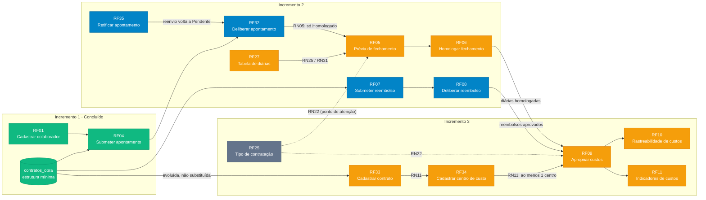
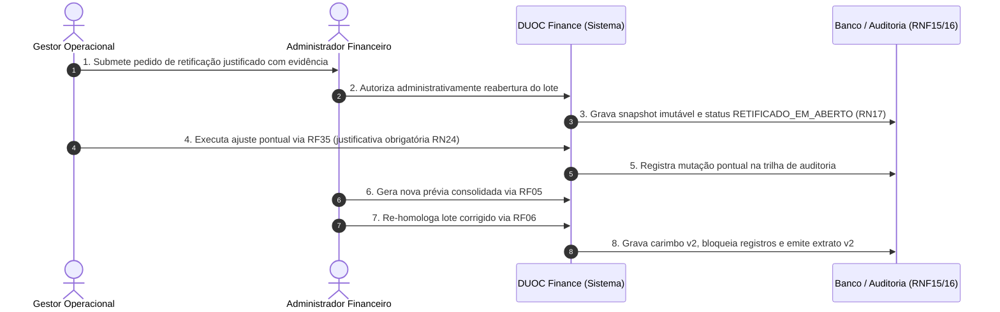

# Priorização e Escopo do Produto (Linha de Corte do MVP)

Este documento consolida o **modelo metodológico integrado de priorização e delimitação do escopo** do sistema ***DUOC Finance***. O método fundamenta-se no cruzamento analítico entre o **Valor de Negócio (VB)** e o **Esforço Técnico Consolidado (EC)**, orientando a linha de corte do **Produto Mínimo Viável (MVP)**. A ordem de execução dentro do MVP parte desse índice, mas o ajusta pelas dependências técnicas entre requisitos e pela formação de entregas utilizáveis a cada incremento, conforme detalhado em [Ordem de Execução](#ordem-de-execucao).

<div class="stats-grid">
  <div class="stat-card stat-accent">
    <span class="stat-num">31 <small>/ 40</small></span>
    <span class="stat-label">Requisitos Funcionais no MVP (77,5%)</span>
  </div>
  <div class="stat-card">
    <span class="stat-num">18 <small>/ 20</small></span>
    <span class="stat-label">Requisitos Não Funcionais no MVP (90,0%)</span>
  </div>
  <div class="stat-card">
    <span class="stat-num">270 <small>horas</small></span>
    <span class="stat-label">Capacidade Líquida (Demanda: 266,5 h)</span>
  </div>
  <div class="stat-card stat-warn">
    <span class="stat-num">9 <small>RFs</small></span>
    <span class="stat-label">Backlog Evolutivo Pós-MVP</span>
  </div>
</div>

---

## O fluxo que precisa funcionar de ponta a ponta

O recorte do MVP foi concebido para assegurar que o fluxo operacional central da DUOC Finance funcione integralmente de ponta a ponta desde a primeira versão em produção. Essas cinco atividades são a espinha dorsal do backlog: a distribuição das histórias de cada atividade por perfil e por incremento está em [Organização do Backlog](#organizacao-do-backlog-por-jornada).

<div class="journey-list">
  <div class="journey-item">
    <div class="journey-dot">1</div>
    <h4 class="journey-title">Cadastro e Identificação</h4>
    <p class="journey-desc">Base cadastral única e validada de colaboradores, dados bancários e funções técnicas de campo.</p>
    <div class="journey-reqs">
      <a href="../#rf01" class="req-tag req-tag-rf"># RF01</a>
      <a href="../#rf02" class="req-tag req-tag-rf"># RF02</a>
      <a href="../#rf03" class="req-tag req-tag-rf"># RF03</a>
      <a href="../#rf25" class="req-tag req-tag-rf"># RF25</a>
      <a href="../#rf26" class="req-tag req-tag-rf"># RF26</a>
    </div>
  </div>

  <div class="journey-item">
    <div class="journey-dot">2</div>
    <h4 class="journey-title">Apontamento em Campo</h4>
    <p class="journey-desc">Registro digital de horas trabalhadas em canteiros com GPS, fotos de evidência e retificações.</p>
    <div class="journey-reqs">
      <a href="../#rf04" class="req-tag req-tag-rf"># RF04</a>
      <a href="../#rf19" class="req-tag req-tag-rf"># RF19</a>
      <a href="../#rf22" class="req-tag req-tag-rf"># RF22</a>
      <a href="../#rf32" class="req-tag req-tag-rf"># RF32</a>
      <a href="../#rf35" class="req-tag req-tag-rf"># RF35</a>
    </div>
  </div>

  <div class="journey-item">
    <div class="journey-dot">3</div>
    <h4 class="journey-title">Fechamento e Reembolsos</h4>
    <p class="journey-desc">Cálculo de diárias técnicas, prévias, deliberação de despesas e homologação bloqueada.</p>
    <div class="journey-reqs">
      <a href="../#rf05" class="req-tag req-tag-rf"># RF05</a>
      <a href="../#rf06" class="req-tag req-tag-rf"># RF06</a>
      <a href="../#rf07" class="req-tag req-tag-rf"># RF07</a>
      <a href="../#rf08" class="req-tag req-tag-rf"># RF08</a>
      <a href="../#rf27" class="req-tag req-tag-rf"># RF27</a>
      <a href="../#rf28" class="req-tag req-tag-rf"># RF28</a>
      <a href="../#rf29" class="req-tag req-tag-rf"># RF29</a>
    </div>
  </div>

  <div class="journey-item">
    <div class="journey-dot">4</div>
    <h4 class="journey-title">Apropriação por Obra</h4>
    <p class="journey-desc">Vinculação direta de custos e despesas aos contratos vigentes, garantindo rastreabilidade contábil.</p>
    <div class="journey-reqs">
      <a href="../#rf09" class="req-tag req-tag-rf"># RF09</a>
      <a href="../#rf10" class="req-tag req-tag-rf"># RF10</a>
      <a href="../#rf33" class="req-tag req-tag-rf"># RF33</a>
      <a href="../#rf37" class="req-tag req-tag-rf"># RF37</a>
      <a href="../#rf38" class="req-tag req-tag-rf"># RF38</a>
    </div>
  </div>

  <div class="journey-item">
    <div class="journey-dot">5</div>
    <h4 class="journey-title">Painel e Governança</h4>
    <p class="journey-desc">Visão de centros de custo, login seguro corporativo, autenticação RBAC e bloqueio de ataques.</p>
    <div class="journey-reqs">
      <a href="../#rf11" class="req-tag req-tag-rf"># RF11</a>
      <a href="../#rf34" class="req-tag req-tag-rf"># RF34</a>
      <a href="../#rf39" class="req-tag req-tag-rf"># RF39</a>
      <a href="../#rf40" class="req-tag req-tag-rf"># RF40</a>
      <a href="../#rf13" class="req-tag req-tag-rf"># RF13</a>
      <a href="../#rf14" class="req-tag req-tag-rf"># RF14</a>
      <a href="../#rf17" class="req-tag req-tag-rf"># RF17</a>
      <a href="../#rf18" class="req-tag req-tag-rf"># RF18</a>
      <a href="../#rf23" class="req-tag req-tag-rf"># RF23</a>
    </div>
  </div>
</div>

---

<a id="8-6-avaliacao-do-valor-de-negocio"></a>
<a id="101-avaliacao-do-valor-de-negocio"></a>
<a id="avaliacao-do-valor-de-negocio"></a>
<a id="criterios-qualitativos-de-negocio"></a>
<a id="criterios-quantitativos-de-negocio"></a>
<a id="rubrica-de-julgamento-do-valor-de-negocio"></a>
## Avaliação do Valor de Negócio

A Engenharia de Requisitos orientada ao valor assegura que os esforços de modelagem, prototipação ágil (*UI-First*) e implementação concentrem-se prioritariamente nas funcionalidades que geram o mais alto retorno operacional e mitigam os maiores riscos institucionais da organização parceira.

Navegue pelas abas abaixo para consultar as diretrizes metodológicas do julgamento de valor:

=== "Escala de Valor (1 a 4)"

    Para tornar a avaliação auditável e comparável, o valor de cada requisito é expresso em uma **escala quantitativa de 1 a 4**. Não há classificação categórica adicional: a priorização decorre exclusivamente do cruzamento **Valor de Negócio × Esforço Técnico** na Matriz 4 × 4.

    | Pontuação | Nível de Valor | Interpretação e Impacto no Negócio | Diretriz Operacional para o MVP |
    | :---: | :---: | :--- | :--- |
    | **4** | **Muito alto**<br>*(Crítico)* | **Indispensável:** sem esta funcionalidade, o sistema torna-se operacionalmente inviável ou juridicamente vulnerável. Sua ausência paralisa o processo central ou impede a substituição das rotinas manuais prioritárias. | **Inclusão obrigatória no MVP.** Bloqueante para a primeira versão operacional. |
    | **3** | **Alto**<br>*(Importante)* | **Muito importante:** resolve atritos operacionais severos ou automatiza etapas de suporte direto ao fluxo principal. O produto ainda pode operar temporariamente sem ela mediante contorno manual assistido a curtíssimo prazo. | **Inclusão prioritária no MVP** para garantir sustentabilidade da rotina de trabalho. |
    | **2** | **Moderado**<br>*(Desejável)* | **Agrega valor e conveniência:** melhora a experiência do usuário ou oferece recursos analíticos avançados, mas sua ausência não degrada a execução dos fluxos financeiros e cadastrais essenciais. | **Inclusão condicionada à capacidade residual** ou postergada para o ciclo seguinte. |
    | **1** | **Baixo**<br>*(Postergável)* | **Não prioritário para a versão atual:** requisito reconhecido como valoroso para a maturidade corporativa futura, mas postergado por não atender às dores imediatas ou possuir melhor alternativa temporária. | **Fora do MVP.** Registrado formalmente no *roadmap* pós-implantação. |

=== "Dimensões da Rubrica (D1 a D4)"

    As notas de 1 a 4 são atribuídas à luz de quatro dimensões de julgamento operacional. As faixas de economia de horas são calculadas sobre a base de referência de **mais de 30 h/mês** de conferência manual da auxiliar-administradora:

    | Dimensão de Julgamento | **Nota 4** — Valor muito alto | **Nota 3** — Valor alto | **Nota 2** — Valor moderado | **Nota 1** — Valor baixo |
    | :--- | :--- | :--- | :--- | :--- |
    | **D1 — Impacto nos gargalos TR-01 a TR-04** | Sem o requisito, ao menos um fluxo TR-01 a TR-04 não se completa ou não pode ser conferido. | Automatiza ou dá visibilidade a etapa de suporte direto a um TR; o TR ainda se completa com contorno assistido. | Oferece análise avançada ou comparativa (histórico, alertas, previsto × realizado) sobre dado de um TR já atendido. | Sem vínculo direto com um TR; contornável pela fase piloto. |
    | **D2 — Economia de horas administrativas** | ≥ 25% da economia mensal estimada (≈ 8 h/mês ou mais). | De 10% a 25% (≈ 3 a 8 h/mês). | Inferior a 10% (< 3 h/mês) ou ganho apenas indireto. | Sem economia mensurável no primeiro ciclo. |
    | **D3 — Risco jurídico-trabalhista, fiscal e LGPD** | Ausência gera exposição direta e imediata: reembolso sem comprovante fiscal (RN06), acesso sem autenticação a dados pessoais e bancários (RN15, RN16) ou lançamento financeiro sem base cadastral válida (RN01, RN03). | Controle preventivo ou de rastreabilidade que reduz a probabilidade ou o impacto do risco (ex.: RN04, RN14, RN23). | Risco indireto ou residual, com controle compensatório existente (ex.: gravação de logs pelo backend, RN19). | Risco tratável por suporte técnico pontual. |
    | **D4 — Frequência de operação** | Contínua: a cada apontamento, transação ou acesso, ou pré-requisito de todos os perfis. | Recorrente: por solicitação, por competência ou por evento de cadastro. | Ocasional: análise gerencial periódica ou política de manutenção. | Eventual ou de exceção. |

=== "Gargalos Operacionais (TR-01 a TR-04)"

    A priorização ancora-se diretamente nos gargalos mapeados no [Cenário Atual](../visao-produto/cenario-atual.md#diagrama-de-causa-e-efeito-ishikawa):

    | Gargalo | Fluxo Operacional na DUOC | Capacidades de Software Vinculadas | Nível de Valor Predominante |
    | :---: | :--- | :--- | :---: |
    | **TR-01** | Envio e homologação do Relatório de Viagem Técnica (RVT) | Coleta móvel, fotos de evidência, deliberação e consulta pelo diarista | **4 / 3** (Crítico) |
    | **TR-02** | Submissão e conferência de comprovantes de despesa | Prestação de contas digital, adiantamentos e validação de cupons fiscais | **4 / 3** (Crítico) |
    | **TR-03** | Consolidação de diárias técnicas e comissões | Prévia automatizada, cálculo centesimal e homologação irrevogável | **4 / 2** (Crítico) |
    | **TR-04** | Apropriação de custo por contrato e centro de custo | Vinculação direta de despesas a obras e painel orçamentário | **3 / 2** (Importante) |
    | **Transversal** | Base cadastral unificada, autenticação e auditoria probatória | Cadastro validado por CPF, perfis RBAC, logs append-only e retenção CLT | **4 a 1** (Fundacional) |

=== "Regras de Consolidação & MVP"

    **Regra de Consolidação:** A nota final é definida pelo **maior grau atingido entre D1 e D3** (fatores bloqueantes de processo ou de exposição de risco). As dimensões **D2 e D4** funcionam como critérios de ajuste: confirmam a nota ou podem deslocá-la em no máximo 1 ponto quando convergirem.
    
    A linha de corte do MVP decorre diretamente do eixo de Valor de Negócio: **requisitos de valor 4 ou 3 integram o MVP** e requisitos de **valor 2 ou 1 integram o backlog de evolução pós-MVP**. O esforço técnico não elimina requisitos de alto valor; orienta a decomposição arquitetural.

    ```mermaid
    flowchart LR
        subgraph NIVEIS["Distribuição dos 40 RFs do Backlog por Valor de Negócio"]
            direction TB
            V4["<b>VALOR 4 — Muito alto (Crítico)</b><br>10 RFs (25,0%) · RF01, RF04, RF05, RF06, RF07, RF08, RF13, RF19, RF27, RF32"]
            V3["<b>VALOR 3 — Alto (Importante)</b><br>21 RFs (52,5%) · RF02, RF03, RF09, RF10, RF11, RF14, RF17, RF18, RF22, RF23, RF25, RF26, RF28, RF29, RF33, RF34, RF35, RF37, RF38, RF39, RF40"]
            V2["<b>VALOR 2 — Moderado (Desejável)</b><br>8 RFs (20,0%) · RF12, RF15, RF20, RF21, RF24, RF30, RF31, RF36"]
            V1["<b>VALOR 1 — Baixo (Postergável)</b><br>1 RF (2,5%) · RF16"]
            V4 ~~~ V3
            V3 ~~~ V2
            V2 ~~~ V1
        end

        subgraph DEST["Linha de Corte e Destinação"]
            direction TB
            MVP["<b>PRODUTO MÍNIMO VIÁVEL (MVP)</b><br>31 RFs selecionados (77,5% do Backlog)<br>Núcleo operacional completo para a DUOC"]
            POST["<b>BACKLOG DE EVOLUÇÃO PÓS-MVP</b><br>9 RFs postergados (22,5% do Backlog)<br>Ciclos posteriores e capacidade residual"]
            MVP ~~~ POST
        end

        V4 ==> MVP
        V3 ==> MVP
        V2 -.-> POST
        V1 -.-> POST

        classDef v4Class fill:#10b981,stroke:#059669,stroke-width:2px,color:#ffffff;
        classDef v3Class fill:#0284c7,stroke:#0369a1,stroke-width:2px,color:#ffffff;
        classDef v2Class fill:#f59e0b,stroke:#d97706,stroke-width:2px,color:#ffffff;
        classDef v1Class fill:#64748b,stroke:#475569,stroke-width:2px,color:#ffffff;
        classDef mvpClass fill:#047857,stroke:#065f46,stroke-width:3px,color:#ffffff;
        classDef postClass fill:#334155,stroke:#1e293b,stroke-width:2px,color:#ffffff;

        class V4 v4Class;
        class V3 v3Class;
        class V2 v2Class;
        class V1 v1Class;
        class MVP mvpClass;
        class POST postClass;
    ```

---

<a id="8-7-avaliacao-do-esforco-tecnico"></a>
<a id="102-avaliacao-do-esforco-tecnico"></a>
<a id="avaliacao-do-esforco-tecnico"></a>
<a id="escalas-tecnicas"></a>
<a id="esforco-de-implementacao-tempo-em-horas"></a>
<a id="complexidade-tecnica"></a>
<a id="lacuna-de-capacidade-da-equipe"></a>
<a id="formula-de-consolidacao-e-regra-de-conversao"></a>
## Avaliação do Esforço Técnico

O esforço técnico consolidado é composto por três dimensões mensuráveis, orientadas no mesmo sentido (onde **1 representa menor barreira e 4 representa maior desafio**):

Navegue pelas abas abaixo para consultar as escalas e a regra de conversão:

=== "Tempo de Implementação (Horas)"

    Mede o volume de trabalho em pessoa-hora para desenvolvimento de backend, frontend, persistência e testes automatizados:

    | Pontuação | Classificação | Faixa de Tempo Estimada | Descrição Operacional |
    | :---: | :--- | :---: | :--- |
    | **1** | Esforço baixo | Até 2 h | Alteração pontual, fluxo direto com tela simples e validação básica. |
    | **2** | Esforço moderado | Mais de 2 h até 8 h | Fluxo de complexidade média, com formulários, validações e persistência relacional padrão. |
    | **3** | Esforço alto | Mais de 8 h até 16 h | Fluxo abrangente, com múltiplas etapas, processamentos condicionais ou manipulação de arquivos/tokens. |
    | **4** | Esforço muito alto | Mais de 16 h | Rotina de alta densidade algorítmica, concorrência crítica, reconciliação em lote ou integração com incertezas. |

=== "Complexidade Arquitetural (CX)"

    Avalia as dependências arquiteturais, regras de validação cruzada e requisitos de integridade transacional:

    | Pontuação | Classificação | Interpretação Técnica |
    | :---: | :--- | :--- |
    | **1** | Baixa | Utiliza padrão CRUD conhecido, com poucas dependências locais e consultas simples. |
    | **2** | Moderada | Exige parametrizações de filtros, validações condicionais simples ou integridade entre tabelas relacionais. |
    | **3** | Alta | Possui regras de negócio estritas (imutabilidade, bloqueio retroativo, validações centesimais ou upload de mídia). |
    | **4** | Muito alta | Apresenta consistência transacional ACID mandatória, segregação RBAC em camadas, auditoria atômica ou integração externa legada. |

=== "Lacuna de Capacidade (LC)"

    Mede a distância entre o domínio tecnológico/conceitual necessário e a experiência prévia dos integrantes:

    | Pontuação | Classificação | Interpretação Técnica |
    | :---: | :--- | :--- |
    | **1** | Domínio pleno | A equipe domina plenamente os conceitos e as tecnologias envolvidas (React/TypeScript, NestJS, PostgreSQL). |
    | **2** | Conhecimento suficiente | A equipe possui conhecimento teórico e prático satisfatório, demandando apenas pesquisa pontual de padrões conhecidos. |
    | **3** | Aprendizagem relevante | A equipe precisa desenvolver conceitos específicos (ponto fixo centesimal, isolamento RBAC rígido e concorrência). |
    | **4** | Lacuna crítica | A equipe ainda não possui experiência prévia com o padrão, demandando investigação aprofundada ou prova de conceito. |

=== "Cálculo & Conversão Ordinal"

    Para consolidar as três dimensões em um indicador único e reprodutível, adota-se a média aritmética simples:

    <div class="formula-clean-card" style="margin: 0.75rem 0 1rem; max-width: 480px;">
      <div class="formula-math-display">
        <span>Média Consolidada = </span>
        <div class="formula-frac-box">
          <span class="frac-num">Horas (ES) + Complexidade (CX) + Lacuna (LC)</span>
          <span class="frac-den">3</span>
        </div>
      </div>
    </div>

    A média decimal resultante é convertida para a escala ordinal inteira de **1 a 4** da Matriz 4 × 4:

    | Intervalo da Média | Esforço Consolidado | Coluna na Matriz 4 × 4 | Interpretação Técnica |
    | :---: | :---: | :---: | :--- |
    | **1,00 a 1,49** | **1 — Baixo** | 1ª Coluna | Demanda técnica muito reduzida, tecnologia dominada e rápida entrega. |
    | **1,50 a 2,49** | **2 — Moderado** | 2ª Coluna | Demanda balanceada, regras claras e execução controlada no ciclo regular. |
    | **2,50 a 3,49** | **3 — Alto** | 3ª Coluna | Demanda substancial, regras de negócio densas e atenção especial a testes. |
    | **3,50 a 4,00** | **4 — Muito alto** | 4ª Coluna | Elevada incerteza, múltiplos componentes acoplados ou risco de retrabalho. |
---

<a id="indicadores-e-formulas-de-calculo"></a>
<a id="indicadores-e-formulas-de-calculo-do-template-oficial"></a>
## Como priorizamos: Fórmulas de Cálculo e Exemplo Demonstrativo

A consolidação analítica e a priorização relativa operam por meio de duas fórmulas diretas:

<div class="formula-card-grid">
  <div class="formula-clean-card">
    <span class="formula-card-title">Esforço Técnico Consolidado (EC)</span>
    <div class="formula-math-display">
      <span>EC = </span>
      <div class="formula-frac-box">
        <span class="frac-num">ES + CX + LC</span>
        <span class="frac-den">3</span>
      </div>
    </div>
    <p class="formula-clean-desc">Média aritmética das notas técnicas de 1 a 4: Esforço em horas (ES), Complexidade arquitetural (CX) e Lacuna de capacidade (LC).</p>
  </div>

  <div class="formula-clean-card">
    <span class="formula-card-title">Índice de Prioridade (IP)</span>
    <div class="formula-math-display">
      <span>IP = </span>
      <div class="formula-frac-box">
        <span class="frac-num">VB</span>
        <span class="frac-den">EC</span>
      </div>
    </div>
    <p class="formula-clean-desc">Relação direta de custo-benefício entre Valor de Negócio (VB) e Esforço Consolidado (EC). Quanto maior o IP, maior o retorno por hora investida.</p>
  </div>
</div>

<div class="example-clean-box">
  <strong>Exemplo Prático Único Demonstrativo: <a href="../#rf06">RF06 — Homologar Fechamento Financeiro</a></strong>
  <p style="margin: 4px 0 6px 0;">Com Valor de Negócio <strong>VB = 4</strong> (crítico para encerrar a competência financeira), Esforço <strong>ES = 2</strong> (6 horas de desenvolvimento), Complexidade <strong>CX = 3</strong> (bloqueio compulsório de edição e carimbo UTC) e Lacuna <strong>LC = 2</strong> (equipe domina transações relacionais no PostgreSQL/Supabase):</p>
  <div style="font-family: var(--md-code-font-family, monospace); line-height: 1.5;">
    • <strong>EC</strong> = (2 + 3 + 2) ÷ 3 = 7 ÷ 3 = <strong>2,33</strong> ➔ <strong>Classe 2 (Esforço Moderado)</strong><br>
    • <strong>IP</strong> = 4 ÷ 2,33 = <strong>1,71</strong> ➔ Posicionado no <strong>Quadrante Q1 (Alta Prioridade · MVP)</strong>
  </div>
</div>

*(As notas individuais e cálculos detalhados dos 40 requisitos estão disponíveis diretamente nos cards do [Catálogo Integrado de Requisitos](index.md) na aba "Priorização & Score 4×4").*

---

<a id="linha-de-corte-do-mvp"></a>
<a id="8-9-matriz-4-x-4"></a>
<a id="8-9-matriz-4-x-4-valor-de-negocio-x-esforco-tecnico"></a>
<a id="104-matriz-4-x-4"></a>
<a id="matriz-4-x-4"></a>
<a id="matriz-4-x-4-valor-de-negocio-x-esforco-tecnico"></a>
<a id="3-matriz-4-x-4-dinamica-de-priorizacao"></a>
<a id="3-matriz-4-4-dinamica-de-priorizacao"></a>
<a id="definicao-dos-requisitos-funcionais-do-mvp"></a>
<a id="requisitos-de-granularidade-decompostos-rf37-a-rf40"></a>
## Composição Geral do Escopo do MVP

A delimitação do escopo consolida **31 Requisitos Funcionais no MVP (77,5%)** e **9 no Pós-MVP (22,5%)**. Utilize os botões abaixo para alternar entre a visão por **Características de Produto (CAR)** e a visão analítica pela **Matriz 4 × 4**:

<div class="scope-view-toggle-bar">
  <span class="scope-toggle-label">Selecione o formato de visualização:</span>
  <div class="scope-toggle-group">
    <button type="button" class="scope-toggle-btn active" id="btn-view-car" onclick="switchScopeView('car')">
      Por Característica (CAR)
    </button>
    <button type="button" class="scope-toggle-btn" id="btn-view-matrix" onclick="switchScopeView('matrix')">
      Matriz 4 × 4 (Valor × Esforço)
    </button>
  </div>
</div>

<!-- VIEW 1: COBERTURA POR CARACTERÍSTICA (CAR-01 a CAR-10) -->
<div id="scope-view-car">
  <p style="font-size: 0.78rem; color: var(--md-default-fg-color--light); margin: 0 0 8px 0;">
    <strong>Legenda:</strong> Verde preenchido = incluído no MVP; Cinza tracejado = backlog evolutivo pós-MVP. Clique em qualquer requisito para navegar diretamente ao seu card.
  </p>
  <div class="feat-cov-container">
    <div class="feat-cov-row">
      <span class="feat-cov-car">CAR-01</span>
      <span class="feat-cov-name">Gestão Cadastral Unificada</span>
      <div class="feat-cov-waf">
        <a href="../#rf01" class="feat-cov-sq on" title="RF01: Cadastrar colaborador (MVP)">RF01</a>
        <a href="../#rf02" class="feat-cov-sq on" title="RF02: Atualizar cadastro (MVP)">RF02</a>
        <a href="../#rf03" class="feat-cov-sq on" title="RF03: Movimentação funcional (MVP)">RF03</a>
        <a href="../#rf25" class="feat-cov-sq on" title="RF25: Tipo de contratação (MVP)">RF25</a>
        <a href="../#rf26" class="feat-cov-sq on" title="RF26: Histórico cadastral (MVP)">RF26</a>
      </div>
      <span class="feat-cov-ratio">5 / 5</span>
    </div>

    <div class="feat-cov-row">
      <span class="feat-cov-car">CAR-02</span>
      <span class="feat-cov-name">Apontamento de Campo (RVT)</span>
      <div class="feat-cov-waf">
        <a href="../#rf04" class="feat-cov-sq on" title="RF04: Submeter apontamento (MVP)">RF04</a>
        <a href="../#rf19" class="feat-cov-sq on" title="RF19: Consultar apontamentos (MVP)">RF19</a>
        <a href="../#rf22" class="feat-cov-sq on" title="RF22: Anexar evidências e GPS (MVP)">RF22</a>
        <a href="../#rf32" class="feat-cov-sq on" title="RF32: Deliberar apontamento (MVP)">RF32</a>
        <a href="../#rf35" class="feat-cov-sq on" title="RF35: Retificar apontamento (MVP)">RF35</a>
      </div>
      <span class="feat-cov-ratio">5 / 5</span>
    </div>

    <div class="feat-cov-row">
      <span class="feat-cov-car">CAR-03</span>
      <span class="feat-cov-name">Fechamento Financeiro</span>
      <div class="feat-cov-waf">
        <a href="../#rf05" class="feat-cov-sq on" title="RF05: Solicitar prévia (MVP)">RF05</a>
        <a href="../#rf06" class="feat-cov-sq on" title="RF06: Homologar fechamento (MVP)">RF06</a>
        <a href="../#rf27" class="feat-cov-sq on" title="RF27: Configurar diárias (MVP)">RF27</a>
        <a href="../#rf21" class="feat-cov-sq off" title="RF21: Estornar fechamento (Pós-MVP)">RF21</a>
      </div>
      <span class="feat-cov-ratio">3 / 4</span>
    </div>

    <div class="feat-cov-row">
      <span class="feat-cov-car">CAR-04</span>
      <span class="feat-cov-name">Prestação de Contas e Reembolsos</span>
      <div class="feat-cov-waf">
        <a href="../#rf07" class="feat-cov-sq on" title="RF07: Submeter reembolso (MVP)">RF07</a>
        <a href="../#rf08" class="feat-cov-sq on" title="RF08: Deliberar reembolso (MVP)">RF08</a>
        <a href="../#rf28" class="feat-cov-sq on" title="RF28: Submeter adiantamento (MVP)">RF28</a>
        <a href="../#rf29" class="feat-cov-sq on" title="RF29: Deliberar adiantamento (MVP)">RF29</a>
      </div>
      <span class="feat-cov-ratio">4 / 4</span>
    </div>

    <div class="feat-cov-row">
      <span class="feat-cov-car">CAR-05</span>
      <span class="feat-cov-name">Apropriação de Custos por Obra</span>
      <div class="feat-cov-waf">
        <a href="../#rf09" class="feat-cov-sq on" title="RF09: Apropriar custos operacionais (MVP)">RF09</a>
        <a href="../#rf10" class="feat-cov-sq on" title="RF10: Consultar rastreabilidade de custos (MVP)">RF10</a>
        <a href="../#rf33" class="feat-cov-sq on" title="RF33: Cadastrar contrato de obra (MVP)">RF33</a>
        <a href="../#rf37" class="feat-cov-sq on" title="RF37: Atualizar contrato de obra (MVP)">RF37</a>
        <a href="../#rf38" class="feat-cov-sq on" title="RF38: Consultar contratos de obra (MVP)">RF38</a>
        <a href="../#rf30" class="feat-cov-sq off" title="RF30: Consultar comparativo de custos (Pós-MVP)">RF30</a>
      </div>
      <span class="feat-cov-ratio">5 / 6</span>
    </div>

    <div class="feat-cov-row">
      <span class="feat-cov-car">CAR-06</span>
      <span class="feat-cov-name">Painel Orçamentário e Centros de Custo</span>
      <div class="feat-cov-waf">
        <a href="../#rf11" class="feat-cov-sq on" title="RF11: Filtrar indicadores de custos (MVP)">RF11</a>
        <a href="../#rf34" class="feat-cov-sq on" title="RF34: Cadastrar centro de custo de obra (MVP)">RF34</a>
        <a href="../#rf39" class="feat-cov-sq on" title="RF39: Atualizar centro de custo de obra (MVP)">RF39</a>
        <a href="../#rf40" class="feat-cov-sq on" title="RF40: Definir tetos orçamentários de obra (MVP)">RF40</a>
        <a href="../#rf12" class="feat-cov-sq off" title="RF12: Monitorar execução orçamentária (Pós-MVP)">RF12</a>
        <a href="../#rf31" class="feat-cov-sq off" title="RF31: Configurar alertas orçamentários (Pós-MVP)">RF31</a>
      </div>
      <span class="feat-cov-ratio">4 / 6</span>
    </div>

    <div class="feat-cov-row">
      <span class="feat-cov-car">CAR-07</span>
      <span class="feat-cov-name">Controle de Acesso (RBAC) e Segurança</span>
      <div class="feat-cov-waf">
        <a href="../#rf13" class="feat-cov-sq on" title="RF13: Efetuar login no sistema (MVP)">RF13</a>
        <a href="../#rf14" class="feat-cov-sq on" title="RF14: Gerenciar perfis de acesso (MVP)">RF14</a>
        <a href="../#rf17" class="feat-cov-sq on" title="RF17: Ativar acesso inicial e recuperar credenciais (MVP)">RF17</a>
        <a href="../#rf18" class="feat-cov-sq on" title="RF18: Encerrar sessão manualmente (MVP)">RF18</a>
        <a href="../#rf23" class="feat-cov-sq on" title="RF23: Bloquear acesso após tentativas falhas (MVP)">RF23</a>
        <a href="../#rf24" class="feat-cov-sq off" title="RF24: Impor renovação periódica de senhas (Pós-MVP)">RF24</a>
      </div>
      <span class="feat-cov-ratio">5 / 6</span>
    </div>

    <div class="feat-cov-row">
      <span class="feat-cov-car">CAR-08</span>
      <span class="feat-cov-name">Trilha de Auditoria</span>
      <div class="feat-cov-waf">
        <a href="../#rf15" class="feat-cov-sq off" title="RF15: Consultar trilha de auditoria (Pós-MVP)">RF15</a>
        <a href="../#rf16" class="feat-cov-sq off" title="RF16: Exportar relatório de auditoria (Pós-MVP)">RF16</a>
      </div>
      <span class="feat-cov-ratio">0 / 2</span>
    </div>

    <div class="feat-cov-row">
      <span class="feat-cov-car">CAR-09</span>
      <span class="feat-cov-name">Integração Externa FLIT</span>
      <div class="feat-cov-waf">
        <a href="../#rf20" class="feat-cov-sq off" title="RF20: Importar presenças homologadas (Pós-MVP)">RF20</a>
      </div>
      <span class="feat-cov-ratio">0 / 1</span>
    </div>

    <div class="feat-cov-row">
      <span class="feat-cov-car">CAR-10</span>
      <span class="feat-cov-name">Exportação de Planilhas</span>
      <div class="feat-cov-waf">
        <a href="../#rf36" class="feat-cov-sq off" title="RF36: Exportar dados em planilha (Pós-MVP)">RF36</a>
      </div>
      <span class="feat-cov-ratio">0 / 1</span>
    </div>
  </div>
</div>

<!-- VIEW 2: MATRIZ 4x4 (VALOR X ESFORÇO) -->
<div id="scope-view-matrix" style="display: none;">
  <div class="matrix-quadrant-wrapper">
    <div class="matrix-axis-y-label">
      <span>▲ Valor de Negócio (VB: 1 a 4)</span>
    </div>

    <div class="matrix-grid-layout">
      <!-- QUADRANTE Q1 -->
      <div class="matrix-card quad-q1">
        <div class="matrix-card-header">
          <div class="matrix-card-title-group">
            <span class="quad-badge q1-badge">Q1</span>
            <h4 class="quad-title">Alta Prioridade · MVP</h4>
          </div>
          <span class="quad-count">28 RFs</span>
        </div>
        <p class="quad-desc">Alto Valor (3-4) · Baixo/Médio Esforço (1-2) — Espinha dorsal indispensável</p>
        <div class="quad-chips-grid">
          <a href="../#rf01" class="quad-rf-btn btn-mvp" title="RF01: Cadastrar colaborador | VB: 4 · EC: 1,67 (2) · IP: 2,40">RF01</a>
          <a href="../#rf02" class="quad-rf-btn btn-mvp" title="RF02: Atualizar cadastro | VB: 3 · EC: 1,67 (2) · IP: 1,80">RF02</a>
          <a href="../#rf03" class="quad-rf-btn btn-mvp" title="RF03: Movimentação funcional | VB: 3 · EC: 2,00 (2) · IP: 1,50">RF03</a>
          <a href="../#rf06" class="quad-rf-btn btn-mvp" title="RF06: Homologar fechamento | VB: 4 · EC: 2,33 (2) · IP: 1,71">RF06</a>
          <a href="../#rf07" class="quad-rf-btn btn-mvp" title="RF07: Submeter reembolso | VB: 4 · EC: 2,00 (2) · IP: 2,00">RF07</a>
          <a href="../#rf08" class="quad-rf-btn btn-mvp" title="RF08: Deliberar reembolso | VB: 4 · EC: 2,00 (2) · IP: 2,00">RF08</a>
          <a href="../#rf10" class="quad-rf-btn btn-mvp" title="RF10: Rastreabilidade custos | VB: 3 · EC: 2,00 (2) · IP: 1,50">RF10</a>
          <a href="../#rf11" class="quad-rf-btn btn-mvp" title="RF11: Filtrar indicadores | VB: 3 · EC: 2,00 (2) · IP: 1,50">RF11</a>
          <a href="../#rf13" class="quad-rf-btn btn-mvp" title="RF13: Efetuar login | VB: 4 · EC: 1,00 (1) · IP: 4,00">RF13</a>
          <a href="../#rf14" class="quad-rf-btn btn-mvp" title="RF14: Gerenciar perfis | VB: 3 · EC: 2,33 (2) · IP: 1,29">RF14</a>
          <a href="../#rf17" class="quad-rf-btn btn-mvp" title="RF17: Ativar / recuperar credenciais | VB: 3 · EC: 1,67 (2) · IP: 1,80">RF17</a>
          <a href="../#rf18" class="quad-rf-btn btn-mvp" title="RF18: Logout manual | VB: 3 · EC: 1,00 (1) · IP: 3,00">RF18</a>
          <a href="../#rf19" class="quad-rf-btn btn-mvp" title="RF19: Consultar apontamentos | VB: 4 · EC: 1,67 (2) · IP: 2,40">RF19</a>
          <a href="../#rf22" class="quad-rf-btn btn-mvp" title="RF22: Anexar evidências e GPS | VB: 3 · EC: 2,33 (2) · IP: 1,29">RF22</a>
          <a href="../#rf23" class="quad-rf-btn btn-mvp" title="RF23: Bloquear tentativas falhas | VB: 3 · EC: 1,67 (2) · IP: 1,80">RF23</a>
          <a href="../#rf25" class="quad-rf-btn btn-mvp" title="RF25: Tipo de contratação | VB: 3 · EC: 1,67 (2) · IP: 1,80">RF25</a>
          <a href="../#rf26" class="quad-rf-btn btn-mvp" title="RF26: Histórico cadastral | VB: 3 · EC: 2,33 (2) · IP: 1,29">RF26</a>
          <a href="../#rf27" class="quad-rf-btn btn-mvp" title="RF27: Configurar diárias técnicas | VB: 4 · EC: 1,67 (2) · IP: 2,40">RF27</a>
          <a href="../#rf28" class="quad-rf-btn btn-mvp" title="RF28: Submeter adiantamento | VB: 3 · EC: 2,00 (2) · IP: 1,50">RF28</a>
          <a href="../#rf29" class="quad-rf-btn btn-mvp" title="RF29: Deliberar adiantamento | VB: 3 · EC: 2,00 (2) · IP: 1,50">RF29</a>
          <a href="../#rf32" class="quad-rf-btn btn-mvp" title="RF32: Deliberar apontamento | VB: 4 · EC: 1,67 (2) · IP: 2,40">RF32</a>
          <a href="../#rf33" class="quad-rf-btn btn-mvp" title="RF33: Cadastrar contrato de obra | VB: 3 · EC: 1,67 (2) · IP: 1,80">RF33</a>
          <a href="../#rf34" class="quad-rf-btn btn-mvp" title="RF34: Cadastrar centro de custo | VB: 3 · EC: 1,67 (2) · IP: 1,80">RF34</a>
          <a href="../#rf35" class="quad-rf-btn btn-mvp" title="RF35: Retificar apontamento | VB: 3 · EC: 1,67 (2) · IP: 1,80">RF35</a>
          <a href="../#rf37" class="quad-rf-btn btn-mvp" title="RF37: Atualizar contrato de obra | VB: 3 · EC: 1,67 (2) · IP: 1,80">RF37</a>
          <a href="../#rf38" class="quad-rf-btn btn-mvp" title="RF38: Consultar contratos de obra | VB: 3 · EC: 1,00 (1) · IP: 3,00">RF38</a>
          <a href="../#rf39" class="quad-rf-btn btn-mvp" title="RF39: Atualizar centro de custo | VB: 3 · EC: 1,67 (2) · IP: 1,80">RF39</a>
          <a href="../#rf40" class="quad-rf-btn btn-mvp" title="RF40: Definir tetos de obra | VB: 3 · EC: 2,00 (2) · IP: 1,50">RF40</a>
        </div>
      </div>

      <!-- QUADRANTE Q2 -->
      <div class="matrix-card quad-q2">
        <div class="matrix-card-header">
          <div class="matrix-card-title-group">
            <span class="quad-badge q2-badge">Q2</span>
            <h4 class="quad-title">Escopo Controlado · MVP</h4>
          </div>
          <span class="quad-count">3 RFs</span>
        </div>
        <p class="quad-desc">Alto Valor (3-4) · Alto Esforço (3) — Viabilizados por redução planejada de escopo</p>
        <div class="quad-chips-grid">
          <a href="../#rf04" class="quad-rf-btn btn-mvp" title="RF04: Submeter apontamento | VB: 4 · EC: 3,00 (3) · IP: 1,33">RF04</a>
          <a href="../#rf05" class="quad-rf-btn btn-mvp" title="RF05: Solicitar prévia | VB: 4 · EC: 3,33 (3) · IP: 1,20">RF05</a>
          <a href="../#rf09" class="quad-rf-btn btn-mvp" title="RF09: Apropriar custos operacionais | VB: 3 · EC: 3,33 (3) · IP: 0,90">RF09</a>
        </div>
      </div>

      <!-- QUADRANTE Q3 -->
      <div class="matrix-card quad-q3">
        <div class="matrix-card-header">
          <div class="matrix-card-title-group">
            <span class="quad-badge q3-badge">Q3</span>
            <h4 class="quad-title">Oportunidade · Pós-MVP</h4>
          </div>
          <span class="quad-count">2 RFs</span>
        </div>
        <p class="quad-desc">Valor Moderado (2) · Baixo/Médio Esforço (2) — Recursos de conveniência</p>
        <div class="quad-chips-grid">
          <a href="../#rf24" class="quad-rf-btn btn-pos" title="RF24: Impor renovação periódica de senhas | VB: 2 · EC: 2,00 (2) · IP: 1,00">RF24</a>
          <a href="../#rf36" class="quad-rf-btn btn-pos" title="RF36: Exportar dados em planilha | VB: 2 · EC: 1,67 (2) · IP: 1,20">RF36</a>
        </div>
      </div>

      <!-- QUADRANTE Q4 -->
      <div class="matrix-card quad-q4">
        <div class="matrix-card-header">
          <div class="matrix-card-title-group">
            <span class="quad-badge q4-badge">Q4</span>
            <h4 class="quad-title">Evolutivo · Pós-MVP</h4>
          </div>
          <span class="quad-count">7 RFs</span>
        </div>
        <p class="quad-desc">Valor Moderado/Baixo (1-2) · Alto Esforço (3) — Demandam histórico ou integrações</p>
        <div class="quad-chips-grid">
          <a href="../#rf12" class="quad-rf-btn btn-pos" title="RF12: Monitorar execução orçamentária | VB: 2 · EC: 3,00 (3) · IP: 0,67">RF12</a>
          <a href="../#rf15" class="quad-rf-btn btn-pos" title="RF15: Consultar trilha de auditoria | VB: 2 · EC: 3,00 (3) · IP: 0,67">RF15</a>
          <a href="../#rf16" class="quad-rf-btn btn-pos" title="RF16: Exportar relatório de auditoria | VB: 1 · EC: 3,00 (3) · IP: 0,33">RF16</a>
          <a href="../#rf20" class="quad-rf-btn btn-pos" title="RF20: Importar presenças homologadas | VB: 2 · EC: 3,00 (3) · IP: 0,67">RF20</a>
          <a href="../#rf21" class="quad-rf-btn btn-pos" title="RF21: Estornar fechamento financeiro | VB: 2 · EC: 2,67 (3) · IP: 0,75">RF21</a>
          <a href="../#rf30" class="quad-rf-btn btn-pos" title="RF30: Consultar comparativo de custos | VB: 2 · EC: 2,67 (3) · IP: 0,75">RF30</a>
          <a href="../#rf31" class="quad-rf-btn btn-pos" title="RF31: Configurar alertas orçamentários | VB: 2 · EC: 2,67 (3) · IP: 0,75">RF31</a>
        </div>
      </div>
    </div>

    <div class="matrix-axis-x-label">
      <span>Esforço Técnico Consolidado (EC: 1 a 4) ►</span>
    </div>
  </div>
</div>

---

<a id="ordem-de-execucao"></a>
## Ordem de Execução: Dependências e Ajustes ao Índice VB / EC

O Índice de Prioridade (`IP = VB / EC`) define **o que entra no MVP** e serve de referência para ordenar o trabalho, mas não captura dois fatores que determinam a ordem real de implementação e teste: **quais requisitos produzem os dados que outros consomem** e **quais conjuntos de requisitos formam uma entrega que a cliente consegue operar e homologar**. Por isso, a ordem de execução do MVP aplica três critérios, nesta precedência:

1. **Dependência técnica de dados:** nenhum RF entra em desenvolvimento antes dos RFs que geram os dados que ele consome, e nenhum RF tem o DoD declarado antes do DoD dos seus pré-requisitos.
2. **Entrega utilizável:** cada incremento fecha um trecho contínuo da [jornada ponta a ponta](#o-fluxo-que-precisa-funcionar-de-ponta-a-ponta), de modo que a cliente consiga executar o trecho do início ao fim na sessão de homologação.
3. **Índice VB / EC:** desempata os RFs que estão no mesmo nível de dependência e no mesmo incremento.

### Sequência por incremento

A tabela reflete o status de execução registrado em cada card do [Catálogo Integrado de Requisitos](index.md). O planejamento semanal está em [Detalhamento dos Ciclos](../metodologia/detalhamento-ciclos.md#ciclo-1).

| Incremento | Trecho da jornada entregue | RFs e status no catálogo | Pré-requisitos que precisam estar prontos |
| :---: | :--- | :--- | :--- |
| **1** | Cadastro, acesso seguro e registro do apontamento em campo | **Concluídos:** RF01, RF02, RF03, RF13, RF17, RF18, RF23 · RF04, RF19, RF22 | Nenhum (fundação). Inclui a estrutura mínima de contratos (`contratos_obra`: código, nome, cliente, status e gestor responsável) usada para vincular apontamentos a obras. |
| **2** | Homologação do apontamento, fechamento de diárias e reembolsos | **Em desenvolvimento:** RF32, RF35, RF07, RF08, RF28, RF29 · **Pronto (DoR):** RF27, RF05, RF06 | RF04 (apontamentos submetidos), RF01 (colaboradores) e RF13 (autenticação e perfis), todos do Incremento 1. |
| **3** | Contratos, centros de custo, apropriação de custos e painel; complementos cadastrais | **Pronto (DoR):** RF33, RF38, RF37, RF34, RF39, RF40, RF09, RF10, RF11 · **Aguardando:** RF14, RF25, RF26 | RF32 (apontamentos homologados), RF06 (fechamento homologado) e RF08 (reembolsos aprovados), todos do Incremento 2. |

<a id="grafo-de-dependencias"></a>
### Dependências do fluxo de fechamento e apropriação

O diagrama mostra as dependências que condicionam RF05 e RF09. As setas indicam "produz dados para"; os rótulos indicam a regra de negócio que cria a dependência.


```mermaid
flowchart LR
    subgraph I1["Incremento 1 · Concluído"]
        direction TB
        RF01["RF01<br>Cadastrar colaborador"]
        CTR[("contratos_obra<br>estrutura mínima")]
        RF04["RF04<br>Submeter apontamento"]
    end

    subgraph I2["Incremento 2"]
        direction TB
        RF35["RF35<br>Retificar apontamento"]
        RF32["RF32<br>Deliberar apontamento"]
        RF27["RF27<br>Tabela de diárias"]
        RF05["RF05<br>Prévia de fechamento"]
        RF06["RF06<br>Homologar fechamento"]
        RF07["RF07<br>Submeter reembolso"]
        RF08["RF08<br>Deliberar reembolso"]
    end

    subgraph I3["Incremento 3"]
        direction TB
        RF33["RF33<br>Cadastrar contrato"]
        RF34["RF34<br>Cadastrar centro de custo"]
        RF09["RF09<br>Apropriar custos"]
        RF10["RF10<br>Rastreabilidade de custos"]
        RF11["RF11<br>Indicadores de custos"]
        RF25["RF25<br>Tipo de contratação"]
    end

    RF01 --> RF04
    CTR --> RF04
    RF04 --> RF32
    RF35 -- "reenvio volta a Pendente" --> RF32
    RF32 -- "RN05: só Homologado" --> RF05
    RF27 -- "RN25 / RN31" --> RF05
    RF05 --> RF06
    CTR --> RF07
    RF07 --> RF08
    CTR -- "evoluída, não substituída" --> RF33
    RF33 -- "RN11" --> RF34
    RF06 -- "diárias homologadas" --> RF09
    RF08 -- "reembolsos aprovados" --> RF09
    RF34 -- "RN11: ao menos 1 centro" --> RF09
    RF09 --> RF10
    RF09 --> RF11
    RF25 -. "RN22 (ponto de atenção)" .-> RF05
    RF25 -. "RN22" .-> RF09

    classDef done fill:#10b981,stroke:#059669,color:#ffffff;
    classDef dev fill:#0284c7,stroke:#0369a1,color:#ffffff;
    classDef ready fill:#f59e0b,stroke:#d97706,color:#ffffff;
    classDef wait fill:#64748b,stroke:#475569,color:#ffffff;

    class RF01,RF04,CTR done;
    class RF32,RF35,RF07,RF08 dev;
    class RF27,RF05,RF06,RF33,RF34,RF09,RF10,RF11 ready;
    class RF25 wait;
```

<small>Verde: concluído · Azul: em desenvolvimento · Âmbar: pronto para desenvolvimento (DoR) · Cinza: aguardando.</small>

<a id="rf05-dependencia-rf32"></a>
### RF05: dependência do RF32 e das regras de diárias

O [RF05](index.md#rf05) consome dois insumos produzidos por outros requisitos:

- **Apontamentos homologados**, que só existem depois da deliberação do gestor no [RF32](index.md#rf32). A [RN05](index.md#rn05) proíbe que a prévia considere apontamentos pendentes ou rejeitados.
- **Valores de diária vigentes na competência**, cadastrados no [RF27](index.md#rf27) ([RN25](index.md#rn25)) e aplicados pela fórmula de diárias e comissões da [RN31](index.md#rn31).

**Efeito na ordem de implementação (Incremento 2):**

1. **RF27 corre em paralelo ao RF32.** A tabela de diárias não consome apontamentos e pode ser entregue enquanto o RF32 está em desenvolvimento.
2. **RF05 aguarda a estabilização do RF32.** O RF32 define os dados que o RF05 lê: o status `HOMOLOGADO`, o gestor que deliberou, o momento da deliberação e o bloqueio de edição ([RN02](index.md#rn02)). Por isso o RF05 permanece em *Pronto (DoR)* enquanto o RF32 está *Em desenvolvimento*: construir a consulta da prévia sobre uma transição de status ainda instável geraria retrabalho.
3. **RF06 vem depois do RF05**, embora tenha IP maior (1,71 contra 1,20), porque homologa o lote calculado pela prévia.

**Efeito na ordem de teste:**

| Nível de teste | O que é verificado | Depende do RF32 concluído? |
| :--- | :--- | :---: |
| Unitário das regras de cálculo | Valor vigente por competência (RN25), troca de vigência dentro do período, fórmula de diárias e comissões (RN31) e arredondamento centesimal, com dados de entrada fixos. | Não |
| Integração do filtro da RN05 | A prévia inclui apenas apontamentos `HOMOLOGADO`; apontamentos `PENDENTE` e `REJEITADO` ficam fora. Os apontamentos de teste são produzidos pelo fluxo RF04 → RF32, e não inseridos diretamente no banco com o status já definido. | Sim |
| Integração com a retificação (RF35) | Um apontamento rejeitado, retificado e reenviado volta a `PENDENTE` e sai da prévia até nova homologação. | Sim (RF32 e RF35) |
| Aceitação com a cliente (DoD) | Prévia de uma competência com apontamentos homologados pelo gestor e tabela de diárias vigente. | Sim |

O DoD do RF05 só é declarado depois do DoD do RF32. Se a transição de status do RF32 mudar, os testes de integração do RF05 são executados novamente.

!!! warning "Ponto de atenção: tipo de contratação (RN22)"
    A [RN22](index.md#rn22) prevê regras de apuração de diárias específicas para cada tipo de contratação (Diarista, CLT ou Prestador de Serviço), mas o [RF25](index.md#rf25), que classifica o colaborador, está no Incremento 3. Para não bloquear o fechamento, o RF05 é validado no Incremento 2 com colaboradores diaristas, que são o público das diárias técnicas de campo. Quando o RF25 for entregue, os testes do RF05 e do RF09 são executados novamente com os três tipos de contratação.

<a id="rf09-contratos-centros-de-custo"></a>
### RF09: contratos e centros de custo coerentes para testar a apropriação

O [RF09](index.md#rf09) aloca aos contratos e centros de custo os valores de diárias homologadas ([RF06](index.md#rf06), que por sua vez depende do RF32) e de reembolsos aprovados ([RF08](index.md#rf08)). Três regras restringem os dados necessários: a [RN11](index.md#rn11) exige que todo contrato tenha ao menos um centro de custo antes de receber apropriação; a [RN09](index.md#rn09) exige rateio proporcional às horas quando a mesma equipe atua em mais de um contrato; e a [RN12](index.md#rn12) separa deslocamento e hospedagem de materiais operacionais.

**A sequência planejada permite testar a apropriação com dados coerentes.** Os insumos financeiros (RF06 e RF08) são entregues no Incremento 2, antes do RF09. Dentro do Incremento 3, a ordem adotada é:

**RF33** (cadastrar contrato) → **RF38** e **RF37** (consultar e atualizar contrato) → **RF34** (cadastrar centro de custo) → **RF39** (atualizar centro de custo) → **RF09** (apropriar custos) → **RF10** e **RF11** (rastreabilidade e indicadores).

O [RF40](index.md#rf40) (tetos orçamentários) não é pré-requisito do RF09 e pode ser desenvolvido em paralelo, depois do RF34.

Essa sequência só produz dados coerentes se três condições forem respeitadas:

1. **Os contratos são os mesmos desde o Incremento 1.** Os apontamentos (RF04, RF32) e os reembolsos (RF07, RF08) já referenciam a estrutura mínima `contratos_obra`. O RF33 evolui essa estrutura em vez de criar um cadastro paralelo; caso contrário, o RF09 apropriaria custos a contratos diferentes daqueles aos quais os apontamentos e reembolsos estão ligados.
2. **A RN11 é atendida antes do RF09.** Todo contrato ativo da massa de teste, inclusive os criados antes do RF33, recebe ao menos um centro de custo pelo RF34. Um caso de teste específico verifica que a apropriação é recusada para um contrato sem centro de custo.
3. **A massa de teste é montada pelo fluxo, e não por carga direta no banco.** O roteiro mínimo é:
    - cadastrar dois contratos (RF33), cada um com centro de custo (RF34);
    - registrar e homologar apontamentos de um mesmo colaborador nos dois contratos (RF04 → RF32), o que exercita o rateio da RN09;
    - gerar e homologar o fechamento da competência (RF05 → RF06);
    - submeter e aprovar um reembolso de deslocamento e outro de material (RF07 → RF08), o que exercita a segregação da RN12;
    - executar o RF09 e conferir que o total apropriado por contrato é igual à soma das diárias homologadas e dos reembolsos aprovados, sem duplicidade, e que o RF10 rastreia cada linha até sua origem.

!!! warning "Ponto de atenção: destino ao centro de custo"
    Apontamentos e reembolsos são vinculados ao contrato, e não ao centro de custo. Quando um contrato tiver mais de um centro de custo, a regra que define o centro de destino de cada valor precisa ser registrada como critério de aceitação do RF09 antes do início da implementação.

<a id="ajustes-ao-indice-vb-ec"></a>
### Onde a ordem prática ajustou o índice VB / EC

Nos RFs abaixo, a posição pelo IP isolado diferia da posição adotada. A coluna "Posição pelo IP" indica a colocação do RF entre os 31 RFs do MVP, do maior para o menor índice.

| RF | IP | Posição pelo IP | Posição adotada | Critério | Justificativa |
| :---: | :---: | :---: | :--- | :---: | :--- |
| [RF04](index.md#rf04) | 1,33 | 26º | Incremento 1 | Dependência | É a origem dos dados de todo o fluxo: sem apontamento submetido, não há o que homologar (RF32), calcular (RF05) ou apropriar (RF09). |
| [RF22](index.md#rf22) | 1,29 | 27º | Incremento 1, junto do RF04 | Entrega utilizável | O apontamento sem fotos e geolocalização não substitui o RVT atual (TR-01). Entregar RF04 sem RF22 não permitiria à cliente homologar o trecho de campo. |
| [RF32](index.md#rf32) | 2,40 | 4º | Incremento 2 | Dependência | Apesar do IP alto, só pode ser testado com apontamentos já submetidos (RF04) e com o gestor responsável vinculado ao contrato. |
| [RF06](index.md#rf06) | 1,71 | 19º | Depois do RF05 | Dependência | Homologa o lote calculado pela prévia; não há o que homologar antes do RF05. |
| [RF33](index.md#rf33), [RF34](index.md#rf34), [RF37](index.md#rf37), [RF38](index.md#rf38), [RF39](index.md#rf39) | 1,80 a 3,00 | 2º a 10º | Incremento 3, depois do RF05 (30º) | Entrega utilizável | O Incremento 2 fecha o ciclo de pagamento de campo (TR-01 a TR-03). O cadastro completo de contratos só gera valor junto com a apropriação (TR-04), e a estrutura mínima de contratos já sustenta os Incrementos 1 e 2. |
| [RF33](index.md#rf33) → [RF34](index.md#rf34) | 1,80 e 1,80 | empate | RF33 antes do RF34 | Dependência | O centro de custo é cadastrado vinculado a um contrato ativo (RN11). |
| [RF09](index.md#rf09) | 0,90 | 31º | Antes do RF10 e do RF11 (1,50) | Dependência | Menor IP do MVP, mas o RF10 e o RF11 consultam os custos que o RF09 apropria. |
| [RF25](index.md#rf25), [RF26](index.md#rf26) | 1,80 e 1,29 | 10º e 27º | Incremento 3 | Entrega utilizável | Não bloqueiam o fluxo de pagamento: o regime trabalhista é informado no cadastro (RF01). Ver o ponto de atenção sobre a RN22 na seção do RF05. |

Nos demais RFs, a ordem adotada coincide com o IP: por exemplo, [RF13](index.md#rf13) (4,00), [RF18](index.md#rf18) (3,00), [RF01](index.md#rf01) e [RF19](index.md#rf19) (2,40) estão entre os primeiros entregues.

---

<a id="organizacao-do-backlog-por-jornada"></a>
## Organização do Backlog: Jornada, Perfis e Histórias

A equipe **não mantém um User Story Map como artefato separado**. O backlog do produto é o [Catálogo Integrado de Requisitos](index.md), organizado na hierarquia **Objetivo Específico (OE) → Característica (CAR) → História de Usuário**, com uma história por requisito funcional (US01 a US40, relação 1:1 com RF01 a RF40). Cada card registra prioridade (quadrante da Matriz 4 × 4), destinação (MVP ou Pós-MVP) e status de execução por incremento.

A [jornada ponta a ponta](#o-fluxo-que-precisa-funcionar-de-ponta-a-ponta) cumpre o papel de espinha dorsal. A tabela abaixo consolida essa organização na forma de leitura de um *story map*: as atividades da jornada nas linhas, os perfis e objetivos atendidos e as histórias distribuídas pelos incrementos, que funcionam como fatias de entrega.

| Atividade da jornada | Perfis | Objetivo · CAR | Incremento 1 | Incremento 2 | Incremento 3 | Pós-MVP |
| :--- | :--- | :--- | :--- | :--- | :--- | :--- |
| **1. Cadastro e Identificação** | `ADMIN_FINANCEIRO` | OE1 · CAR-01 | [US01](index.md#rf01), [US02](index.md#rf02), [US03](index.md#rf03) | — | [US25](index.md#rf25), [US26](index.md#rf26) | — |
| **2. Apontamento em Campo** | `TECNICO_CAMPO`, `GESTOR_OBRAS` | OE1 · CAR-02 | [US04](index.md#rf04), [US19](index.md#rf19), [US22](index.md#rf22) | [US32](index.md#rf32), [US35](index.md#rf35) | — | [US20](index.md#rf20) (CAR-09) |
| **3. Fechamento e Reembolsos** | `ADMIN_FINANCEIRO`, `TECNICO_CAMPO`, `GESTOR_OBRAS` | OE2 · CAR-03, CAR-04 | — | [US27](index.md#rf27), [US05](index.md#rf05), [US06](index.md#rf06), [US07](index.md#rf07), [US08](index.md#rf08), [US28](index.md#rf28), [US29](index.md#rf29) | — | [US21](index.md#rf21) |
| **4. Apropriação por Obra** | `ADMIN_FINANCEIRO`, `GESTOR_OBRAS` | OE3 · CAR-05 | — | — | [US33](index.md#rf33), [US38](index.md#rf38), [US37](index.md#rf37), [US09](index.md#rf09), [US10](index.md#rf10) | [US30](index.md#rf30) |
| **5. Painel e Governança** | `GESTOR_OBRAS`, `ADMIN_FINANCEIRO`, `ADMIN_SISTEMA`, todos os usuários (acesso) | OE3 · CAR-06 · OE4 · CAR-07 | [US13](index.md#rf13), [US17](index.md#rf17), [US18](index.md#rf18), [US23](index.md#rf23) | — | [US34](index.md#rf34), [US39](index.md#rf39), [US40](index.md#rf40), [US11](index.md#rf11), [US14](index.md#rf14) | [US12](index.md#rf12), [US31](index.md#rf31), [US24](index.md#rf24), [US15](index.md#rf15), [US16](index.md#rf16) (CAR-08), [US36](index.md#rf36) (CAR-10) |

As histórias de cada célula seguem a ordem de execução descrita em [Ordem de Execução](#ordem-de-execucao). A coluna Pós-MVP corresponde aos 9 RFs do backlog evolutivo.

---

<a id="procedimento-operacional-de-retificacao-e-estorno-assistido-no-mvp"></a>
## Procedimento Operacional de Retificação e Estorno Assistido no MVP

Com a postergação do estorno automático em lote ([RF21](index.md#rf21)), instituiu-se o fluxo assistido de retificação para correções pós-fechamento no MVP sem ferir a imutabilidade dos lançamentos:


```mermaid
sequenceDiagram
    autonumber
    actor G as Gestor Operacional
    actor A as Administrador Financeiro
    participant S as DUOC Finance (Sistema)
    participant B as Banco / Auditoria (RNF15/16)

    G->>A: 1. Submete pedido de retificação justificado com evidência
    A->>S: 2. Autoriza administrativamente reabertura do lote
    S->>B: 3. Grava snapshot imutável e status RETIFICADO_EM_ABERTO (RN17)
    G->>S: 4. Executa ajuste pontual via RF35 (justificativa obrigatória RN24)
    S->>B: 5. Registra mutação pontual na trilha de auditoria
    A->>S: 6. Gera nova prévia consolidada via RF05
    A->>S: 7. Re-homologa lote corrigido via RF06
    S->>B: 8. Grava carimbo v2, bloqueia registros e emite extrato v2
```

1. O `GESTOR_OPERACIONAL` solicita o ajuste com justificativa e comprovação; o `ADMIN_FINANCEIRO` analisa e autoriza a reabertura do lote.
2. O lote original é preservado imutável (*append-only*); o ajuste pontual é efetuado via **[RF35](index.md#rf35)** com justificativa obrigatória registrada em banco.
3. O lote é recalculado via **[RF05](index.md#rf05)** e re-homologado via **[RF06](index.md#rf06)**, gerando nova versão do extrato sem violar o histórico probatório.

---

<a id="8-12-evidencia-e-registro-da-validacao-do-mvp-com-o-cliente"></a>
<a id="107-evidencia-e-registro-da-validacao-do-mvp-com-o-cliente"></a>
<a id="evidencia-e-registro-da-validacao-do-mvp-com-o-cliente"></a>
<a id="tabela-de-classificacao-e-vinculacao-dos-rnfs-ao-mvp"></a>
## Registro da Priorização e Validação com a Cliente

A [Ata da Reunião 05](../governanca/atas/reuniao-05.md) registra a sessão de alinhamento com a equipe e a cliente realizada em 24/09/2026. Na ocasião, a cliente avaliou a metodologia de priorização apresentada e aprovou com ressalvas o escopo preliminar do MVP. A linha de corte oficial foi subsequentemente consolidada em **31 RFs no MVP (77,5%)** e **9 RFs no backlog evolutivo pós-MVP (22,5%)**, totalizando as 40 histórias de usuário (US01 a US40) após a incorporação de RF32 a RF35 e dos requisitos decompostos RF37 a RF40. O status formal de homologação definitiva dessa composição consolidada consta como **Pendente de validação** perante a cliente parceira, conforme discriminado a seguir:

| Tópico Deliberado | Decisão / Escopo Registrado | Status Perante a Cliente | Evidência Rastreável |
| :--- | :--- | :--- | :--- |
| **Linha de corte do MVP** | Escopo aprovado internamente com ressalvas na Reunião 05 e consolidado posteriormente em 31 RFs (inclusão de RF32 a RF35 e dos decompostos RF37 a RF40). | **Pendente de validação** | [Ata 05, Decisão D5](../governanca/atas/reuniao-05.md#decisao-d5-mvp) e [Linha de Corte do MVP](#linha-de-corte-do-mvp). |
| **Inclusão de indicadores (RF11)** | Incluir a filtragem de custos por obra no escopo prioritário do MVP. | **Pendente de validação** | [Ata 05, Decisão D1](../governanca/atas/reuniao-05.md#decisao-d1-rf11) e [Especificação do RF11](index.md#rf11). |
| **Tratamento do estorno (RF21)** | Retirar o estorno automático do MVP e manter tratamento operacional assistido. | **Pendente de validação** | [Ata 05, Decisão D2](../governanca/atas/reuniao-05.md#decisao-d2-rf21) e [Especificação do RF21](index.md#rf21). |
| **Postergação do modo offline (RNF01)** | Classificar a operação offline completa como evolutiva. | **Pendente de validação** | [Ata 05, Decisão D4](../governanca/atas/reuniao-05.md#decisao-d4-rnf01) e [Classificação dos RNFs](index.md#catalogo-nao-funcionais). |
| **Exportação de auditoria (RF16)** | Manter relatórios avançados de auditoria fora do escopo inicial do MVP. | **Pendente de validação** | [Ata 05, Decisão D3](../governanca/atas/reuniao-05.md#decisao-d3-rf16) e [Especificação do RF16](index.md#rf16). |
| **Segurança e infraestrutura** | Registrar como mandatórios no MVP os requisitos de login, RBAC e integridade. | **Pendente de validação** | [Ata 05, Decisão D6](../governanca/atas/reuniao-05.md#decisao-d6-seguranca-infraestrutura) e [Classificação dos RNFs](index.md#catalogo-nao-funcionais). |

---

## Histórico de Versão

| Versão | Data | Descrição | Autor(es) | Revisor(es) |
| :---: | :---: | :--- | :--- | :--- |
| `1.0` | 24/09/2026 | Estruturação inicial do método de priorização por Valor de Negócio (1 a 4) e Esforço Técnico (ES, CX, LC). | Matheus Ribeiro e Eric Araújo | Giovana Ferreira |
| `2.0` | 28/09/2026 | Consolidação da Matriz 4×4 cartesiana e definição do primeiro corte preliminar do MVP alinhado na Reunião 05. | Matheus Ribeiro | Eric Araújo |
| `3.0` | 10/11/2026 | Expansão atômica para 40 RFs (31 no MVP / 9 Pós-MVP) com desmembramento de contratos e centros de custo (RF37 a RF40) em mapeamento 1:1 com Histórias de Usuário. | Paulo Nery | Matheus Ribeiro |
| `4.0` | 16/11/2026 | Reformulação visual compacta: resumo estatístico contido, fluxo ponta a ponta, tabelas metodológicas de avaliação (VB e EC), alternador dinâmico de visualização (Características vs Matriz 4x4), fórmulas limpas e procedimento de retificação assistida. | Matheus Ribeiro Szervinsk | Equipe Cascata Ágil |
| `5.0` | 26/11/2026 | Inclusão da ordem de execução por incremento, do diagrama de dependências, da análise de dependências do RF05 (RF32, RF27) e do RF09 (RF33, RF34), da tabela de ajustes ao índice VB / EC e da organização do backlog por jornada, perfis e histórias. | Paulo Nery | — |
