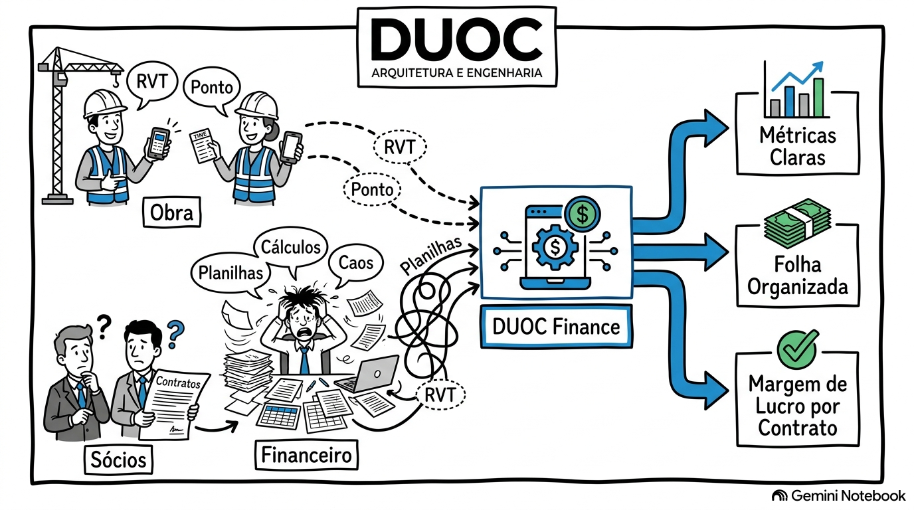

# 1.3 Mapeamento do Ecossistema Operacional

## Rich Picture do Sistema DUOC Finance

---

### Instrucoes para a Redacao Tecnica
O integrante encarregado desta secao deve desenvolver a explicacao analitica do diagrama do Rich Picture, descrevendo os limites do sistema, as interacoes sociotecnicas entre os atores envolvidos e as principais transacoes operacionais e financeiras da organizacao.

### Perguntas Norteadoras
1. Quais sao os atores principais representados no diagrama (socios, gestao administrativa, engenheiros de campo, encarregados de canteiro, clientes e contabilidade externa)?
2. Quais sao os fluxos de informacao e transacoes documentadas que ocorrem rotineiramente entre os canteiros de obras e a sede administrativa (apontamento de horas de visita via RVT, envio de notas de reembolso, emissao de ordens de pagamento)?
3. Onde estao situados os principais pontos de atrito, conflito ou perda de informacao evidenciados no diagrama (atraso na prestacao de contas de campo, perda de comprovantes fisicos, divergencias entre horas faturadas e horas trabalhadas)?
4. Quais fronteiras delimitam o que esta dentro do escopo do sistema DUOC Finance e o que permanece sob a responsabilidade de sistemas legados ou parceiros externos?

---

### Estrutura Sugerida para Detalhamento das Transacoes

| Codigo | Fluxo Operacional / Transacao | Origem | Destino | Descricao da Interacao | Pontos de Tensao Identificados |
| :---: | :--- | :--- | :--- | :--- | :--- |
| TR-01 | Envio do Relatorio de Viagem Tecnica (RVT) | Engenheiro / Tecnico em Campo | Administrativo / DP | [Descrever o envio de horas e escopo de visita executado] | [Ex: Atraso no preenchimento, informacoes incompletas no papel] |
| TR-02 | Submissao de Comprovantes de Despesa | Equipe de Campo | Financeiro | [Descrever submissao de recibos de combustivel, alimentacao e pedagio] | [Ex: Extravio de cupons fiscais fisicos, falta de padronizacao] |
| TR-03 | Consolidacao de Folha e Comissoes | Administrativo / DP | Socios / Diretoria | [Descrever cruzamento manual de horas e comissoes por projeto] | [Ex: Risco de erro de calculo, retrabalho em planilhas Excel] |
| TR-04 | Apropriacao de Custo por Contrato | Financeiro | Gestao Estrategica | [Descrever calculo do custo real de mao de obra alocada em cada obra] | [Ex: Opacidade financeira, impossibilidade de apurar margem liquida] |