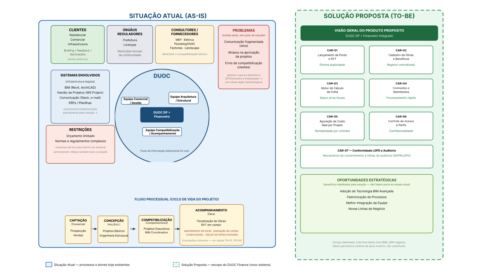

# 1.3 Rich Picture (Fluxo Sociotécnico)

## Análise do Rich Picture — Sistema DUOC Finance

!!! note "Revisão de fronteiras (v2)"
    A versão anterior deste diagrama misturava o cenário atual e a solução proposta dentro do mesmo bloco visual — notadamente selos "resolvido pelo novo sistema" embutidos no bloco "Problemas" e o bloco "Oportunidades" sem vínculo visual claro a nenhum dos dois lados. A versão atual separa as duas dimensões em zonas explicitamente delimitadas: **Situação Atual (AS-IS)**, com borda sólida azul, e **Solução Proposta (TO-BE)**, com borda tracejada verde — conforme legenda na base da imagem.

## Limites do Sistema e Atores Principais

O diagrama delimita um sistema sociotécnico centrado na **DUOC**, representada no núcleo como três equipes interdependentes: **Comercial/Gestão**, **Arquitetura/Estrutural** e **Compatibilização/Acompanhamento**. Essas três equipes compartilham um fluxo de informação bidirecional (In-Out) que atravessa o módulo central "DUOC DP + Financeiro" — o núcleo do sistema proposto, que integra a gestão de pessoas (DP) à gestão financeira da obra.

Ao redor desse núcleo, o diagrama posiciona os **atores externos e interfaces**:

- **Clientes** (residencial, comercial, infraestrutura), que enviam briefings e recebem aprovações/feedback;
- **Órgãos reguladores** (prefeitura, licenças), que impõem restrições formais de conformidade;
- **Consultores complementares** e **fornecedores de material** (MEP, elétrica, plumbing/HVAC, factorias, landscape), que alimentam o processo de compatibilização técnica;
- Um bloco inferior de **sistemas envolvidos** (BIM/Revit/ArchiCAD, gestão de projetos via MS Project, comunicação via Slack/e-mail, ERPs/planilhas), que representa a infraestrutura tecnológica legada com a qual o novo sistema DP + Financeiro interopera. As integrações com auditor.ia, ERPs/planilhas, BIM e Slack estão formalizadas como [CAR-09](../capitulo-2/2.3-caracteristicas.md#car-09) a [CAR-12](../capitulo-2/2.3-caracteristicas.md#car-12); a gestão de projetos via MS Project não tem integração planejada nesta fase e permanece apenas como referência de infraestrutura legada observada.

## Fluxos de Informação e Transações Rotineiras

O diagrama mostra um fluxo processual na base (Captação → Concepção → Compatibilização → Acompanhamento de Obra), que corresponde ao ciclo de vida do projeto. É nesse fluxo que residem as transações operacionais e financeiras rotineiras entre canteiro e sede: apontamento de horas, prestação de contas de campo, emissão de comprovantes e o cálculo consolidado da folha e comissões — exatamente o que a tabela de transações abaixo detalha.

## Pontos de Atrito Evidenciados

O bloco "**Problemas**", na zona da Situação Atual, nomeia os principais pontos de tensão hoje existentes — comunicação fragmentada (silos), atrasos na aprovação de projetos e erros de compatibilidade (clashes) — sem antecipar qual solução os endereça, para não confundir diagnóstico com proposta. Apenas o subconjunto relacionado à gestão de pessoas e financeiro (essencialmente a comunicação fragmentada nos fluxos de apontamento e prestação de contas) é diretamente endereçado pelo DUOC Finance; erros de compatibilização técnica (clashes de BIM) permanecem fora do escopo deste sistema. O bloco "**Restrições**" (orçamento limitado, normas e regulamentos complexos) mostra os limites impostos de fora para dentro do sistema e continuam válidos também para a solução proposta.

## Fronteira do Sistema DUOC Finance

O escopo do novo sistema é delimitado na zona "**Solução Proposta (TO-BE)**", à direita do diagrama, com borda tracejada verde para diferenciá-la visualmente da zona "Situação Atual (AS-IS)": lançamento de ponto/RVT, cadastro de férias e benefícios, motor de cálculo de folha, cálculo de comissões e reembolsos, apuração de custo real por projeto, controle de acesso/perfis, conformidade LGPD e as integrações externas com auditor.ia, ERPs/planilhas, BIM e Slack (CAR-09 a CAR-12 — ver [2.6 Viabilidade da Proposta](../capitulo-2/2.6-viabilidade-mvp.md)). O bloco "Oportunidades Estratégicas" também está posicionado nessa zona, pois representa benefícios habilitados pela solução, não características do estado atual. Tudo que estiver fora dessa lista (ex.: gestão de projetos via MS Project) permanece como sistema de apoio externo, na zona da Situação Atual, sem integração planejada nesta fase.

---

## Estrutura Detalhada das Transações

| Código | Fluxo Operacional / Transação | Origem | Destino | Descrição da Interação | Pontos de Tensão Identificados |
|:---:|:---|:---|:---|:---|:---|
| **TR-01** | Envio do Relatório de Viagem Técnica (RVT) | Engenheiro/Técnico em Campo | Administrativo / DP | O técnico registra, ao final de uma visita de obra, as horas trabalhadas e o escopo executado (fiscalização, engenharia estrutural, acompanhamento), normalmente em papel ou planilha isolada, para posterior lançamento no sistema de ponto. | Atraso no preenchimento por acúmulo de visitas; letra ou registro manual ilegível; ausência de padronização do escopo descrito, dificultando o cruzamento com o cronograma do projeto. |
| **TR-02** | Submissão de Comprovantes de Despesa | Equipe de Campo | Financeiro | O colaborador em campo acumula cupons fiscais de combustível, alimentação e pedágio durante a visita e os entrega fisicamente (ou por foto) ao setor financeiro para reembolso. | Extravio de cupons fiscais físicos; comprovantes ilegíveis ou incompletos; falta de padronização do formato de envio, gerando retrabalho na conferência. |
| **TR-03** | Consolidação de Folha e Comissões | Administrativo / DP | Sócios / Diretoria | O DP cruza manualmente as horas apontadas via RVT com as tabelas de comissionamento por projeto/venda, consolidando os valores em planilhas Excel para fechamento da folha mensal. | Alto risco de erro de cálculo humano; retrabalho constante em planilhas descentralizadas; dependência de uma única pessoa para o fechamento, criando gargalo operacional. |
| **TR-04** | Apropriação de Custo por Contrato | Financeiro | Gestão Estratégica | O financeiro apura o custo real de mão de obra (horas + comissões + reembolsos) alocado a cada obra/contrato, comparando-o com o orçamento previsto para acompanhar o desvio orçamentário do projeto. | Opacidade financeira por falta de rastreabilidade em tempo real; impossibilidade de apurar o custo de mão de obra por contrato antes do fechamento mensal; decisões estratégicas tomadas com dados defasados. |

---

**Observação metodológica:** este Rich Picture segue a lógica da Soft Systems Methodology (SSM), evidenciando não apenas o fluxo formal de processos, mas também as relações informais e os pontos de conflito do sistema atual. A fronteira entre "situação atual" e "solução proposta" é demarcada por duas zonas com bordas visualmente distintas (sólida azul à esquerda, tracejada verde à direita) e uma legenda explícita — recurso necessário para justificar, na redação técnica, por que o novo sistema DP + Financeiro é necessário e onde exatamente ele intervém no fluxo existente, sem sobrepor diagnóstico e proposta no mesmo elemento visual.

---

## Histórico de Versão

| Versão | Data | Descrição | Autor(es) | Revisor(es) |
| :---: | :---: | :--- | :--- | :--- |
| `1.0` | 05/09/2026 | Elaboração do Rich Picture e análise das transações operacionais | Paulo Nery | Matheus Ribeiro |
| `1.1` | 07/09/2026 | Correção da hierarquia de títulos e padronização visual | Matheus Ribeiro | |
| `2.0` | 19/09/2026 | Substituição do diagrama por versão com fronteiras explícitas entre Situação Atual (AS-IS) e Solução Proposta (TO-BE); remoção dos selos "resolvido pelo novo sistema" do bloco Problemas e realocação do bloco Oportunidades para a zona da solução | Eric Araújo | |
| `2.1` | 19/09/2026 | Lastreamento das afirmações de interoperabilidade (BIM, ERPs, Slack, auditor.ia) às novas CAR-09 a CAR-12, corrigindo menção solta sem respaldo no MVP/cronograma | Eric Araújo | |
| `2.2` | 19/09/2026 | Correção de terminologia em TR-04: "rentabilidade"/"margem líquida" substituídas por "desvio orçamentário"/"custo de mão de obra", já que o sistema não apura receita nem custos totais do contrato | Paulo Nery | |