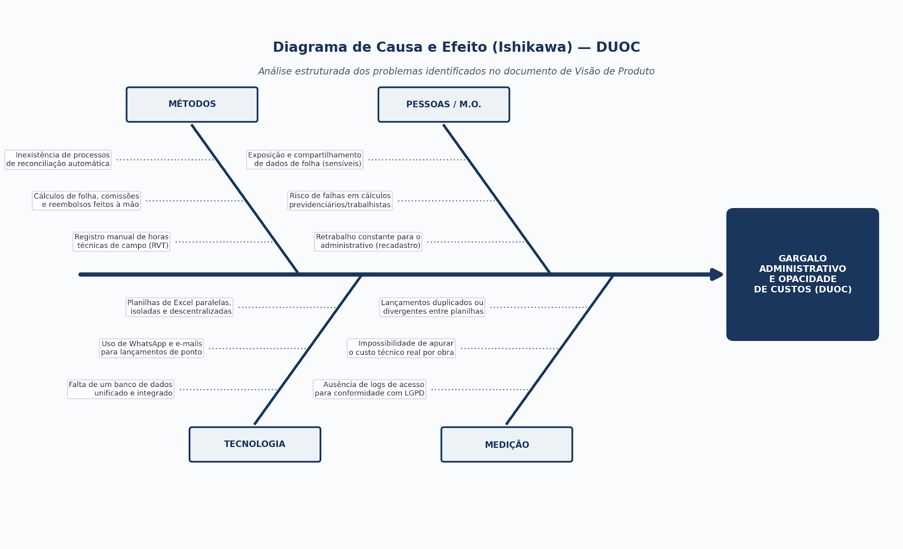

# 1.4 Identificação da Oportunidade ou Problema

## Problema

A inconsistência gerencial e a opacidade na apuração da rentabilidade de contratos da DUOC são causadas pela fragmentação dos registros operacionais, como RVT e ponto, em ferramentas desconectadas.

<figure markdown="span">
  { width="200%" }
  <figcaption>Figura 2: Diagrama de Causa e Efeito (Ishikawa) dos gargalos administrativos.</figcaption>
</figure>

## Causas do problema

O Diagrama de Ishikawa organiza as causas do problema em quatro categorias:

* **Métodos:** Processos manuais e descentralizados para registrar ponto, férias, benefícios, RVT, folha de pagamento, comissões e reembolsos, com lançamentos duplicados e pouca padronização.
* **Tecnologia:** Uso de planilhas, e-mails e mensagens de WhatsApp sem integração entre os registros de horas, os dados de pessoal e as informações financeiras dos contratos.
* **Pessoas:** Dependência de diferentes responsáveis para coletar, conferir e consolidar informações, aumentando a possibilidade de falhas de comunicação, retrabalho e perda de dados.
* **Medição:** Ausência de uma correlação direta entre as horas técnicas registradas e o custo real de pessoal por contrato, dificultando a apuração da rentabilidade e a tomada de decisão.