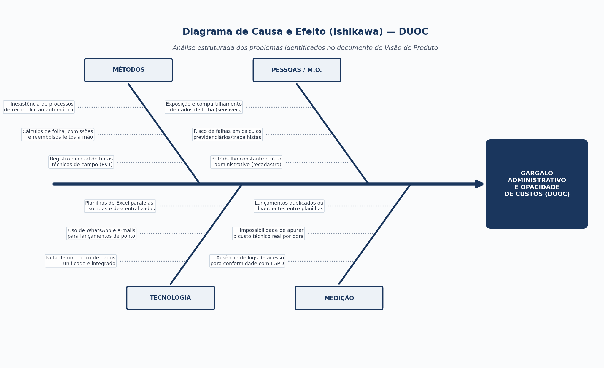

# 1.4 Diagnóstico do Problema e Diagrama de Ishikawa

## Declaração do Problema Central

> **"A inconsistência gerencial e a opacidade na apuração da rentabilidade de contratos da DUOC, causadas pela fragmentação de registros operacionais (RVT e ponto) em ferramentas desconectadas."**

---

## Diagrama de Causa e Efeito (Ishikawa)

---

### Instrucoes para a Redacao da Analise de Causas-Raiz
A equipe deve detalhar analiticamente os fatores causais levantados nas entrevistas e no mapeamento de processos da DUOC, preenchendo a tabela estruturada abaixo e desenvolvendo justificativas tecnicas para cada uma das quatro dimensoes do diagrama (Metodos, Tecnologia, Pessoas e Medicao).

### Perguntas Norteadoras
1. **Metodos:** Como a ausencia de processos padronizados para entrega de RVTs e fechamento de comissoes induz retrabalho e vulnerabilidade na gestao?
2. **Tecnologia:** De que forma a fragmentacao de ferramentas (planilhas de Excel avulsas e mensagens de WhatsApp) inviabiliza a integridade dos dados e o controle de acesso por papeis?
3. **Pessoas:** Quais comportamentos, variacoes de letramento tecnologico e pressoes operacionais sobre a lideranca e os engenheiros agravam o problema?
4. **Medicao:** Por que a organizacao nao dispoe de metricas em tempo habil para apurar o custo da hora-homem e a margem liquida de cada contrato?

---

### Tabela Estruturada de Causas-Raiz por Categoria

| Categoria | Causa Primaria (Espinha Maior) | Causas Secundarias e Subcausas | Efeito Direto na Operacao da DUOC |
| :--- | :--- | :--- | :--- |
| **Metodos** | Ausencia de padronizacao e rotinas manuais | - Falta de protocolo temporal para submissao do RVT - Fluxo informal de homologacao de despesas de viagem - Processo tardio e concentrado de fechamento de folha | [Descrever o efeito: retrabalho gerencial, atraso em pagamentos, riscos trabalhistas] |
| **Tecnologia** | Fragmentacao de ferramentas e ausencia de integracao | - Uso de planilhas de Excel desconectadas como banco de dados - Utilizacao de WhatsApp para trafego de recibos e dados salariais - Ausencia de sistema com controle de acesso granular (RBAC) | [Descrever o efeito: perda de historico, vulnerabilidade na seguranca da informacao e LGPD] |
| **Pessoas** | Disparidade no letramento e sobrecarga da lideranca | - Variacao de letramento digital entre canteiro e escritorio - Resistencia cultural ao registro formal de atividades tecnicas - Centralizacao excessiva de tarefas conferenciais na socia Maria Beatryz | [Descrever o efeito: atritos interpessoais, esgotamento da lideranca e abandono de ferramentas] |
| **Medicao** | Inexistencia de indicadores de rentabilidade e custo | - Impossibilidade de correlacionar horas tecnicas a centros de custo - Falta de apuracao do custo real de mao de obra por projeto - Metricas contabeis e gerenciais apuradas de forma retroativa e defasada | [Descrever o efeito: precificacao inadequada de propostas comerciais e opacidade na margem de lucro] |
