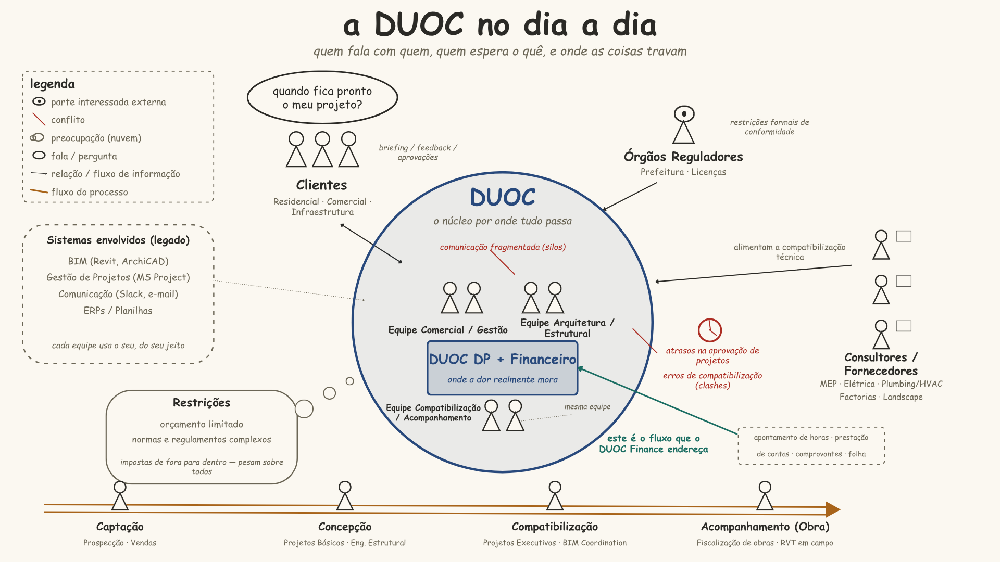

# Capítulo 1: Cenário Atual e Diagnóstico do Problema

## Objetivo do Capítulo

Este capítulo contextualiza a realidade operacional e mercadológica da DUOC Arquitetura e Engenharia. O objetivo principal é realizar uma imersão sociotécnica no ecossistema da organização parceira, mapeando seus fluxos informacionais, identificando os gargalos administrativos que limitam o crescimento do negócio e diagnosticando as causas-raiz de suas principais ineficiências de gestão.

## Conjunto de Artefatos

Para sustentar este diagnóstico, foram produzidos e integrados os seguintes artefatos:

*   **Ficha de Identificação do Cliente:** Dados formais de registro da empresa e da representante focal.
*   **Introdução ao Negócio:** Contextualização histórica do modelo de serviços multidisciplinares.
*   **Rich Picture:** Modelo visual sociotécnico que explicita os fluxos informacionais e tensões operacionais.
*   **Diagrama de Ishikawa:** Representação gráfica das causas-raiz que orbitam o problema central do faturamento.
*   **Mapeamento de Desafios:** Delimitação das barreiras sociotécnicas de adoção e restrições de escopo.
*   **Matriz de Stakeholders:** Classificação de influência e interesse das partes afetadas pela solução.
*   **Segmentação de Usuários:** Perfis detalhados de Interação Humano-Computador sob os aspectos físicos, computacionais e demográficos.

---

## 1.1 Identificação do Cliente

A tabela abaixo apresenta os dados cadastrais e institucionais da organização parceira, detalhando sua natureza jurídica, canais de contato e vínculo formal com o projeto de software.

| Campo | Detalhamento Institucional |
| :--- | :--- |
| **Razão Social** | DUOC Arquitetura e Engenharia LTDA |
| **Tipo Societário** | Sociedade Empresária Limitada (LTDA - ME) / Setor Privado |
| **Cadastro Nacional da Pessoa Jurídica (CNPJ)** | 53.616.784/0001-43 |
| **Ano de Fundação** | 2024 (23 de janeiro de 2024) |
| **Sede Operacional** | Brasília - DF, Brasil |
| **Ponto Focal do Cliente** | Maria Beatryz Vieira de Sousa |
| **Formas de Contato** | E-mail: beatryz.vieira@duoc.eng.br   Portal: https://www.duoc.eng.br |
| **Segmento de Atuação** | Arquitetura, Engenharia Estrutural, Instalações Prediais e Gestão de Obras |
| **Vínculo com o Projeto** | Cliente Parceiro e Homologadora de Regras de Negócio e Interfaces |

### Cargo, Papel no Projeto e Poder Decisório de Maria Beatryz

Para evitar ambiguidade em referências anteriores do repositório, distinguem-se três dimensões que não se confundem:

| Dimensão | Descrição |
| :--- | :--- |
| **Cargo na DUOC** | Auxiliar Administrativa — vínculo formal de trabalho na organização, sem participação societária. |
| **Papel no Projeto** | Representante do Cliente (Ponto Focal / Cliente Focal) — interlocutora única da equipe para elicitação, validação de protótipos e homologação de entregas. |
| **Poder Decisório** | Detém autoridade delegada pela DUOC para aprovar escopo, prototipagem e aceite formal do MVP neste projeto, apesar de seu cargo administrativo. Não figura como representante legal (societária) da empresa. |

---

## 1.2 Introdução ao Negócio e Contexto Operacional

A DUOC Arquitetura e Engenharia LTDA ME (CNPJ: 53.616.784/0001-43) é uma microempresa do setor privado fundada em 23 de janeiro de 2024, com sede de operações localizada em Brasília - DF. Inicialmente registrada sob a atividade econômica principal de instalação e manutenção elétrica, a DUOC rapidamente evoluiu suas operações para um modelo de negócios híbrido e multidisciplinar. Atualmente, a organização integra serviços de concepção e projeto arquitetônico, engenharia civil estrutural, projetos complementares (instalações hidrossanitárias e elétricas) e coordenação técnica com acompanhamento físico de canteiros de obras.

A rotina operacional da empresa caracteriza-se por um intenso fluxo sociotécnico de informações, que conecta equipes técnicas internas (sócios, arquitetos, engenheiros especialistas, estagiários e operários) a múltiplos atores externos (clientes residenciais e comerciais, fornecedores e órgãos reguladores). Com a expansão de contratos, a gestão descentralizada baseada em ferramentas fragmentadas (e-mails, WhatsApp e planilhas paralelas de Excel) gerou gargalos gerenciais severos. O cenário atual evidencia a inconsistência no registro de horas técnicas (RVT), falta de padronização no controle de folha de pagamento e reembolso de colaboradores, e opacidade no cálculo do custo real de mão de obra por projeto. Diante dessa conjuntura, o projeto visa reestruturar a infraestrutura administrativa da DUOC por meio de uma solução integrada de Departamento Pessoal e Gestão Financeira.

### Síntese do Diagnóstico Operacional

A partir do diálogo inicial e das entrevistas semiestruturadas com a auxiliar administrativa Maria Beatryz, consolidaram-se os seguintes pontos de diagnóstico:

!!! warning "Limitação metodológica"
    Os perfis internos citados acima (arquitetos, engenheiros especialistas, estagiários e operários) e externos (fornecedores, órgãos reguladores) foram caracterizados por relato indireto da ponto focal administrativa, não por entrevista ou observação direta com representantes desses papéis. A equipe ainda não coletou evidência primária junto a esses perfis; a caracterização detalhada deve ser tratada como hipótese sociotécnica a validar, não como levantamento confirmado.

1. **Evolução do Foco Operacional:** A empresa expandiu sua atuação da instalação elétrica para o ciclo completo de projetos (arquitetura, cálculo estrutural e instalações), exigindo coordenação multidisciplinar entre campo e escritório.
2. **Desconexão Campo-Escritório:** A ausência de um canal único para envio do Relatório de Viagem Técnica (RVT) e das notas de despesas gera atrasos na consolidação do fechamento mensal.
3. **Decisão Gerencial Informada:** A dependência de planilhas manuais impede que os sócios visualizem em tempo real o custo de mão de obra apropriado a cada contrato frente ao orçamento previsto, atrasando tomadas de decisão comercial e precificação de novos serviços.

---

## 1.3 Rich Picture (Fluxo Sociotécnico)

### Análise do Rich Picture — Sistema DUOC Finance

!!! note "Revisão de fronteiras (v2)"
    A versão anterior deste diagrama misturava o cenário atual e a solução proposta dentro do mesmo bloco visual — notadamente selos "resolvido pelo novo sistema" embutidos no bloco "Problemas" e o bloco "Oportunidades" sem vínculo visual claro a nenhum dos dois lados. A versão atual separa as duas dimensões em zonas explicitamente delimitadas: **Situação Atual (AS-IS)**, com borda sólida azul, e **Solução Proposta (TO-BE)**, com borda tracejada verde — conforme legenda na base da imagem.

### Limites do Sistema e Atores Principais

O diagrama delimita um sistema sociotécnico centrado na **DUOC**, representada no núcleo como três equipes interdependentes: **Comercial/Gestão**, **Arquitetura/Estrutural** e **Compatibilização/Acompanhamento**. Essas três equipes compartilham um fluxo de informação bidirecional (In-Out) que atravessa o módulo central "DUOC DP + Financeiro" — o núcleo do sistema proposto, que integra a gestão de pessoas (DP) à gestão financeira da obra.

Ao redor desse núcleo, o diagrama posiciona os **atores externos e interfaces**:

- **Clientes** (residencial, comercial, infraestrutura), que enviam briefings e recebem aprovações/feedback;
- **Órgãos reguladores** (prefeitura, licenças), que impõem restrições formais de conformidade;
- **Consultores complementares** e **fornecedores de material** (MEP, elétrica, plumbing/HVAC, factorias, landscape), que alimentam o processo de compatibilização técnica;
- Um bloco inferior de **sistemas envolvidos** (BIM/Revit/ArchiCAD, gestão de projetos via MS Project, comunicação via Slack/e-mail, ERPs/planilhas), que representa a infraestrutura tecnológica legada com a qual o novo sistema DP + Financeiro interopera. As integrações com auditor.ia, ERPs/planilhas, BIM e Slack estão formalizadas como [CAR-09](../capitulo-2/index.md#car-09) a [CAR-12](../capitulo-2/index.md#car-12); a gestão de projetos via MS Project não tem integração planejada nesta fase e permanece apenas como referência de infraestrutura legada observada.

### Fluxos de Informação e Transações Rotineiras

O diagrama mostra um fluxo processual na base (Captação → Concepção → Compatibilização → Acompanhamento de Obra), que corresponde ao ciclo de vida do projeto. É nesse fluxo que residem as transações operacionais e financeiras rotineiras entre canteiro e sede: apontamento de horas, prestação de contas de campo, emissão de comprovantes e o cálculo consolidado da folha e comissões — exatamente o que a tabela de transações abaixo detalha.

### Pontos de Atrito Evidenciados

O bloco "**Problemas**", na zona da Situação Atual, nomeia os principais pontos de tensão hoje existentes — comunicação fragmentada (silos), atrasos na aprovação de projetos e erros de compatibilidade (clashes) — sem antecipar qual solução os endereça, para não confundir diagnóstico com proposta. Apenas o subconjunto relacionado à gestão de pessoas e financeiro (essencialmente a comunicação fragmentada nos fluxos de apontamento e prestação de contas) é diretamente endereçado pelo DUOC Finance; erros de compatibilização técnica (clashes de BIM) permanecem fora do escopo deste sistema. O bloco "**Restrições**" (orçamento limitado, normas e regulamentos complexos) mostra os limites impostos de fora para dentro do sistema e continuam válidos também para a solução proposta.

### Fronteira do Sistema DUOC Finance

O escopo do novo sistema é delimitado na zona "**Solução Proposta (TO-BE)**", à direita do diagrama, com borda tracejada verde para diferenciá-la visualmente da zona "Situação Atual (AS-IS)": lançamento de ponto/RVT, cadastro de férias e benefícios, motor de cálculo de folha, cálculo de comissões e reembolsos, apuração de custo real por projeto, controle de acesso/perfis, conformidade LGPD e as integrações externas com auditor.ia, ERPs/planilhas, BIM e Slack (CAR-09 a CAR-12 — ver [2.6 Viabilidade da Proposta](../capitulo-2/index.md#26-viabilidade-da-proposta-analise-do-mvp)). O bloco "Oportunidades Estratégicas" também está posicionado nessa zona, pois representa benefícios habilitados pela solução, não características do estado atual. Tudo que estiver fora dessa lista (ex.: gestão de projetos via MS Project) permanece como sistema de apoio externo, na zona da Situação Atual, sem integração planejada nesta fase.

### Estrutura Detalhada das Transações

| Código | Fluxo Operacional / Transação | Origem | Destino | Descrição da Interação | Pontos de Tensão Identificados |
|:---:|:---|:---|:---|:---|:---|
| **TR-01** | Envio do Relatório de Viagem Técnica (RVT) | Engenheiro/Técnico em Campo | Administrativo / DP | O técnico registra, ao final de uma visita de obra, as horas trabalhadas e o escopo executado (fiscalização, engenharia estrutural, acompanhamento), normalmente em papel ou planilha isolada, para posterior lançamento no sistema de ponto. | Atraso no preenchimento por acúmulo de visitas; letra ou registro manual ilegível; ausência de padronização do escopo descrito, dificultando o cruzamento com o cronograma do projeto. |
| **TR-02** | Submissão de Comprovantes de Despesa | Equipe de Campo | Financeiro | O colaborador em campo acumula cupons fiscais de combustível, alimentação e pedágio durante a visita e os entrega fisicamente (ou por foto) ao setor financeiro para reembolso. | Extravio de cupons fiscais físicos; comprovantes ilegíveis ou incompletos; falta de padronização do formato de envio, gerando retrabalho na conferência. |
| **TR-03** | Consolidação de Folha e Comissões | Administrativo / DP | Sócios / Diretoria | O DP cruza manualmente as horas apontadas via RVT com as tabelas de comissionamento por projeto/venda, consolidando os valores em planilhas Excel para fechamento da folha mensal. | Alto risco de erro de cálculo humano; retrabalho constante em planilhas descentralizadas; dependência de uma única pessoa para o fechamento, criando gargalo operacional. |
| **TR-04** | Apropriação de Custo por Contrato | Financeiro | Gestão Estratégica | O financeiro apura o custo real de mão de obra (horas + comissões + reembolsos) alocado a cada obra/contrato, comparando-o com o orçamento previsto para acompanhar o desvio orçamentário do projeto. | Opacidade financeira por falta de rastreabilidade em tempo real; impossibilidade de apurar o custo de mão de obra por contrato antes do fechamento mensal; decisões estratégicas tomadas com dados defasados. |

**Observação metodológica:** este Rich Picture segue a lógica da Soft Systems Methodology (SSM), evidenciando não apenas o fluxo formal de processos, mas também as relações informais e os pontos de conflito do sistema atual. A fronteira entre "situação atual" e "solução proposta" é demarcada por duas zonas com bordas visualmente distintas (sólida azul à esquerda, tracejada verde à direita) e uma legenda explícita — recurso necessário para justificar, na redação técnica, por que o novo sistema DP + Financeiro é necessário e onde exatamente ele intervém no fluxo existente, sem sobrepor diagnóstico e proposta no mesmo elemento visual.

---

## 1.4 Diagnóstico do Problema e Diagrama de Ishikawa

### Declaração do Problema Central

> **"A inconsistência gerencial e a opacidade na apuração da rentabilidade de contratos da DUOC, causadas pela fragmentação de registros operacionais (RVT e ponto) em ferramentas desconectadas."**

### Diagrama de Causa e Efeito (Ishikawa)

### Análise das Causas-Raiz

O problema central resulta da combinação de quatro categorias de causas representadas no diagrama.

!!! note "Adaptação do modelo 6M clássico"
    O diagrama de Ishikawa parte do modelo tradicional de manufatura (6M: Método, Mão de Obra, Material, Máquina, Medição, Meio Ambiente), mas foi adaptado para 4 categorias por se tratar de um diagnóstico de processo administrativo-financeiro de serviços, não de linha de produção física. **Método** e **Medição** foram mantidos sem alteração; **Máquina** e **Material** foram consolidados em **Tecnologia** (ferramentas e sistemas de registro, não maquinário físico); **Mão de Obra** foi renomeada para **Pessoas** (letramento digital e rotina das equipes, não desempenho de operação manual); **Meio Ambiente** foi descartado por não haver causa-raiz ambiental relevante identificada no diagnóstico. Essa adaptação é mantida de forma consistente em todas as referências ao diagrama neste repositório.

#### Métodos

A DUOC não possui um fluxo padronizado e integrado para registrar, validar e fechar os Relatórios de Viagem Técnica (RVT), as despesas e as informações de pessoal. A entrega dos registros ocorre em momentos e formatos diferentes, e a conferência se concentra no fechamento mensal. Isso provoca retrabalho, atrasos e maior risco de divergências entre o trabalho realizado, o valor pago e o custo atribuído ao contrato.

#### Tecnologia

Os registros de RVT, ponto, despesas e folha ficam distribuídos em planilhas e canais de comunicação que não funcionam como uma base única. A ausência de integração impede o cruzamento direto entre horas técnicas e custos de pessoal, dificulta a recuperação do histórico e aumenta a exposição de informações operacionais e salariais. Também limita a aplicação de perfis de acesso e de uma trilha de auditoria adequada.

#### Pessoas

As equipes de campo e do escritório possuem diferentes níveis de familiaridade com ferramentas digitais e trabalham sob pressão de prazos operacionais. Sem um processo simples e uniforme, o registro formal pode ser adiado ou preenchido de maneira incompleta. A necessidade de conferir manualmente informações de diferentes fontes ainda sobrecarrega a liderança e concentra o conhecimento em poucas pessoas, dificultando a continuidade do processo.

#### Medição

Os dados disponíveis não são consolidados em indicadores de custo de mão de obra por contrato. Como as horas técnicas não estão diretamente relacionadas ao custo real de pessoal, a gestão recebe uma visão tardia e incompleta do custo apropriado de cada projeto. A falta de métricas atualizadas prejudica a precificação, o acompanhamento de desvios e a tomada de decisões financeiras.

### Síntese das Causas e Efeitos

| Categoria | Causa principal | Efeito direto na operação |
| :--- | :--- | :--- |
| **Métodos** | Registros e validações sem fluxo padronizado | Retrabalho, atrasos e divergências no fechamento |
| **Tecnologia** | Ferramentas desconectadas e sem base integrada | Perda de histórico, baixa rastreabilidade e risco de acesso indevido |
| **Pessoas** | Diferentes níveis de letramento digital e sobrecarga da liderança | Registros incompletos e dependência de conhecimento concentrado |
| **Medição** | Ausência de indicadores consolidados por contrato | Opacidade sobre custos, margens e desvios financeiros |

---

## 1.5 Desafios do Projeto

O principal desafio do DUOC Finance é integrar o registro de horas operacionais (RVT) ao processamento financeiro de folha de pagamento e comissões. Essa integração precisa funcionar em uma equipe com diferentes níveis de letramento tecnológico, que inclui engenheiros especialistas, arquitetos, encarregados, estagiários, assistentes pessoais e operários de obra.

!!! warning "Limitação metodológica"
    A caracterização desses perfis de campo (engenheiros, arquitetos, encarregados, estagiários, operários) baseia-se no relato indireto da ponto focal administrativa da DUOC, não em entrevista ou observação direta com esses profissionais. As barreiras de adoção descritas na seção seguinte devem ser lidas como hipótese a confirmar em campo, não como diagnóstico validado por múltiplas fontes.

### Barreiras Sociotécnicas de Adoção

A adoção exige que o registro do RVT seja simples, acessível e compatível com a rotina de campo. Engenheiros e arquitetos podem lidar com formulários e ferramentas digitais com maior autonomia, enquanto operários e outros profissionais do canteiro podem ter menor familiaridade com sistemas corporativos. Por isso, o MVP deve priorizar fluxos curtos, linguagem objetiva, poucos campos obrigatórios e possibilidade de uso em dispositivos móveis.

A mudança também pode ser percebida como fiscalização, principalmente quando o registro de horas estiver associado ao pagamento. A implantação deve comunicar que o RVT é um instrumento de transparência, conferência e garantia dos direitos remuneratórios. O processo precisa prever validação pelos responsáveis, correção de registros e orientação inicial para reduzir erros e resistência.

### Contenção de Escopo do MVP

O escopo deve permanecer restrito ao Departamento Pessoal e ao Financeiro durante o semestre letivo. O produto mínimo viável deve concentrar-se no cadastro de usuários e papéis, registro e aprovação do RVT, consolidação das horas e apoio ao processamento de folha, comissões e relatórios financeiros essenciais.

Ficam fora desta entrega os módulos de gestão de engenharia e de obras, como cronogramas de Gantt, orçamentos SINAPI, controle de materiais, acompanhamento técnico detalhado e funcionalidades de um ERP de construção. Essa restrição protege o prazo, reduz a complexidade de implantação e permite validar o fluxo financeiro central antes de considerar futuras expansões.

---

## 1.6 Mapa de Stakeholders

A tabela a seguir apresenta as partes interessadas internas e externas, seu interesse no DUOC Finance, o grau de influência sobre o projeto e o nível de acesso esperado na plataforma. Os níveis de acesso devem ser implementados conforme o princípio do menor privilégio, permitindo que cada perfil visualize e altere somente os dados necessários para sua atividade.

| Stakeholder / Papel | Interesse no Projeto | Grau de Influência | Nível de Acesso Esperado |
| :--- | :--- | :---: | :--- |
| Sócios / Gestão da DUOC | Acompanhar a rentabilidade dos contratos, aprovar regras financeiras e tomar decisões estratégicas com dados confiáveis. | Alto | Administrador da organização; visão gerencial de usuários, RVT, folha, comissões e relatórios. |
| Arquitetos | Registrar horas e atividades vinculadas aos contratos, acompanhar aprovações e reduzir retrabalho administrativo. | Médio | Colaborador técnico; lançamento e consulta dos próprios registros e acompanhamento de aprovações. |
| Engenheiros Especialistas | Registrar RVT por projeto e centro de custo, validar informações técnicas e apoiar a apuração de custos de mão de obra. | Alto | Colaborador técnico com permissão de validação dos registros de suas equipes ou projetos. |
| Estagiários | Informar horas e atividades realizadas com orientação do responsável e manter seus registros atualizados. | Baixo | Colaborador; lançamento e consulta dos próprios registros, sem acesso a dados salariais. |
| Encarregados | Conferir a presença e as horas das equipes de campo antes do envio para processamento. | Alto | Aprovador de campo; registro e aprovação dos RVTs da equipe sob sua responsabilidade. |
| Assistentes Pessoais | Apoiar o cadastro, a organização dos registros, a conferência de documentos e as rotinas administrativas. | Médio | Operador administrativo; consulta e tratamento dos registros autorizados, sem configurações de sistema. |
| Operários | Registrar presença e horas trabalhadas de forma simples e consultar o status dos próprios lançamentos. | Baixo | Colaborador de campo; acesso somente aos próprios registros e informações de pagamento disponibilizadas. |
| Clientes Finais | Obter maior transparência sobre horas e custos que fundamentam medições e entregas contratadas. | Médio | Sem acesso operacional direto; recebimento de relatórios ou extratos aprovados pela DUOC. |
| Construtoras e Empreiteiros Parceiros | Conferir horas, serviços e valores relacionados às equipes ou contratos compartilhados. | Médio | Acesso externo restrito a relatórios e registros dos contratos autorizados. |
| Órgãos Públicos | Receber documentos e informações necessários para trâmites e aprovações de obra. | Baixo | Sem acesso direto; documentos e relatórios exportados pela DUOC quando necessário. |
| Fornecedores de Materiais | Relacionar documentos de fornecimento aos contratos e facilitar a conferência financeira. | Baixo | Sem acesso direto ao MVP; envio de documentos por canal administrativo definido pela DUOC. |

---

## 1.7 Segmentação de Usuários e Perfis de Interação Humano-Computador

A caracterização dos segmentos de usuários que interagem com o ecossistema do **DUOC Finance** é estruturada sob a lente da Engenharia de Requisitos Sociotécnica. Cada perfil de interação é mapeado segundo suas características demográficas, letramento tecnológico, restrições ambientais de hardware e rotina de tarefas operacionais, conforme as diretrizes de Interação Humano-Computador (IHC). Sob essa perspectiva, trabalharemos seguindo os 2 tipos de perfis:

!!! warning "Limitação metodológica"
    O Perfil 1 (Empresa Administrativa) apoia-se em evidência direta, coletada junto à ponto focal Maria Beatryz. O Perfil 2 (Construtoras e Equipe de Campo) foi inferido a partir do relato dessa mesma interlocutora administrativa, sem entrevista ou observação direta com engenheiros, fiscais, técnicos ou operários em campo. As características de letramento tecnológico, ambiente de uso e requisitos de IHC descritas para o Perfil 2 devem ser tratadas como hipótese de design a validar, não como levantamento confirmado com os próprios usuários.

### Perfil 1: Empresa Administrativa (Escritório / Gestão Estratégica)

| Dimensão de Interação | Caracterização do Perfil |
| :--- | :--- |
| **Definição do Papel** | Sócios administradores e equipe de apoio administrativo-financeiro da DUOC que utilizam a plataforma para consolidação de dados e tomada de decisão estratégica. |
| **Perfil Humano e Letramento Tecnológico** | Apresentam foco em governança corporativa, análise de indicadores de negócios e cumprimento de metas gerenciais. Possuem letramento tecnológico corporativo avançado (uso frequente de planilhas eletrônicas, relatórios financeiros e sistemas de gestão), porém sem conhecimento técnico em desenvolvimento de software ou engenharia de campo. |
| **Ambiente de Uso e Hardware** | Uso prioritário em escritórios corporativos estáveis e estruturados. Interação por meio de computadores de mesa (Desktop) ou Laptops de alto desempenho, com suporte a monitores amplos de alta resolução, teclado físico estendido, mouse dedicado e conexões de rede confiáveis. |
| **Tarefas Predominantes** | 1. Análise profunda e consolidação de faturamento por projeto corporativo. 2. Conciliação de despesas operacionais e acompanhamento das horas de deslocamento e trabalho técnico (RVT). 3. Homologação e auditoria das folhas de pagamento geradas pelo sistema. 4. Configuração de taxas, comissões de projetos e gestão de acessos e permissões (RBAC). |
| **Requisitos de Interação e Usabilidade (IHC)** | Alta densidade de informação gráfica e tabular na interface. Necessidade de suporte robusto a atalhos de navegação via teclado, mecanismos de busca rápida com filtros multicritério e função prioritária de exportação de relatórios estruturados para os formatos Microsoft Excel e PDF. |

---

### Perfil 2: Construtoras e Equipe de Campo (Engenheiros, Fiscais e Técnicos)

| Dimensão de Interação | Caracterização do Perfil |
| :--- | :--- |
| **Definição do Papel** | Engenheiros residentes, diretores de obra, fiscais de contrato e operários que atuam diretamente nos canteiros de serviço e dependem do sistema para apontamento operacional. |
| **Perfil Humano e Letramento Tecnológico** | Engenheiros e fiscais possuem perfil altamente analítico, técnico e familiarizado com ferramentas de modelagem e planejamento (CAD, BIM). Os técnicos e operários possuem perfil pragmático, focado na execução de tarefas físicas, com letramento tecnológico variável (utilização frequente de aplicativos de mensagens e redes sociais, mas com potencial resistência a sistemas corporativos complexos). |
| **Ambiente de Uso e Hardware** | Interação em ambientes dinâmicos e de alta hostilidade operacional (presença de ruídos, poeira, intempéries e vibrações), utilizando predominantemente dispositivos móveis pessoais ou corporativos (smartphones e tablets). |
| **Tarefas Predominantes** | 1. Visualização do registro de ponto eletrônico de entrada e saída nos canteiros de obra. 2. Preenchimento e envio diário do Relatório de Viagem Técnica (RVT) com apontamento de horas técnicas e operacionais. 3. Envio de comprovantes de despesas e quilometragem para fins de reembolso administrativo. |
| **Requisitos de Interação e Usabilidade (IHC)** | Média a baixa densidade de dados na interface móvel para evitar sobrecarga cognitiva. Componentes visuais projetados com grandes margens de toque para operação rápida em campo. Suporte a mecanismo estável de persistência offline para evitar perda de dados durante oscilações de sinal de internet móvel nos canteiros, além de alto contraste de tela para visualização sob luz solar direta. |

---

## Histórico de Versão

| Versão | Data | Descrição | Autor(es) | Revisor(es) |
| :---: | :---: | :--- | :--- | :--- |
| `1.0` | 05/09/2026 | Levantamento inicial dos dados cadastrais, negócio, Rich Picture, Ishikawa e IHC | Equipe Cascata Ágil | Matheus Ribeiro Szervinsk |
| `1.1` | 07/09/2026 | Refinamento dos artefatos, inclusão do histórico de versão e padronização | Matheus Ribeiro Szervinsk | Eric Araújo |
| `2.0` | 15/09/2026 | Unificação integral de todos os artefatos 1.1 a 1.7 em página única contínua | Equipe Cascata Ágil | Matheus Ribeiro Szervinsk |
| `2.1` | 19/09/2026 | Reconciliação pós-merge com `develop`: correção do papel de Maria Beatryz (1.1); notas de limitação metodológica sobre caracterização de perfis (1.2, 1.5, 1.7); Rich Picture v2 com fronteiras AS-IS/TO-BE e lastro a CAR-09/CAR-12 (1.3); adaptação do modelo 6M para 4M no Ishikawa (1.4); correção de terminologia financeira ("margem líquida" → "custo apropriado") | Paulo Nery | |
| `2.2` | 20/09/2026 | Atualização do Rich Picture (1.3) para novo arquivo de imagem `Rich_picture_DUOC.png`; habilitação de ampliação (zoom) de imagens em toda a documentação via plugin `mkdocs-glightbox`, registrada como regra de estilo no `CONTRIBUTING.md` | Paulo Nery | |